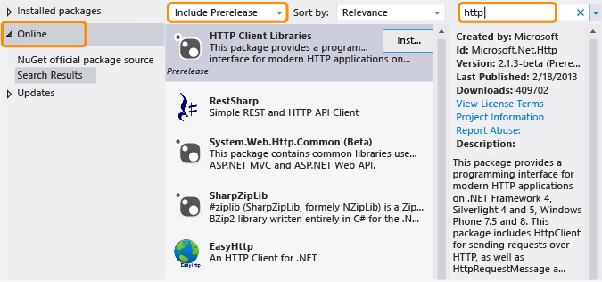

# The .NET Framework and Out-of-Band Releases
The .NET Framework is evolving to accommodate different platforms such as Windows Phone and Windows Store apps as well as traditional desktop and web apps, and to maximize code reuse. In addition to our regular .NET Framework releases, we release new features out of band (OOB) to improve cross-platform development or to introduce new functionality. This topic discusses the future direction of the .NET Framework and its OOB releases.  
  
## Advantages of OOB releases  
 Shipping new components or updates to components out of band enables Microsoft to provide more frequent updates to the .NET Framework. In addition, we can gather and respond to customer feedback more quickly.  
  
 When you use an OOB feature in your app, your users do not have to install the latest version of the .NET Framework to run your app, because the OOB assemblies deploy with your app package.  
  
## How OOB packages are distributed  
OOB releases for core common language runtime (CLR) components are delivered through the [NuGet](https://www.nuget.org/), which is a package manager for .NET. NuGet enables you to browse and add libraries to your .NET Framework projects easily from the Solution Explorer in Visual Studio. NuGet is included with all editions of Visual Studio starting with Visual Studio 2012. To see if NuGet is installed, look for **Library Package Manager** on the Visual Studio **Tools** menu. If it’s not installed:  
  
1.  On the Visual Studio menu bar, choose **Tools**, **Extensions and Updates** (in Visual Studio 2010, choose **Extension Manager**).  
  
     The **Extensions and Updates** dialog box opens.  
  
2.  Choose **Online**, **NuGet Package Manager**, and then choose **Download**.  
  
3.  After the download completes, restart Visual Studio.  
  
 For detailed installation instructions, see [Installing NuGet client tools](/nuget/install-nuget-client-tools) on the NuGet Docs website. For more information about NuGet, see the [NuGet documentation](/nuget/).  
  
## Using a NuGet OOB package  
 After you install NuGet, you can browse and add references to NuGet packages by using Solution Explorer in Visual Studio:  
  
1.  Open the shortcut menu for your project in Visual Studio, and then choose **Manage NuGet Packages**. (This option is also available from the **Project** menu.)  
  
2.  In the left pane, choose **Online**.  
  
3.  If you want to use prerelease packages, in the drop-down list box in the middle pane, choose **Include Prerelease** instead of **Stable Only**.  
  
4.  In the right pane, use the **Search** box to locate the package you would like to use. Some Microsoft packages are identified by the Microsoft .NET Framework logo, and all identify Microsoft as the publisher.  
  
   
  
 As mentioned previously, when you deploy an app that uses an OOB package, the OOB assemblies will ship with your app package.  
  
## Types of OOB releases  
 Typically, an OOB package has one or more prerelease versions and a stable version. The license that accompanies a prerelease doesn't typically allow redistribution, but enables you to try out a package and provide feedback. Feedback is incorporated in any updates made to the package. A final release is distributed as a stable package with NuGet and includes a license that lets you redistribute the NuGet package with your app. Stable packages are supported by Microsoft. Microsoft provides IntelliSense support as well as other types of documentation such as blog posts and forum answers for all packages. In addition, source code may be available with some, but not all, packages. For announcements regarding new and updated packages, you can subscribe to [the .NET Framework Blog](https://blogs.msdn.com/b/dotnet/).  
  
 To find both prerelease and stable packages, choose **Include Prerelease** in the NuGet Package Manager.  
  
 If you want to be notified of stable package releases, subscribe to [the .NET Framework feed](https://nuget.org/api/v2/curated-feeds/dotnetframework/Packages/).  
  
## See Also  
 [Getting Started](../../../docs/framework/get-started/index.md)
