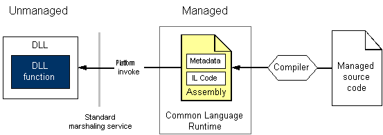

# Consuming Unmanaged DLL Functions
Platform invoke is a service that enables managed code to call unmanaged functions implemented in dynamic link libraries (DLLs), such as those in the Win32 API. It locates and invokes an exported function and marshals its arguments (integers, strings, arrays, structures, and so on) across the interoperation boundary as needed.  
  
 This section introduces tasks associated with consuming unmanaged DLL functions and provides more information about platform invoke. In addition to the following tasks, there are general considerations and a link providing additional information and examples.  
  
#### To consume exported DLL functions  
  
1.  [Identify functions in DLLs](../../../docs/framework/interop/identifying-functions-in-dlls.md).  
  
     Minimally, you must specify the name of the function and name of the DLL that contains it.  
  
2.  [Create a class to hold DLL functions](../../../docs/framework/interop/creating-a-class-to-hold-dll-functions.md).  
  
     You can use an existing class, create an individual class for each unmanaged function, or create one class that contains a set of related unmanaged functions.  
  
3.  [Create prototypes in managed code](../../../docs/framework/interop/creating-prototypes-in-managed-code.md).  
  
     [Visual Basic] Use the **Declare** statement with the **Function** and **Lib** keywords. In some rare cases, you can use the **DllImportAttribute** with the **Shared Function** keywords. These cases are explained later in this section.  
  
     [C#] Use the **DllImportAttribute** to identify the DLL and function. Mark the method with the **static** and **extern** modifiers.  
  
     [C++] Use the **DllImportAttribute** to identify the DLL and function. Mark the wrapper method or function with **extern "C"**.  
  
4.  [Call a DLL function](../../../docs/framework/interop/calling-a-dll-function.md).  
  
     Call the method on your managed class as you would any other managed method. [Passing structures](../../../docs/framework/interop/passing-structures.md) and [implementing callback functions](../../../docs/framework/interop/callback-functions.md) are special cases.  
  
 For examples that demonstrate how to construct .NET-based declarations to be used with platform invoke, see [Marshaling Data with Platform Invoke](../../../docs/framework/interop/marshaling-data-with-platform-invoke.md).  
  
## A closer look at platform invoke  
 Platform invoke relies on metadata to locate exported functions and marshal their arguments at run time. The following illustration shows this process.  
  
   
A platform invoke call to an unmanaged DLL function  
  
 When platform invoke calls an unmanaged function, it performs the following sequence of actions:  
  
1.  Locates the DLL containing the function.  
  
2.  Loads the DLL into memory.  
  
3.  Locates the address of the function in memory and pushes its arguments onto the stack, marshaling data as required.  
  
    > [!NOTE]
    >  Locating and loading the DLL, and locating the address of the function in memory occur only on the first call to the function.  
  
4.  Transfers control to the unmanaged function.  
  
 Platform invoke throws exceptions generated by the unmanaged function to the managed caller.

> [!NOTE] 
> The .NET threading model does not support [fibers](/windows/desktop/procthread/fibers). You should not call into any unmanaged function that is implemented by using fibers. Such calls may result in a crash of the .NET runtime.

## See Also  
 [Interoperating with Unmanaged Code](../../../docs/framework/interop/index.md)  
 [Platform Invoke Examples](../../../docs/framework/interop/platform-invoke-examples.md)  
 [Interop Marshaling](../../../docs/framework/interop/interop-marshaling.md)  
