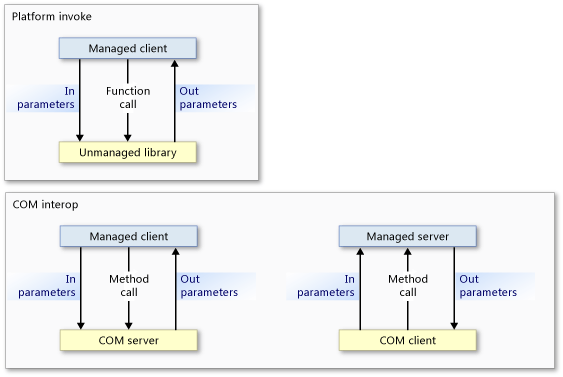
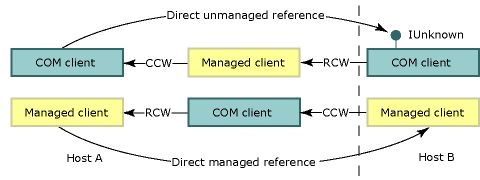

# Interop Marshaling
 Interop marshaling governs how data is passed in method arguments and return values between managed and unmanaged memory during calls. Interop marshaling is a run-time activity performed by the common language runtime's marshaling service.  
  
 Most data types have common representations in both managed and unmanaged memory. The interop marshaler handles these types for you. Other types can be ambiguous or not represented at all in managed memory.  
  
 An ambiguous type can have either multiple unmanaged representations that map to a single managed type, or missing type information, such as the size of an array. For ambiguous types, the marshaler provides a default representation and alternative representations where multiple representations exist. You can supply explicit instructions to the marshaler on how it is to marshal an ambiguous type.  
  
 This overview contains the following sections:  
  
-   [Platform Invoke and COM Interop Models](#platform_invoke_and_com_interop_models)  
  
-   [Marshaling and COM Apartments](#marshaling_and_com_apartments)  
  
-   [Marshaling Remote Calls](#marshaling_remote_calls)  
  
-   [Related Topics](#related_topics)  
  
-   [Reference](#reference)  
  
   
## Platform Invoke and COM Interop Models  
 The common language runtime provides two mechanisms for interoperating with unmanaged code:  
  
-   Platform invoke, which enables managed code to call functions exported from an unmanaged library.  
  
-   COM interop, which enables managed code to interact with Component Object Model (COM) objects through interfaces.  
  
 Both platform invoke and COM interop use interop marshaling to accurately move method arguments between caller and callee and back, if required. As the following illustration shows, a platform invoke method call flows from managed to unmanaged code and never the other way, except when [callback functions](../../../docs/framework/interop/callback-functions.md) are involved. Even though platform invoke calls can flow only from managed to unmanaged code, data can flow in both directions as input or output parameters. COM interop method calls can flow in either direction.  
  
   
Platform invoke and COM interop call flow  
  
 At the lowest level, both mechanisms use the same interop marshaling service; however, certain data types are supported exclusively by COM interop or platform invoke. For details, see [Default Marshaling Behavior](../../../docs/framework/interop/default-marshaling-behavior.md).  
  
 [Back to top](#top)  
  
   
## Marshaling and COM Apartments  
 The interop marshaler marshals data between the common language runtime heap and the unmanaged heap. Marshaling occurs whenever the caller and callee cannot operate on the same instance of data. The interop marshaler makes it possible for the caller and callee to appear to be operating on the same data even if they have their own copy of the data.  
  
 COM also has a marshaler that marshals data between COM apartments or different COM processes. When calling between managed and unmanaged code within the same COM apartment, the interop marshaler is the only marshaler involved. When calling between managed code and unmanaged code in a different COM apartment or a different process, both the interop marshaler and the COM marshaler are involved.  
  
### COM Clients and Managed Servers  
 An exported managed server with a type library registered by the [Regasm.exe (Assembly Registration Tool)](../../../docs/framework/tools/regasm-exe-assembly-registration-tool.md) has a `ThreadingModel` registry entry set to `Both`. This value indicates that the server can be activated in a single-threaded apartment (STA) or a multithreaded apartment (MTA). The server object is created in the same apartment as its caller, as shown in the following table.  
  
|COM client|.NET server|Marshaling requirements|  
|----------------|-----------------|-----------------------------|  
|STA|`Both` becomes STA.|Same-apartment marshaling.|  
|MTA|`Both` becomes MTA.|Same-apartment marshaling.|  
  
 Because the client and server are in the same apartment, the interop marshaling service automatically handles all data marshaling. The following illustration shows the interop marshaling service operating between managed and unmanaged heaps within the same COM-style apartment.  
  
   
Same-apartment marshaling process  
  
 If you plan to export a managed server, be aware that the COM client determines the apartment of the server. A managed server called by a COM client initialized in an MTA must ensure thread safety.  
  
### Managed Clients and COM Servers  
 The default setting for managed client apartments is MTA; however, the application type of the .NET client can change the default setting. For example, a [!INCLUDE[vbprvblong](../../../includes/vbprvblong-md.md)] client apartment setting is STA. You can use the <xref:System.STAThreadAttribute?displayProperty=nameWithType>, the <xref:System.MTAThreadAttribute?displayProperty=nameWithType>, the <xref:System.Threading.Thread.ApartmentState%2A?displayProperty=nameWithType> property, or the <xref:System.Web.UI.Page.AspCompatMode%2A?displayProperty=nameWithType> property to examine and change the apartment setting of a managed client.  
  
 The author of the component sets the thread affinity of a COM server. The following table shows the combinations of apartment settings for .NET clients and COM servers. It also shows the resulting marshaling requirements for the combinations.  
  
|.NET client|COM server|Marshaling requirements|  
|-----------------|----------------|-----------------------------|  
|MTA (default)|MTA   STA|Interop marshaling.   Interop and COM marshaling.|  
|STA|MTA   STA|Interop and COM marshaling.   Interop marshaling.|  
  
 When a managed client and unmanaged server are in the same apartment, the interop marshaling service handles all data marshaling. However, when client and server are initialized in different apartments, COM marshaling is also required. The following illustration shows the elements of a cross-apartment call.  
  
   
Cross-apartment call between a .NET client and COM object  
  
 For cross-apartment marshaling, you can do the following:  
  
-   Accept the overhead of the cross-apartment marshaling, which is noticeable only when there are many calls across the boundary. You must register the type library of the COM component for calls to successfully cross the apartment boundary.  
  
-   Alter the main thread by setting the client thread to STA or MTA. For example, if your C# client calls many STA COM components, you can avoid cross-apartment marshaling by setting the main thread to STA.  
  
    > [!NOTE]
    >  Once the thread of a C# client is set to STA, calls to MTA COM components will require cross-apartment marshaling.  
  
 For instructions on explicitly selecting an apartment model, see [Managed and Unmanaged Threading](http://msdn.microsoft.com/en-us/db425c20-4b2f-4433-bf96-76071c7881e5).  
  
 [Back to top](#top)  
  
   
## Marshaling Remote Calls  
 As with cross-apartment marshaling, COM marshaling is involved in each call between managed and unmanaged code whenever the objects reside in separate processes. For example:  
  
-   A COM client that invokes a managed server on a remote host uses distributed COM (DCOM).  
  
-   A managed client that invokes a COM server on a remote host uses DCOM.  
  
 The following illustration shows how interop marshaling and COM marshaling provide communications channels across process and host boundaries.  
  
   
Cross-process marshaling  
  
### Preserving Identity  
 The common language runtime preserves the identity of managed and unmanaged references. The following illustration shows the flow of direct unmanaged references (top row) and direct managed references (bottom row) across process and host boundaries.  
  
   
Reference passing across process and host boundaries  
  
 In this illustration:  
  
-   An unmanaged client gets a reference to a COM object from a managed object that gets this reference from a remote host. The remoting mechanism is DCOM.  
  
-   A managed client gets a reference to a managed object from a COM object that gets this reference from a remote host. The remoting mechanism is DCOM.  
  
    > [!NOTE]
    >  The exported type library of the managed server must be registered.  
  
 The number of process boundaries between caller and callee is irrelevant; the same direct referencing occurs for in-process and out-of-process calls.  
  
### Managed Remoting  
 The runtime also provides managed remoting, which you can use to establish a communications channel between managed objects across process and host boundaries. Managed remoting can accommodate a firewall between the communicating components, as the following illustration shows.  
  
   
Remote calls across firewalls using SOAP or the TcpChannel class  
  
 Some unmanaged calls can be channeled through SOAP, such as the calls between [serviced components](http://msdn.microsoft.com/en-us/f109ee24-81ad-4d99-9892-51ac6f34978c) and COM.  
  
 [Back to top](#top)  
  
   
## Related Topics  
  
|Title|Description|  
|-----------|-----------------|  
|[Default Marshaling Behavior](../../../docs/framework/interop/default-marshaling-behavior.md)|Describes the rules that the interop marshaling service uses to marshal data.|  
|[Marshaling Data with Platform Invoke](../../../docs/framework/interop/marshaling-data-with-platform-invoke.md)|Describes how to declare method parameters and pass arguments to functions exported by unmanaged libraries.|  
|[Marshaling Data with COM Interop](../../../docs/framework/interop/marshaling-data-with-com-interop.md)|Describes how to customize COM wrappers to alter marshaling behavior.|  
|[How to: Migrate Managed-Code DCOM to WCF](../../../docs/framework/interop/how-to-migrate-managed-code-dcom-to-wcf.md)|Describes how to migrate from DCOM to WCF.|  
|[How to: Map HRESULTs and Exceptions](../../../docs/framework/interop/how-to-map-hresults-and-exceptions.md)|Describes how to map custom exceptions to HRESULTs and provides the complete mapping from each HRESULT to its comparable exception class in the .NET Framework.|  
|[Interoperating Using Generic Types](http://msdn.microsoft.com/en-us/26b88e03-085b-4b53-94ba-a5a9c709ce58)|Describes which actions are supported when using generic types for COM interoperability.|  
|[Interoperating with Unmanaged Code](../../../docs/framework/interop/index.md)|Describes interoperability services provided by the common language runtime.|  
|[Advanced COM Interoperability](http://msdn.microsoft.com/en-us/3ada36e5-2390-4d70-b490-6ad8de92f2fb)|Provides links to more information about incorporating COM components into your .NET Framework application.|  
|[Design Considerations for Interoperation](http://msdn.microsoft.com/en-us/b59637f6-fe35-40d6-ae72-901e7a707689)|Provides tips for writing integrated COM components.|  
  
 [Back to top](#top)  
  
   
## Reference  
 <xref:System.Runtime.InteropServices?displayProperty=nameWithType>  
  
 [Back to top](#top)
