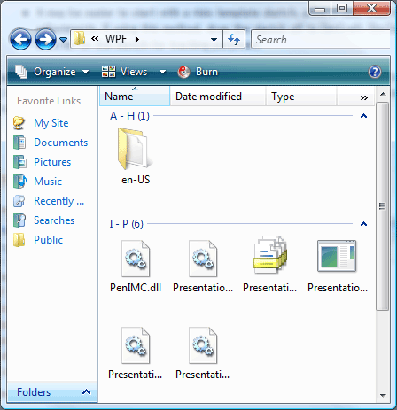

# Implementing the UI Automation Grid Control Pattern
> [!NOTE]
>  This documentation is intended for .NET Framework developers who want to use the managed [!INCLUDE[TLA2#tla_uiautomation](../../../includes/tla2sharptla-uiautomation-md.md)] classes defined in the <xref:System.Windows.Automation> namespace. For the latest information about [!INCLUDE[TLA2#tla_uiautomation](../../../includes/tla2sharptla-uiautomation-md.md)], see [Windows Automation API: UI Automation](http://go.microsoft.com/fwlink/?LinkID=156746).  
  
 This topic introduces guidelines and conventions for implementing <xref:System.Windows.Automation.Provider.IGridProvider>, including information about properties, methods, and events. Links to additional references are listed at the end of the overview.  
  
 The <xref:System.Windows.Automation.GridPattern> control pattern is used to support controls that act as containers for a collection of child elements. The children of this element must implement <xref:System.Windows.Automation.Provider.IGridItemProvider> and be organized in a two-dimensional logical coordinate system that can be traversed by row and column. For examples of controls that implement this control pattern, see [Control Pattern Mapping for UI Automation Clients](../../../docs/framework/ui-automation/control-pattern-mapping-for-ui-automation-clients.md).  
  
   
## Implementation Guidelines and Conventions  
 When implementing the Grid control pattern, note the following guidelines and conventions:  
  
-   Grid coordinates are zero-based with the upper left (or upper right cell depending on locale) having coordinates (0, 0).  
  
-   If a cell is empty, a UI Automation element must still be returned in order to support the <xref:System.Windows.Automation.Provider.IGridItemProvider.ContainingGrid%2A> property for that cell. This is possible when the layout of child elements in the grid is similar to a ragged array (see example below).  
  
   
Example of a Grid Control with Empty Coordinates  
  
-   A grid with a single item is still required to implement <xref:System.Windows.Automation.Provider.IGridProvider> if it is logically considered to be a grid. The number of child items in the grid is immaterial.  
  
-   Hidden rows and columns, depending on the provider implementation, may be loaded in the [!INCLUDE[TLA2#tla_uiautomation](../../../includes/tla2sharptla-uiautomation-md.md)] tree and therefore will be reflected in the <xref:System.Windows.Automation.GridPattern.GridPatternInformation.RowCount%2A> and <xref:System.Windows.Automation.GridPattern.GridPatternInformation.ColumnCount%2A> properties. If the hidden rows and columns have not yet been loaded, they should not be counted.  
  
-   <xref:System.Windows.Automation.Provider.IGridProvider> does not enable active manipulation of a grid; <xref:System.Windows.Automation.Provider.ITransformProvider> must be implemented to enable this functionality.  
  
-   Use a <xref:System.Windows.Automation.StructureChangedEventHandler> to listen for structural or layout changes to the grid such as cells that have been added, removed, or merged.  
  
-   Use a <xref:System.Windows.Automation.AutomationFocusChangedEventHandler> to track traversal through the items or cells of a grid.  
  
   
## Required Members for IGridProvider  
 The following properties and methods are required for implementing the IGridProvider interface.  
  
|Required members|Type|Notes|  
|----------------------|----------|-----------|  
|<xref:System.Windows.Automation.Provider.IGridProvider.RowCount%2A>|Property|None|  
|<xref:System.Windows.Automation.Provider.IGridProvider.ColumnCount%2A>|Property|None|  
|<xref:System.Windows.Automation.Provider.IGridProvider.GetItem%2A>|Method|None|  
  
 This control pattern has no associated events.  
  
   
## Exceptions  
 Providers must throw the following exceptions.  
  
|Exception type|Condition|  
|--------------------|---------------|  
|<xref:System.ArgumentOutOfRangeException>|<xref:System.Windows.Automation.Provider.IGridProvider.GetItem%2A>   -   If the requested row coordinate is larger than the <xref:System.Windows.Automation.Provider.IGridProvider.RowCount%2A> or the column coordinate is larger than the <xref:System.Windows.Automation.Provider.IGridProvider.ColumnCount%2A>.|  
|<xref:System.ArgumentOutOfRangeException>|<xref:System.Windows.Automation.Provider.IGridProvider.GetItem%2A>   -   If either of the requested row or column coordinates is less than zero.|  
  
## See Also  
 [UI Automation Control Patterns Overview](../../../docs/framework/ui-automation/ui-automation-control-patterns-overview.md)   
 [Support Control Patterns in a UI Automation Provider](../../../docs/framework/ui-automation/support-control-patterns-in-a-ui-automation-provider.md)   
 [UI Automation Control Patterns for Clients](../../../docs/framework/ui-automation/ui-automation-control-patterns-for-clients.md)   
 [Implementing the UI Automation GridItem Control Pattern](../../../docs/framework/ui-automation/implementing-the-ui-automation-griditem-control-pattern.md)   
 [UI Automation Tree Overview](../../../docs/framework/ui-automation/ui-automation-tree-overview.md)   
 [Use Caching in UI Automation](../../../docs/framework/ui-automation/use-caching-in-ui-automation.md)
