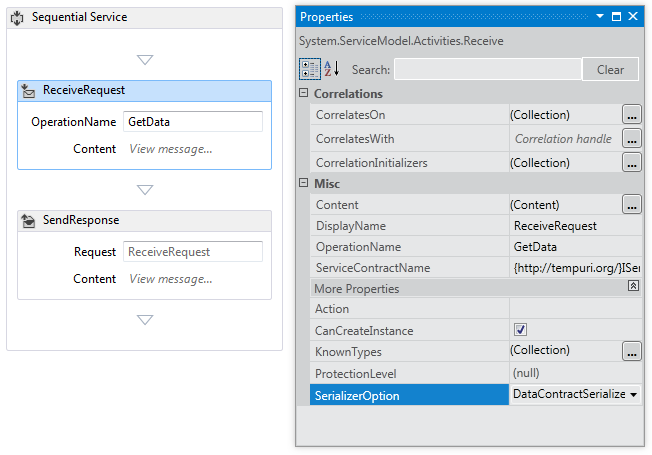
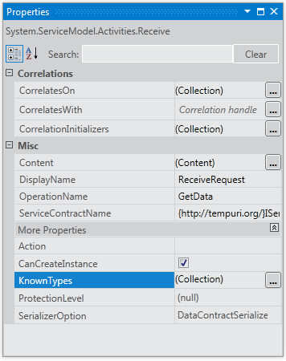
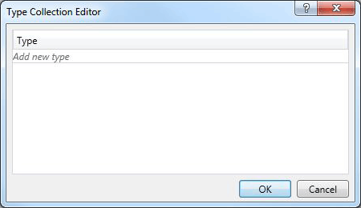

# Configuring Serialization in a Workflow Service
Workflow services are [!INCLUDE[indigo1](../../../../includes/indigo1-md.md)] services and so have the option of using either the <xref:System.Runtime.Serialization.DataContractSerializer> (the default) or the <xref:System.Xml.Serialization.XmlSerializer>. When writing non-workflow services the type of serializer to use is specified on the service or operation contract. When creating [!INCLUDE[indigo2](../../../../includes/indigo2-md.md)] workflow services you don’t specify these contracts in code, but rather they are generated at runtime by contract inference. [!INCLUDE[crabout](../../../../includes/crabout-md.md)] contract inference, see  [Using Contracts in Workflow](../../../../docs/framework/wcf/feature-details/using-contracts-in-workflow.md).  The serializer is specified using the <xref:System.ServiceModel.Activities.Receive.SerializerOption%2A> property. This can be set in the designer as shown in the following illustration.  
  
   
  
 The serializer can also be set in code as shown in the following example,  
  
```  
Receive approveExpense = new Receive  
            {  
                OperationName = "ApproveExpense",  
                CanCreateInstance = true,  
                ServiceContractName = "FinanceService",  
                SerializerOption = SerializerOption.DataContractSerializer,  
                Content = ReceiveContent.Create(new OutArgument<Expense>(expense))  
            };  
```  
  
 Known types can be specified on Workflow services as well. [!INCLUDE[crabout](../../../../includes/crabout-md.md)] Known Types see [Data Contract Known Types](../../../../docs/framework/wcf/feature-details/data-contract-known-types.md). Known types can be specified in the designer or in code. To specify known types in the designer, click the ellipsis button next to the KnownTypes property in the properties window for a <xref:System.ServiceModel.Activities.Receive> activity as shown in the following illustration.  
  
   
  
 This will display the Type Collections Editor that will allow you to search for and specify known types.  
  
   
  
 Click the **Add new type** link and use the drop down to select or search for a type to add to the known types collection. To specify known types in code use the <xref:System.ServiceModel.Activities.Receive.KnownTypes%2A> property as shown in the following example.  
  
```  
Receive approveExpense = new Receive  
            {  
                OperationName = "ApproveExpense",  
                CanCreateInstance = true,  
                ServiceContractName = "FinanceService",  
                SerializerOption = SerializerOption.DataContractSerializer,  
                Content = ReceiveContent.Create(new OutArgument<Expense>(expense))  
            };  
            approveExpense.KnownTypes.Add(typeof(Travel));  
            approveExpense.KnownTypes.Add(typeof(Meal));  
```  
  
 To see a complete code example showing how to configure serialization for a workflow service see [Formatting messages in Workflow Services](../../../../docs/framework/windows-workflow-foundation/samples/formatting-messages-in-workflow-services.md).
