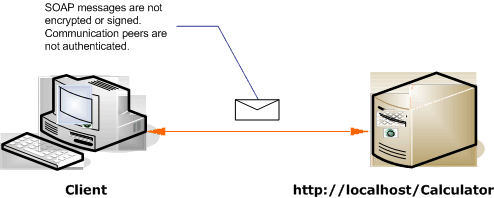

# Internet Unsecured Client and Service
The following illustration shows an example of a public, unsecured Windows Communication Foundation (WCF) client and service.  
  
   
  
|Characteristic|Description|  
|--------------------|-----------------|  
|Security Mode|None|  
|Transport|HTTP|  
|Binding|<xref:System.ServiceModel.BasicHttpBinding> in code, or the [\<basicHttpBinding>](../../../../docs/framework/configure-apps/file-schema/wcf/basichttpbinding.md) element in configuration.|  
|Interoperability|With existing Web service clients and services|  
|Authentication|None|  
|Integrity|None|  
|Confidentiality|None|  
  
## Service  
 The following code and configuration are meant to run independently. Do one of the following:  
  
-   Create a stand-alone service using the code with no configuration.  
  
-   Create a service using the supplied configuration, but do not define any endpoints.  
  
### Code  
 The following code shows how to create an endpoint with no security. By default, the <xref:System.ServiceModel.BasicHttpBinding> has the security mode set to <xref:System.ServiceModel.BasicHttpSecurityMode.None>.  
  
 [!code-csharp[C_UnsecuredService#1](../../../../samples/snippets/csharp/VS_Snippets_CFX/c_unsecuredservice/cs/source.cs#1)]
 [!code-vb[C_UnsecuredService#1](../../../../samples/snippets/visualbasic/VS_Snippets_CFX/c_unsecuredservice/vb/source.vb#1)]  
  
### Service Configuration  
 The following code sets up the same endpoint using configuration.  
  
```xml  
<?xml version="1.0" encoding="utf-8"?>  
<configuration>  
  <system.serviceModel>  
    <behaviors />  
    <services>  
      <service behaviorConfiguration="" name="ServiceModel.Calculator">  
        <endpoint address="http://localhost/Calculator"   
                  binding="basicHttpBinding"  
                  bindingConfiguration="Basic_Unsecured"   
                  name="BasicHttp_ICalculator"  
                  contract="ServiceModel.ICalculator" />  
      </service>  
    </services>  
    <bindings>  
      <basicHttpBinding>  
        <binding name="Basic_Unsecured" />  
      </basicHttpBinding>  
    </bindings>  
    <client />  
  </system.serviceModel>  
</configuration>  
```  
  
## Client  
 The following code and configuration are meant to run independently. Do one of the following:  
  
-   Create a stand-alone client using the code (and client code).  
  
-   Create a client that does not define any endpoint addresses. Instead, use the client constructor that takes the configuration name as an argument. For example:  
  
     [!code-csharp[C_SecurityScenarios#0](../../../../samples/snippets/csharp/VS_Snippets_CFX/c_securityscenarios/cs/source.cs#0)]
     [!code-vb[C_SecurityScenarios#0](../../../../samples/snippets/visualbasic/VS_Snippets_CFX/c_securityscenarios/vb/source.vb#0)]  
  
### Code  
 The following code shows a basic [!INCLUDE[indigo2](../../../../includes/indigo2-md.md)] client that accesses an unsecured endpoint.  
  
 [!code-csharp[C_UnsecuredClient#1](../../../../samples/snippets/csharp/VS_Snippets_CFX/c_unsecuredclient/cs/source.cs#1)]
 [!code-vb[C_UnsecuredClient#1](../../../../samples/snippets/visualbasic/VS_Snippets_CFX/c_unsecuredclient/vb/source.vb#1)]  
  
### Client Configuration  
 The following code configures the client.  
  
```xml  
<?xml version="1.0" encoding="utf-8"?>  
<configuration>  
  <system.serviceModel>  
    <bindings>  
      <basicHttpBinding>  
        <binding name="BasicHttpBinding_ICalculator" >  
          <security mode="None">  
          </security>  
        </binding>  
      </basicHttpBinding>  
    </bindings>  
    <client>  
      <endpoint address="http://localhost/Calculator/Unsecured"  
          binding="basicHttpBinding"   
          bindingConfiguration="BasicHttpBinding_ICalculator"  
          contract="ICalculator"   
          name="BasicHttpBinding_ICalculator" />  
    </client>  
  </system.serviceModel>  
</configuration>  
```  
  
## See Also  
 [Common Security Scenarios](../../../../docs/framework/wcf/feature-details/common-security-scenarios.md)  
 [Security Overview](../../../../docs/framework/wcf/feature-details/security-overview.md)  
 [Security Model for Windows Server App Fabric](http://go.microsoft.com/fwlink/?LinkID=201279&clcid=0x409)
