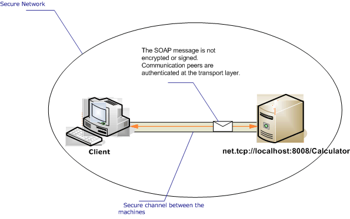

# Intranet Unsecured Client and Service
The following illustration depicts a simple Windows Communication Foundation (WCF) service developed to provide information on a secure private network to a WCF application. Security is not required because the data is of low importance, the network is expected to be inherently secure, or security is provided by a layer below the WCF infrastructure.  
  
   
  
|Characteristic|Description|  
|--------------------|-----------------|  
|Security Mode|None|  
|Transport|TCP|  
|Binding|<xref:System.ServiceModel.NetTcpBinding>|  
|Interoperability|WCF only|  
|Authentication|None|  
|Integrity|None|  
|Confidentiality|None|  
  
## Service  
 The following code and configuration are meant to run independently. Do one of the following:  
  
- Create a stand-alone service using the code with no configuration.  
  
- Create a service using the supplied configuration, but do not define any endpoints.  
  
### Code  
 The following code shows how to create an endpoint with no security:  
  
 [!code-csharp[C_UnsecuredService#2](../../../../samples/snippets/csharp/VS_Snippets_CFX/c_unsecuredservice/cs/source.cs#2)]
 [!code-vb[C_UnsecuredService#2](../../../../samples/snippets/visualbasic/VS_Snippets_CFX/c_unsecuredservice/vb/source.vb#2)]  
  
### Configuration  
 The following code sets up the same endpoint using configuration:  
  
```xml  
<?xml version="1.0" encoding="utf-8"?>  
<configuration>  
  <system.serviceModel>  
    <behaviors />  
    <services>  
      <service behaviorConfiguration=""
               name="ServiceModel.Calculator">  
        <endpoint address="net.tcp://localhost:8008/Calculator"
                  binding="netTcpBinding"  
                  bindingConfiguration="tcp_Unsecured"
                  name="netTcp_ICalculator"  
                  contract="ServiceModel.ICalculator" />  
      </service>  
    </services>  
    <bindings>  
      <netTcpBinding>  
        <binding name="tcp_Unsecured">  
          <security mode="None" />  
        </binding>  
      </netTcpBinding>  
    </bindings>  
    <client />  
  </system.serviceModel>  
</configuration>  
```  
  
## Client  
 The following code and configuration are meant to run independently. Do one of the following:  
  
- Create a stand-alone client using the code (and client code).  
  
- Create a client that does not define any endpoint addresses. Instead, use the client constructor that takes the configuration name as an argument. For example:  
  
     [!code-csharp[C_SecurityScenarios#0](../../../../samples/snippets/csharp/VS_Snippets_CFX/c_securityscenarios/cs/source.cs#0)]
     [!code-vb[C_SecurityScenarios#0](../../../../samples/snippets/visualbasic/VS_Snippets_CFX/c_securityscenarios/vb/source.vb#0)]  
  
### Code  
 The following code shows a basic WCF client that accesses an unsecured endpoint using the TCP protocol.  
  
 [!code-csharp[C_UnsecuredClient#2](../../../../samples/snippets/csharp/VS_Snippets_CFX/c_unsecuredclient/cs/source.cs#2)]
 [!code-vb[C_UnsecuredClient#2](../../../../samples/snippets/visualbasic/VS_Snippets_CFX/c_unsecuredclient/vb/source.vb#2)]  
  
### Configuration  
 The following configuration code applies to the client:  
  
```xml  
<?xml version="1.0" encoding="utf-8"?>  
<configuration>  
  <system.serviceModel>  
    <bindings>  
      <netTcpBinding>  
        <binding name="NetTcpBinding_ICalculator" >  
          <security mode="None">  
          </security>  
        </binding>  
      </netTcpBinding>  
    </bindings>  
    <client>  
      <endpoint address="net.tcp://machineName:8008/Calculator "  
                binding="netTcpBinding"
                bindingConfiguration="NetTcpBinding_ICalculator"  
                contract="ICalculator"
                name="NetTcpBinding_ICalculator" />  
    </client>  
  </system.serviceModel>  
</configuration>  
```  
  
## See also

- <xref:System.ServiceModel.NetTcpBinding>
- [Security Overview](../../../../docs/framework/wcf/feature-details/security-overview.md)
- [Security Model for Windows Server App Fabric](https://docs.microsoft.com/previous-versions/appfabric/ee677202(v=azure.10))
