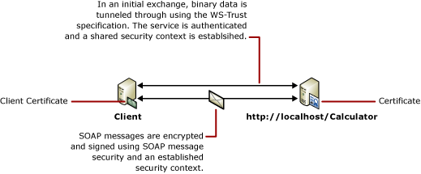

# Message Security with a Certificate Client
The following scenario shows a Windows Communication Foundation (WCF) client and service secured using message security mode. Both the client and the service are authenticated with certificates. For more information, see [Distributed Application Security](../../../../docs/framework/wcf/feature-details/distributed-application-security.md).

   
  
 For a sample application, see [Message Security Certificate](../../../../docs/framework/wcf/samples/message-security-certificate.md).  

|Characteristic|Description|  
|--------------------|-----------------|  
|Security Mode|Message|  
|Interoperability|WCF only|  
|Authentication (Server)|Using service certificate|  
|Authentication (Client)|Using client certificate|  
|Integrity|Yes|  
|Confidentiality|Yes|  
|Transport|HTTP|  
|Binding|<xref:System.ServiceModel.WSHttpBinding>|  
  
## Service  
 The following code and configuration are meant to run independently. Do one of the following:  
  
- Create a stand-alone service using the code with no configuration.  
  
- Create a service using the supplied configuration, but do not define any endpoints.  
  
### Code  
 The following code shows how to create a service endpoint that uses message security to establish a secure context.  
  
 [!code-csharp[C_SecurityScenarios#10](../../../../samples/snippets/csharp/VS_Snippets_CFX/c_securityscenarios/cs/source.cs#10)]
 [!code-vb[C_SecurityScenarios#10](../../../../samples/snippets/visualbasic/VS_Snippets_CFX/c_securityscenarios/vb/source.vb#10)]  
  
### Configuration  
 The following configuration can be used instead of the code.  
  
```xml  
<?xml version="1.0" encoding="utf-8"?>  
<configuration>  
  <system.serviceModel>  
    <behaviors>  
      <serviceBehaviors>  
        <behavior name="ServiceCredentialsBehavior">  
          <serviceCredentials>  
            <serviceCertificate findValue="Contoso.com"  
                                x509FindType="FindBySubjectName" />  
          </serviceCredentials>  
        </behavior>  
      </serviceBehaviors>  
    </behaviors>  
    <services>  
      <service behaviorConfiguration="ServiceCredentialsBehavior"   
               name="ServiceModel.Calculator">  
        <endpoint address="http://localhost/Calculator"   
                  binding="wsHttpBinding"  
                  bindingConfiguration="MessageAndCertificateClient"   
                  name="SecuredByClientCertificate"  
                  contract="ServiceModel.ICalculator" />  
      </service>  
    </services>  
    <bindings>  
      <wsHttpBinding>  
        <binding name="WSHttpBinding_ICalculator">  
          <security mode="Message">  
            <message clientCredentialType="Certificate" />  
          </security>  
        </binding>  
      </wsHttpBinding>  
    </bindings>  
    <client />  
  </system.serviceModel>  
</configuration>  
```  
  
## Client  
 The following code and configuration are meant to run independently. Do one of the following:  
  
- Create a stand-alone client using the code (and client code).  
  
- Create a client that does not define any endpoint addresses. Instead, use the client constructor that takes the configuration name as an argument. For example:  
  
     [!code-csharp[C_SecurityScenarios#0](../../../../samples/snippets/csharp/VS_Snippets_CFX/c_securityscenarios/cs/source.cs#0)]
     [!code-vb[C_SecurityScenarios#0](../../../../samples/snippets/visualbasic/VS_Snippets_CFX/c_securityscenarios/vb/source.vb#0)]  
  
### Code  
 The following code creates the client. The binding is to message mode security, and the client credential type is set to `Certificate`.  
  
 [!code-csharp[C_SecurityScenarios#17](../../../../samples/snippets/csharp/VS_Snippets_CFX/c_securityscenarios/cs/source.cs#17)]
 [!code-vb[C_SecurityScenarios#17](../../../../samples/snippets/visualbasic/VS_Snippets_CFX/c_securityscenarios/vb/source.vb#17)]  
  
### Configuration  
 The following configuration specifies the client certificate using an endpoint behavior. For more information about certificates, see [Working with Certificates](../../../../docs/framework/wcf/feature-details/working-with-certificates.md). The code also uses an <`identity`> element to specify a Domain Name System (DNS) of the expected server identity. For more information about identity, see [Service Identity and Authentication](../../../../docs/framework/wcf/feature-details/service-identity-and-authentication.md).  
  
```xml  
<?xml version="1.0" encoding="utf-8"?>  
<configuration>  
  <system.serviceModel>  
    <behaviors>  
      <endpointBehaviors>  
        <behavior name="endpointCredentialsBehavior">  
          <clientCredentials>  
            <clientCertificate findValue="Cohowinery.com"   
               storeLocation="LocalMachine"  
              x509FindType="FindBySubjectName" />  
          </clientCredentials>  
        </behavior>  
      </endpointBehaviors>  
    </behaviors>  
    <bindings>  
      <wsHttpBinding>  
        <binding name="WSHttpBinding_ICalculator" >  
          <security mode="Message">  
            <message clientCredentialType="Certificate" />  
          </security>  
        </binding>  
      </wsHttpBinding>  
    </bindings>  
    <client>  
      <endpoint address="http://machineName/Calculator"   
                behaviorConfiguration="endpointCredentialsBehavior"  
                binding="wsHttpBinding"  
                bindingConfiguration="WSHttpBinding_ICalculator"  
                contract="ICalculator"  
                name="WSHttpBinding_ICalculator">  
        <identity>  
          <dns value="Contoso.com" />  
        </identity>  
      </endpoint>  
    </client>  
  </system.serviceModel>  
</configuration>  
```  
  
## See also

- [Security Overview](../../../../docs/framework/wcf/feature-details/security-overview.md)
- [Service Identity and Authentication](../../../../docs/framework/wcf/feature-details/service-identity-and-authentication.md)
- [Working with Certificates](../../../../docs/framework/wcf/feature-details/working-with-certificates.md)
- [Security Model for Windows Server App Fabric](https://docs.microsoft.com/previous-versions/appfabric/ee677202(v=azure.10))
