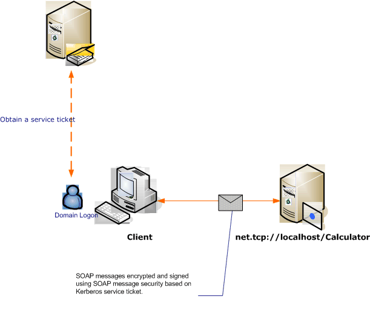

# Message Security with a Windows Client without Credential Negotiation
The following scenario shows a Windows Communication Foundation (WCF) client and service secured by the Kerberos protocol.  
  
 Both the service and the client are in the same domain or trusted domains.  
  
> [!NOTE]
> The difference between this scenario and [Message Security with a Windows Client](../../../../docs/framework/wcf/feature-details/message-security-with-a-windows-client.md) is that this scenario does not negotiate the service credential with the service prior to sending the application message. Additionally, because this requires the Kerberos protocol, this scenario requires a Windows domain environment.  
  
   
  
|Characteristic|Description|  
|--------------------|-----------------|  
|Security Mode|Message|  
|Interoperability|Yes, WS-Security with Kerberos token-profile compatible clients|  
|Authentication (Server)|Mutual authentication of the server and client|  
|Authentication (Client)|Mutual authentication of the server and client|  
|Integrity|Yes|  
|Confidentiality|Yes|  
|Transport|HTTP|  
|Binding|<xref:System.ServiceModel.WSHttpBinding>|  
  
## Service  
 The following code and configuration are meant to run independently. Do one of the following:  
  
- Create a stand-alone service using the code with no configuration.  
  
- Create a service using the supplied configuration, but do not define any endpoints.  
  
### Code  
 The following code creates a service endpoint that uses message security. The code disables service credential negotiation, and the establishment of a security context token (SCT).  
  
> [!NOTE]
> To use the Windows credential type without negotiation, the service's user account must have access to service principal name (SPN) that is registered with the Active Directory domain. You can do this in two ways:  
  
1. Use the `NetworkService` or `LocalSystem` account to run your service. Because those accounts have access to the machine SPN that is established when the machine joins the Active Directory domain, WCF automatically generates the proper SPN element inside the service's endpoint in the service's metadata (Web Services Description Language, or WSDL).  
  
2. Use an arbitrary Active Directory domain account to run your service. In this case, you need to establish an SPN for that domain account. One way of doing this is to use the Setspn.exe utility tool. Once the SPN is created for the service's account, configure WCF to publish that SPN to the service's clients through its metadata (WSDL). This is done by setting the endpoint identity for the exposed endpoint, either though an application configuration file or code. The following example publishes the identity programmatically.  
  
 For more information about SPNs, the Kerberos protocol, and Active Directory, see [Kerberos Technical Supplement for Windows](https://go.microsoft.com/fwlink/?LinkId=88330). For more information about endpoint identities, see [SecurityBindingElement Authentication Modes](../../../../docs/framework/wcf/feature-details/securitybindingelement-authentication-modes.md).  
  
 [!code-csharp[C_SecurityScenarios#12](../../../../samples/snippets/csharp/VS_Snippets_CFX/c_securityscenarios/cs/source.cs#12)]
 [!code-vb[C_SecurityScenarios#12](../../../../samples/snippets/visualbasic/VS_Snippets_CFX/c_securityscenarios/vb/source.vb#12)]  
  
### Configuration  
 The following configuration can be used instead of the code.  
  
```xml  
<?xml version="1.0" encoding="utf-8"?>  
<configuration>  
  <system.serviceModel>  
    <behaviors />  
    <services>  
      <service behaviorConfiguration="" name="ServiceModel.Calculator">  
        <endpoint address="http://localhost/Calculator"   
                  binding="wsHttpBinding"  
                  bindingConfiguration="KerberosBinding"  
                  name="WSHttpBinding_ICalculator"  
                  contract="ServiceModel.ICalculator"   
                  listenUri="net.tcp://localhost/metadata" >  
         <identity>  
            <servicePrincipalName value="service_spn_name" />  
         </identity>  
        </endpoint>  
      </service>  
    </services>  
    <bindings>  
      <wsHttpBinding>  
        <binding name="KerberosBinding">  
          <security>  
            <message negotiateServiceCredential="false"   
                     establishSecurityContext="false" />  
          </security>  
        </binding>  
      </wsHttpBinding>  
    </bindings>  
    <client />  
  </system.serviceModel>  
</configuration>  
```  
  
## Client  
 The following code and configuration are meant to run independently. Do one of the following:  
  
- Create a stand-alone client using the code (and client code).  
  
- Create a client that does not define any endpoint addresses. Instead, use the client constructor that takes the configuration name as an argument. For example:  
  
     [!code-csharp[C_SecurityScenarios#0](../../../../samples/snippets/csharp/VS_Snippets_CFX/c_securityscenarios/cs/source.cs#0)]
     [!code-vb[C_SecurityScenarios#0](../../../../samples/snippets/visualbasic/VS_Snippets_CFX/c_securityscenarios/vb/source.vb#0)]  
  
### Code  
 The following code configures the client. The security mode is set to Message, and the client credential type is set to Windows. Note that the <xref:System.ServiceModel.MessageSecurityOverHttp.NegotiateServiceCredential%2A> and <xref:System.ServiceModel.NonDualMessageSecurityOverHttp.EstablishSecurityContext%2A> properties are set to `false`.  
  
> [!NOTE]
> To use Windows credential type without negotiation, the client must be configured with the service's account SPN prior to commencing the communication with the service. The client uses the SPN to get the Kerberos token to authenticate and secure the communication with the service. The following sample shows how to configure the client with the service's SPN. If you are using the [ServiceModel Metadata Utility Tool (Svcutil.exe)](../../../../docs/framework/wcf/servicemodel-metadata-utility-tool-svcutil-exe.md) to generate the client, the service's SPN will be automatically propagated to the client from the service's metadata (WSDL), if the service's metadata contains that information. For more information about how to configure the service to include its SPN in the service's metadata, see the "Service" section later in this topic .  
>   
>  For more information about SPNs, Kerberos, and Active Directory, see [Kerberos Technical Supplement for Windows](https://go.microsoft.com/fwlink/?LinkId=88330). For more information about endpoint identities, see [SecurityBindingElement Authentication Modes](../../../../docs/framework/wcf/feature-details/securitybindingelement-authentication-modes.md) topic.  
  
 [!code-csharp[C_SecurityScenarios#19](../../../../samples/snippets/csharp/VS_Snippets_CFX/c_securityscenarios/cs/source.cs#19)]
 [!code-vb[C_SecurityScenarios#19](../../../../samples/snippets/visualbasic/VS_Snippets_CFX/c_securityscenarios/vb/source.vb#19)]  
  
### Configuration  
 The following code configures the client. Note that the [\<servicePrincipalName>](../../../../docs/framework/configure-apps/file-schema/wcf/serviceprincipalname.md) element must be set to match the service's SPN as registered for the service's account in the Active Directory domain.  
  
```xml  
<?xml version="1.0" encoding="utf-8"?>  
<configuration>  
  <system.serviceModel>  
    <bindings>  
      <wsHttpBinding>  
        <binding name="WSHttpBinding_ICalculator" >  
          <security mode="Message">  
            <message clientCredentialType="Windows"   
                     negotiateServiceCredential="false"  
                     establishSecurityContext="false" />  
          </security>  
        </binding>  
      </wsHttpBinding>  
    </bindings>  
    <client>  
      <endpoint address="http://localhost/Calculator"   
                binding="wsHttpBinding"  
                bindingConfiguration="WSHttpBinding_ICalculator"  
                contract="ICalculator"  
                name="WSHttpBinding_ICalculator">  
        <identity>  
          <servicePrincipalName value="service_spn_name" />  
        </identity>  
      </endpoint>  
    </client>  
  </system.serviceModel>  
</configuration>  
```  
  
## See also

- [Security Overview](../../../../docs/framework/wcf/feature-details/security-overview.md)
- [Service Identity and Authentication](../../../../docs/framework/wcf/feature-details/service-identity-and-authentication.md)
- [Security Model for Windows Server App Fabric](https://go.microsoft.com/fwlink/?LinkID=201279&clcid=0x409)
