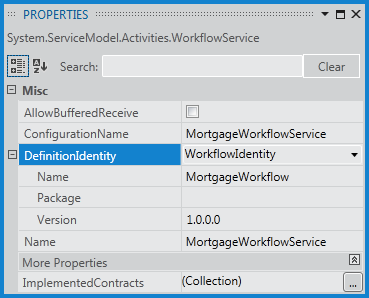
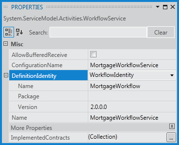

# Side by Side Versioning in WorkflowServiceHost

The <xref:System.ServiceModel.Activities.WorkflowServiceHost> side-by-side versioning introduced in .NET Framework 4.5 provides the capability to host multiple versions of a workflow service on a single endpoint. The side-by-side functionality provided allows a workflow service to be configured so that new instances of the workflow service are created using the new workflow definition, while running instances complete using the existing definition. This topic provides an overview of workflow service side-by-side execution using <xref:System.ServiceModel.Activities.WorkflowServiceHost>.  
  
> [!NOTE]
> To download a sample and watch a video walkthrough of workflow service side-by-side versioning, see [Side by Side Versioning with a Web-Hosted Xamlx Workflow Service](https://go.microsoft.com/fwlink/?LinkId=393746).  
  
## Hosting Multiple Versions in a Workflow Service  

 <xref:System.ServiceModel.Activities.WorkflowServiceHost> contains two properties that can be configured to allow multiple versions of a workflow to execute side-by-side: <xref:System.ServiceModel.Activities.WorkflowServiceHost.SupportedVersions%2A> and <xref:System.ServiceModel.Activities.WorkflowService.DefinitionIdentity%2A>. <xref:System.ServiceModel.Activities.WorkflowServiceHost.SupportedVersions%2A> contains the supported versions of the workflow service, and <xref:System.ServiceModel.Activities.WorkflowService.DefinitionIdentity%2A> is used to uniquely identify each workflow service. This is done by associating a <xref:System.Activities.WorkflowIdentity> with the workflow service. A <xref:System.Activities.WorkflowIdentity> contains three identifying pieces of information. <xref:System.Activities.WorkflowIdentity.Name%2A> and <xref:System.Activities.WorkflowIdentity.Version%2A> contain a name and a <xref:System.Version> and are required, and <xref:System.Activities.WorkflowIdentity.Package%2A> is optional and can be used to specify an additional string containing information such as assembly name or other desired information. Each workflow service contained in the <xref:System.ServiceModel.Activities.WorkflowServiceHost.SupportedVersions%2A> collection must have a unique <xref:System.Activities.WorkflowIdentity>. A <xref:System.Activities.WorkflowIdentity> is unique if any of its three properties are different from another <xref:System.Activities.WorkflowIdentity>. A `null` <xref:System.Activities.WorkflowIdentity> is an allowable value for <xref:System.ServiceModel.Activities.WorkflowService.DefinitionIdentity%2A>, but only one previous version of a workflow service may have a `null` <xref:System.Activities.WorkflowIdentity>.  
  
> [!IMPORTANT]
> A <xref:System.Activities.WorkflowIdentity> should not contain any personally identifiable information (PII). <xref:System.Activities.WorkflowIdentity> is composed of three parts: a <xref:System.Activities.WorkflowIdentity.Name%2A> (<xref:System.String>), a <xref:System.Activities.WorkflowIdentity.Version%2A> (<xref:System.Version>), and a <xref:System.Activities.WorkflowIdentity.Package%2A> (<xref:System.String>). Information about the <xref:System.Activities.WorkflowIdentity> used to create an instance is emitted to any configured tracking services at several different points of the activity life-cycle by the runtime. WF Tracking does not have any mechanism to hide PII (sensitive user data). Therefore, a <xref:System.Activities.WorkflowIdentity> instance should not contain any PII data as it will be emitted by the runtime in tracking records and may be visible to anyone with access to view the tracking records.  
  
### Rules for Hosting Multiple Versions of a Workflow Service  

 When a user adds an additional version to the <xref:System.ServiceModel.Activities.WorkflowServiceHost>, there are several conditions that must be met in order for a workflow service to be hosted with the same set of endpoints and description. If any of the additional versions fail to meet these conditions, the <xref:System.ServiceModel.Activities.WorkflowServiceHost> throws an exception when `Open` is called. Each workflow definition provided to the host as an additional version must meet the following requirements (where the primary version is the workflow service definition that is provided to the host constructor). The additional workflow version must:  
  
- Have the same the <xref:System.ServiceModel.Activities.WorkflowService.Name%2A> as the primary version of the workflow service.  
  
- Must not have any <xref:System.ServiceModel.Activities.Receive> or <xref:System.ServiceModel.Activities.SendReply> activities in its <xref:System.ServiceModel.Activities.WorkflowService.Body%2A> that are not in the primary version, and they must match the operation contract.  
  
- Have a unique <xref:System.ServiceModel.Activities.WorkflowService.DefinitionIdentity%2A>. One and only one workflow definition may have a `null`<xref:System.ServiceModel.Activities.WorkflowService.DefinitionIdentity%2A>.  
  
 Some changes are permitted. The following items may be different between the versions:  
  
- The <xref:System.ServiceModel.Activities.WorkflowService.DefinitionIdentity%2A> may have a different Name and Package than the primary version.  
  
- The <xref:System.ServiceModel.Activities.WorkflowService.AllowBufferedReceive%2A> value may be different than the primary version.  
  
- The <xref:System.ServiceModel.Activities.WorkflowService.ConfigurationName%2A> may be different than the primary version.  
  
- The <xref:System.ServiceModel.Activities.WorkflowService.ImplementedContracts%2A> may be different than the primary version.  
  
### Configuring the DefinitionIdentity  

 When a workflow service is created using the workflow designer, the <xref:System.ServiceModel.Activities.WorkflowService.DefinitionIdentity%2A> is set using the **Properties** window. Click outside of the service’s root activity in the designer to select the workflow service, and choose **Properties Window** from the **View** menu. Select **WorkflowIdentity** from the drop-down list that appears beside the **DefinitionIdentity** property, and then expand and specify the desired <xref:System.Activities.WorkflowIdentity> properties. In the following example the <xref:System.ServiceModel.Activities.WorkflowService.DefinitionIdentity%2A> is configured with the <xref:System.Activities.WorkflowIdentity.Name%2A> `MortgageWorkflow` and a <xref:System.Activities.WorkflowIdentity.Version%2A> of `1.0.0.0`. <xref:System.Activities.WorkflowIdentity.Package%2A> is optional and in this example is `null`.  
  
   
  
 When a workflow service is self-hosted, the <xref:System.ServiceModel.Activities.WorkflowService.DefinitionIdentity%2A> is configured when the workflow service is constructed. In the following example, the <xref:System.ServiceModel.Activities.WorkflowService.DefinitionIdentity%2A> is configured with the same values as the previous example, with the <xref:System.Activities.WorkflowIdentity.Name%2A> `MortgageWorkflow` and a <xref:System.Activities.WorkflowIdentity.Name%2A> of `1.0.0.0`.  
  
```csharp  
WorkflowService service = new WorkflowService  
{  
    Name = "MortgageWorkflowService",  
    Body = new MortgageWorkflow(),  
    DefinitionIdentity = new WorkflowIdentity  
    {  
        Name = "MortgageWorkflow",  
        Version = new Version(1, 0, 0, 0)  
    }  
};  
```  
  
```vb  
Dim service As New WorkflowService  
With service  
    .Name = "MortgageWorkflowService"  
    .Body = New MortgageWorkflow  
    .DefinitionIdentity = New WorkflowIdentity With _  
    { _  
        .Name = "MortgageWorkflow", _  
        .Version = New Version(1, 0, 0, 0) _  
    }  
End With  
```  
  
 A <xref:System.ServiceModel.Activities.WorkflowService.DefinitionIdentity%2A> is not required, although only one version of the workflow service may have a **null**<xref:System.ServiceModel.Activities.WorkflowService.DefinitionIdentity%2A>.  
  
> [!NOTE]
> This is useful if the service was deployed initially without a <xref:System.ServiceModel.Activities.WorkflowService.DefinitionIdentity%2A> configured, and then an updated version is created.  
  
### Adding a New Version to a Web-hosted Workflow Service  

 The first step in configuring a new version of a workflow service in a web-hosted service is to create a new folder in the `App_Code` folder that has the same name as the service file. If the service’s `xamlx` file is named `MortgageWorkflow.xamlx`, then the folder must be named `MortgageWorkflow`. Place a copy of the original service’s `xamlx` file into this folder and rename it to a new name, such as `MortgageWorkflowV1.xamlx`. Make the desired changes to the primary service, update its <xref:System.ServiceModel.Activities.WorkflowService.DefinitionIdentity%2A>, and then deploy the service. In the following example the <xref:System.ServiceModel.Activities.WorkflowService.DefinitionIdentity%2A> has been updated with a <xref:System.Activities.WorkflowIdentity.Name%2A> of `MortgageWorkflow` and a <xref:System.Activities.WorkflowIdentity.Version%2A> of `2.0.0.0`.  
  
   
  
 When the service restarts, the previous version will automatically be added to the <xref:System.ServiceModel.Activities.WorkflowServiceHost.SupportedVersions%2A> collection because it is located in the designated `App_Code` subfolder. Note that if the primary version of the workflow service has a `null` <xref:System.ServiceModel.Activities.WorkflowService.DefinitionIdentity%2A> the previous versions will not be added. One version may have a `null`<xref:System.ServiceModel.Activities.WorkflowService.DefinitionIdentity%2A>, but if there are multiple versions the primary version must not be the one with the `null`<xref:System.ServiceModel.Activities.WorkflowService.DefinitionIdentity%2A> or else the previous versions will not be added to the <xref:System.ServiceModel.Activities.WorkflowServiceHost.SupportedVersions%2A> collection.  
  
### Adding a New Version to a Self-hosted Workflow Service  

 When adding a new version to a self-hosted workflow service, the <xref:System.ServiceModel.Activities.WorkflowServiceHost> is configured with the primary version of the workflow service, and previous versions must be explicitly added to the <xref:System.ServiceModel.Activities.WorkflowServiceHost.SupportedVersions%2A> collection. In the following example, a <xref:System.ServiceModel.Activities.WorkflowServiceHost> is configured with a primary workflow service that uses a `MortgageWorkflowV2` workflow definition, and a workflow service configured with a `MortgageWorkflowV1` workflow definition is added to the <xref:System.ServiceModel.Activities.WorkflowServiceHost.SupportedVersions%2A> collection. Each workflow service is configured with a unique <xref:System.ServiceModel.Activities.WorkflowService.DefinitionIdentity%2A> that reflects the version of the workflow definition.  
  
```csharp  
// Create the primary version of the workflow service.  
WorkflowService serviceV2 = new WorkflowService  
{  
    Name = "MortgageWorkflowService",  
    Body = new MortgageWorkflowV2(),  
    DefinitionIdentity = new WorkflowIdentity  
    {  
        Name = "MortgageWorkflow",  
        Version = new Version(2, 0, 0, 0)  
    }  
};  
  
// Configure the WorkflowServiceHost with the current version  
// of the workflow service. This code requires Administrator  
// privileges to function correctly. If running from Visual  
// Studio, Visual Studio must be run with Administrator privileges.  
WorkflowServiceHost host = new WorkflowServiceHost(serviceV2,
    new Uri("http://localhost:8080/MortgageWorkflowService"));  
  
// Create the previous version of the workflow service.  
WorkflowService serviceV1 = new WorkflowService  
{  
    Name = "MortgageWorkflowService",  
    Body = new MortgageWorkflowV1(),  
    DefinitionIdentity = new WorkflowIdentity  
    {  
        Name = "MortgageWorkflow",  
        Version = new Version(1, 0, 0, 0)  
    }  
};  
  
// Add the previous version of the service to the SupportedVersions collection.  
host.SupportedVersions.Add(serviceV1);  
```  
  
```vb  
'Create the primary version of the workflow service  
Dim serviceV2 As New WorkflowService  
With serviceV2  
    .Name = "MortgageWorkflowService"  
    .Body = New MortgageWorkflowV2  
    .DefinitionIdentity = New WorkflowIdentity With _  
    { _  
        .Name = "MortgageWorkflow", _  
        .Version = New Version(2, 0, 0, 0) _  
    }  
End With  
  
'Configure the WorkflowServiceHost with the current version  
'of the workflow service. This code requires Administrator  
'privileges to function correctly. If running from Visual  
'Studio, Visual Studio must be run with Administrator privileges.  
  
Dim host As New WorkflowServiceHost(serviceV2, _  
    New Uri("http://localhost:8080/MortgageWorkflowService"))  
  
'Create the previous version of the workflow service.  
Dim serviceV1 As New WorkflowService  
With serviceV1  
    .Name = "MortgageWorkflowService"  
    .Body = New MortgageWorkflowV1  
    .DefinitionIdentity = New WorkflowIdentity With _  
    { _  
        .Name = "MortgageWorkflow", _  
        .Version = New Version(1, 0, 0, 0) _  
    }  
End With  
  
'Add the previous version of the service to the SupportedVersions collection.  
host.SupportedVersions.Add(serviceV1)  
```
