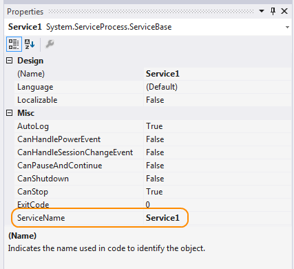

# How to: Create Windows Services
When you create a service, you can use a Visual Studio project template called **Windows Service**. This template automatically does much of the work for you by referencing the appropriate classes and namespaces, setting up the inheritance from the base class for services, and overriding several of the methods you're likely to want to override.  
  
> [!WARNING]
>  The Windows Services project template is not available in the Express edition of Visual Studio.  
  
 At a minimum, to create a functional service you must:  
  
- Set the <xref:System.ServiceProcess.ServiceBase.ServiceName%2A> property.  
  
- Create the necessary installers for your service application.  
  
- Override and specify code for the <xref:System.ServiceProcess.ServiceBase.OnStart%2A> and <xref:System.ServiceProcess.ServiceBase.OnStop%2A> methods to customize the ways in which your service behaves.  
  
### To create a Windows Service application  
  
1. Create a **Windows Service** project.  
  
    > [!NOTE]
    >  For instructions on writing a service without using the template, see [How to: Write Services Programmatically](how-to-write-services-programmatically.md).  
  
2. In the **Properties** window, set the <xref:System.ServiceProcess.ServiceBase.ServiceName%2A> property for your service.  
  
       
  
    > [!NOTE]
    >  The value of the <xref:System.ServiceProcess.ServiceBase.ServiceName%2A> property must always match the name recorded in the installer classes. If you change this property, you must update the <xref:System.ServiceProcess.ServiceBase.ServiceName%2A> property of installer classes as well.  
  
3. Set any of the following properties to determine how your service will function.  
  
    |Property|Setting|  
    |--------------|-------------|  
    |<xref:System.ServiceProcess.ServiceBase.CanStop%2A>|`True` to indicate that the service will accept requests to stop running; `false` to prevent the service from being stopped.|  
    |<xref:System.ServiceProcess.ServiceBase.CanShutdown%2A>|`True` to indicate that the service wants to receive notification when the computer on which it lives shuts down, enabling it to call the <xref:System.ServiceProcess.ServiceBase.OnShutdown%2A> procedure.|  
    |<xref:System.ServiceProcess.ServiceBase.CanPauseAndContinue%2A>|`True` to indicate that the service will accept requests to pause or to resume running; `false` to prevent the service from being paused and resumed.|  
    |<xref:System.ServiceProcess.ServiceBase.CanHandlePowerEvent%2A>|`True` to indicate that the service can handle notification of changes to the computer's power status; `false` to prevent the service from being notified of these changes.|  
    |<xref:System.ServiceProcess.ServiceBase.AutoLog%2A>|`True` to write informational entries to the Application event log when your service performs an action; `false` to disable this functionality. For more information, see [How to: Log Information About Services](how-to-log-information-about-services.md). **Note:**  By default, <xref:System.ServiceProcess.ServiceBase.AutoLog%2A> is set to `true`.|  
  
    > [!NOTE]
    >  When <xref:System.ServiceProcess.ServiceBase.CanStop%2A> or <xref:System.ServiceProcess.ServiceBase.CanPauseAndContinue%2A> are set to `false`, the **Service Control Manager** will disable the corresponding menu options to stop, pause, or continue the service.  
  
4. Access the Code Editor and fill in the processing you want for the <xref:System.ServiceProcess.ServiceBase.OnStart%2A> and <xref:System.ServiceProcess.ServiceBase.OnStop%2A> procedures.  
  
5. Override any other methods for which you want to define functionality.  
  
6. Add the necessary installers for your service application. For more information, see [How to: Add Installers to Your Service Application](how-to-add-installers-to-your-service-application.md).  
  
7. Build your project by selecting **Build Solution** from the **Build** menu.  
  
    > [!NOTE]
    >  Do not press F5 to run your project — you cannot run a service project in this way.  
  
8. Install the service. For more information, see [How to: Install and Uninstall Services](how-to-install-and-uninstall-services.md).  
  
## See also

- [Introduction to Windows Service Applications](introduction-to-windows-service-applications.md)
- [How to: Write Services Programmatically](how-to-write-services-programmatically.md)
- [How to: Add Installers to Your Service Application](how-to-add-installers-to-your-service-application.md)
- [How to: Log Information About Services](how-to-log-information-about-services.md)
- [How to: Start Services](how-to-start-services.md)
- [How to: Specify the Security Context for Services](how-to-specify-the-security-context-for-services.md)
- [How to: Install and Uninstall Services](how-to-install-and-uninstall-services.md)
- [Walkthrough: Creating a Windows Service Application in the Component Designer](walkthrough-creating-a-windows-service-application-in-the-component-designer.md)
