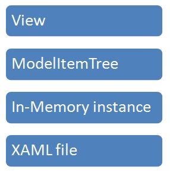

# Programming Model Item Tree
This sample demonstrates how to navigate the <xref:System.Activities.Presentation.Model.ModelItem> tree using declarative data binding from the [!INCLUDE[avalon1](../../../../includes/avalon1-md.md)] Tree View.  
  
## Sample Details  
 The <xref:System.Activities.Presentation.Model.ModelItem> tree is the abstraction that is used by the [!INCLUDE[wfd1](../../../../includes/wfd1-md.md)] infrastructure to expose the data about the underlying instance being edited. The following illustration is a depiction of the various layers of infrastructure within the [!INCLUDE[wfd2](../../../../includes/wfd2-md.md)].  
  
   
  
 A <xref:System.Activities.Presentation.Model.ModelItem> consists of a pointer to the underlying value, as well as a collection of <xref:System.Activities.Presentation.Model.ModelProperty> objects. A <xref:System.Activities.Presentation.Model.ModelProperty> object in turn, consists of data such as the name and type of the property and then a pointer to the value, which in turn, is another <xref:System.Activities.Presentation.Model.ModelItem>. A value converter is used to manipulate some of the <xref:System.Activities.Presentation.Model.ModelItem>s returned from a <xref:System.Activities.Presentation.Model.ModelProperty> to make them appear correctly in the tree view. The sample then demonstrates how to imperatively program against the <xref:System.Activities.Presentation.Model.ModelItem> tree using the imperative syntax, as seen in the following example.  
  
```csharp  
ModelItem mi = wd.Context.Services.GetService<ModelService>().Root;  
ModelProperty mp = mi.Properties["Activities"];  
mp.Collection.Add(new Persist());  
ModelItem justAdded = mp.Collection.Last();  
justAdded.Properties["DisplayName"].SetValue("new name");  
  
```  
  
#### To use this sample  
  
1.  Open the ProgrammingModelItemTree.sln solution in [!INCLUDE[vs2010](../../../../includes/vs2010-md.md)].  
  
2.  Build the solution by selecting **Build Solution** from the **Build** menu.  
  
3.  Press F5 to run the application. The [!INCLUDE[avalon2](../../../../includes/avalon2-md.md)] form is then displayed.  
  
4.  Click the **Load WF** button to load the <xref:System.Activities.Presentation.Model.ModelItem> and bind it to the tree view.  
  
5.  Clicking the **Change Model Item Tree** button executes the preceding code to add an item into the tree and set a property.  
  
> [!IMPORTANT]
>  The samples may already be installed on your computer. Check for the following (default) directory before continuing.  
>   
>  `<InstallDrive>:\WF_WCF_Samples`  
>   
>  If this directory does not exist, go to [Windows Communication Foundation (WCF) and Windows Workflow Foundation (WF) Samples for .NET Framework 4](http://go.microsoft.com/fwlink/?LinkId=150780) to download all [!INCLUDE[indigo1](../../../../includes/indigo1-md.md)] and [!INCLUDE[wf1](../../../../includes/wf1-md.md)] samples. This sample is located in the following directory.  
>   
>  `<InstallDrive>:\WF_WCF_Samples\WF\Basic\Designer\ProgrammingModelItemTree`  
  
## See Also  
 <xref:System.Windows.Data.IValueConverter>