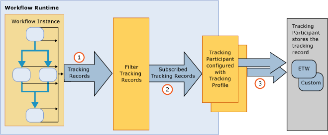

# Workflow Tracking and Tracing
Windows Workflow tracking is a [!INCLUDE[netfx_current_long](../../../includes/netfx-current-long-md.md)] feature designed to provide visibility into workflow execution. It provides a tracking infrastructure to track the execution of a workflow instance. The WF tracking infrastructure transparently instruments a workflow to emit records reflecting key events during the execution. This functionality is available by default for any [!INCLUDE[netfx_current_short](../../../includes/netfx-current-short-md.md)] workflow. No changes are required to be made to a [!INCLUDE[netfx_current_long](../../../includes/netfx-current-long-md.md)] workflow for tracking to occur. It is just a matter of deciding how much tracking data you want to receive. When a workflow instance starts or completes, its processing tracking records are emitted. Tracking can also extract business-relevant data associated with the workflow variables. For example, if the workflow represents an order processing system, the order ID can be extracted along with the <xref:System.Activities.Tracking.TrackingRecord> object. In general, enabling WF tracking facilitates diagnostics or business analytics data to be accessed from a workflow execution.  
  
 These tracking components are equivalent to the tracking service in [!INCLUDE[vstecwinfx](../../../includes/vstecwinfx-md.md)]. In [!INCLUDE[netfx_current_short](../../../includes/netfx-current-short-md.md)], the performance has been improved and the programming model simplified for the WF tracking feature. The tracking runtime instruments a workflow instance to emit events related to the workflow life cycle, workflow activities and custom events.  
  
 Windows Server App Fabric also provides the ability to monitor the execution of a WCF and workflow services. For more information, see [Windows Server App Fabric Monitoring](https://go.microsoft.com/fwlink/?LinkId=201273) and [Monitoring Applications with Windows Server AppFabric](https://go.microsoft.com/fwlink/?LinkId=201287)  
  
 To troubleshoot the workflow runtime, you can turn on diagnostic workflow tracing. For more information, see [Workflow Tracing](workflow-tracing.md).  
  
 To understand the programming model, the primary components of the tracking infrastructure are discussed in this topic:  
  
-   <xref:System.Activities.Tracking.TrackingRecord> objects emitted from the workflow runtime. For more information, see [Tracking Records](tracking-records.md).  
  
-   <xref:System.Activities.Tracking.TrackingParticipant> objects subscribe to <xref:System.Activities.Tracking.TrackingRecord> objects. The tracking participants contain the logic to process the payload from the <xref:System.Activities.Tracking.TrackingRecord> objects (for example, they could choose to write to a file). For more information, see [Tracking Participants](tracking-participants.md).  
  
-   <xref:System.Activities.Tracking.TrackingProfile> objects filter tracking records emitted from a workflow instance. For more information, see [Tracking Profiles](tracking-profiles.md).  
  
## Workflow Tracking Infrastructure  
 The workflow tracking infrastructure follows a publish-and-subscribe paradigm. The workflow instance is the publisher of tracking records, while subscribers of the tracking records are registered as extensions to the workflow. These extensions that subscribe to <xref:System.Activities.Tracking.TrackingRecord> objects are called tracking participants. Tracking participants are extensibility points that access <xref:System.Activities.Tracking.TrackingRecord> objects and process them in whatever manner they are written to do so. The tracking infrastructure allows the application of a filter on the outgoing tracking records to allow a participant to subscribe to a subset of the records. This filtering mechanism is accomplished through a tracking profile file.  
  
 A high level view of the tracking infrastructure is shown in the following illustration.  
  
   
  
## In This Section  
 [Tracking Records](tracking-records.md)  
 Describes the tracking records that the workflow runtime emits.  
  
 [Tracking Profiles](tracking-profiles.md)  
 Discusses how tracking profiles are used.  
  
 [Tracking Participants](tracking-participants.md)  
 Describes how to use system-provided tracking participant or how to create custom tracking participants.  
  
 [Configuring Tracking for a Workflow](configuring-tracking-for-a-workflow.md)  
 Describes how to configure tracking for a workflow.  
  
 [Workflow Tracing](workflow-tracing.md)  
 Describes the two ways to enable debug tracing for a workflow.  
  
## See also
- [SQL Tracking](./samples/sql-tracking.md)
