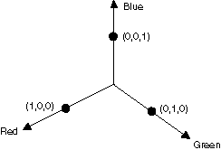
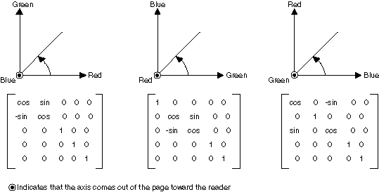

# How to: Rotate Colors
Rotation in a four-dimensional color space is difficult to visualize. We can make it easier to visualize rotation by agreeing to keep one of the color components fixed. Suppose we agree to keep the alpha component fixed at 1 (fully opaque). Then we can visualize a three-dimensional color space with red, green, and blue axes as shown in the following illustration.  
  
   
  
 A color can be thought of as a point in 3-D space. For example, the point (1, 0, 0) in space represents the color red, and the point (0, 1, 0) in space represents the color green.  
  
 The following illustration shows what it means to rotate the color (1, 0, 0) through an angle of 60 degrees in the Red-Green plane. Rotation in a plane parallel to the Red-Green plane can be thought of as rotation about the blue axis.  
  
   
  
 The following illustration shows how to initialize a color matrix to perform rotations about each of the three coordinate axes (red, green, blue).  
  
   
  
## Example  
 The following example takes an image that is all one color (1, 0, 0.6) and applies a 60-degree rotation about the blue axis. The angle of the rotation is swept out in a plane that is parallel to the red-green plane.  
  
 The following illustration shows the original image on the left and the color-rotated image on the right.  
  
   
  
 The following illustration shows a visualization of the color rotation performed in the following code.  
  
   
  
 [!code-csharp[System.Drawing.RotateColors#1](../../../../samples/snippets/csharp/VS_Snippets_Winforms/System.Drawing.RotateColors/CS/Form1.cs#1)]
 [!code-vb[System.Drawing.RotateColors#1](../../../../samples/snippets/visualbasic/VS_Snippets_Winforms/System.Drawing.RotateColors/VB/Form1.vb#1)]  
  
## Compiling the Code  
 The preceding example is designed for use with Windows Forms, and it requires <xref:System.Windows.Forms.PaintEventArgs>`e`, which is a parameter of the <xref:System.Windows.Forms.Control.Paint> event handler. Replace `RotationInput.bmp` with an image file name and path valid on your system.  
  
## See Also  
 <xref:System.Drawing.Imaging.ColorMatrix>   
 <xref:System.Drawing.Imaging.ImageAttributes>   
 [Graphics and Drawing in Windows Forms](../../../../docs/framework/winforms/advanced/graphics-and-drawing-in-windows-forms.md)   
 [Recoloring Images](../../../../docs/framework/winforms/advanced/recoloring-images.md)
