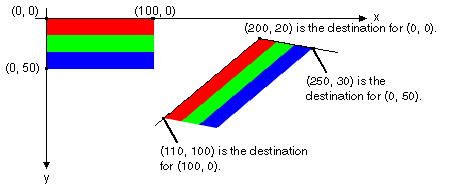
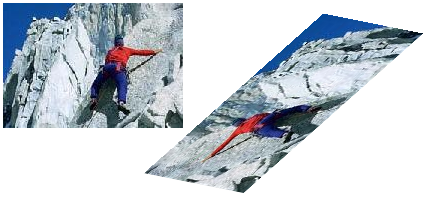
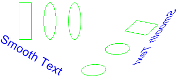

# How to: Rotate, Reflect, and Skew Images
You can rotate, reflect, and skew an image by specifying destination points for the upper-left, upper-right, and lower-left corners of the original image. The three destination points determine an affine transformation that maps the original rectangular image to a parallelogram.  
  
## Example  
 For example, suppose the original image is a rectangle with upper-left corner at (0, 0), upper-right corner at (100, 0), and lower-left corner at (0, 50). Now suppose you map those three points to destination points as follows.  
  
|Original point|Destination point|  
|--------------------|-----------------------|  
|Upper-left (0, 0)|(200, 20)|  
|Upper-right (100, 0)|(110, 100)|  
|Lower-left (0, 50)|(250, 30)|  
  
 The following illustration shows the original image and the image mapped to the parallelogram. The original image has been skewed, reflected, rotated, and translated. The x-axis along the top edge of the original image is mapped to the line that runs through (200, 20) and (110, 100). The y-axis along the left edge of the original image is mapped to the line that runs through (200, 20) and (250, 30).  
  
   
  
 The following illustration shows a similar transformation applied to a photographic image.  
  
   
  
 The following illustration shows a similar transformation applied to a metafile.  
  
   
  
 The following example produces the images shown in the first illustration.  
  
 [!code-csharp[System.Drawing.WorkingWithImages#61](../../../../samples/snippets/csharp/VS_Snippets_Winforms/System.Drawing.WorkingWithImages/CS/Class1.cs#61)]
 [!code-vb[System.Drawing.WorkingWithImages#61](../../../../samples/snippets/visualbasic/VS_Snippets_Winforms/System.Drawing.WorkingWithImages/VB/Class1.vb#61)]  
  
## Compiling the Code  
 The preceding example is designed for use with Windows Forms, and it requires <xref:System.Windows.Forms.PaintEventArgs>`e`, which is a parameter of the <xref:System.Windows.Forms.Control.Paint> event handler. Make sure to replace `Stripes.bmp` with the path to an image that is valid on your system.  
  
## See Also  
 [Working with Images, Bitmaps, Icons, and Metafiles](../../../../docs/framework/winforms/advanced/working-with-images-bitmaps-icons-and-metafiles.md)
