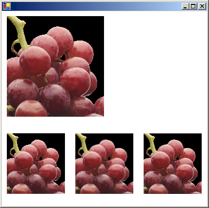

# How to: Use Interpolation Mode to Control Image Quality During Scaling
The interpolation mode of a <xref:System.Drawing.Graphics> object influences the way [!INCLUDE[ndptecgdiplus](../../../../includes/ndptecgdiplus-md.md)] scales (stretches and shrinks) images. The <xref:System.Drawing.Drawing2D.InterpolationMode> enumeration defines several interpolation modes, some of which are shown in the following list:  
  
-   <xref:System.Drawing.Drawing2D.InterpolationMode.NearestNeighbor>  
  
-   <xref:System.Drawing.Drawing2D.InterpolationMode.Bilinear>  
  
-   <xref:System.Drawing.Drawing2D.InterpolationMode.HighQualityBilinear>  
  
-   <xref:System.Drawing.Drawing2D.InterpolationMode.Bicubic>  
  
-   <xref:System.Drawing.Drawing2D.InterpolationMode.HighQualityBicubic>  
  
 To stretch an image, each pixel in the original image must be mapped to a group of pixels in the larger image. To shrink an image, groups of pixels in the original image must be mapped to single pixels in the smaller image. The effectiveness of the algorithms that perform these mappings determines the quality of a scaled image. Algorithms that produce higher-quality scaled images tend to require more processing time. In the preceding list, <xref:System.Drawing.Drawing2D.InterpolationMode.NearestNeighbor> is the lowest-quality mode and <xref:System.Drawing.Drawing2D.InterpolationMode.HighQualityBicubic> is the highest-quality mode.  
  
 To set the interpolation mode, assign one of the members of the <xref:System.Drawing.Drawing2D.InterpolationMode> enumeration to the <xref:System.Drawing.Graphics.InterpolationMode%2A> property of a <xref:System.Drawing.Graphics> object.  
  
## Example  
 The following example draws an image and then shrinks the image with three different interpolation modes.  
  
 The following illustration shows the original image and the three smaller images.  
  
   
  
 [!code-csharp[System.Drawing.WorkingWithImages#81](../../../../samples/snippets/csharp/VS_Snippets_Winforms/System.Drawing.WorkingWithImages/CS/Class1.cs#81)]
 [!code-vb[System.Drawing.WorkingWithImages#81](../../../../samples/snippets/visualbasic/VS_Snippets_Winforms/System.Drawing.WorkingWithImages/VB/Class1.vb#81)]  
  
## Compiling the Code  
 The preceding example is designed for use with Windows Forms, and it requires <xref:System.Windows.Forms.PaintEventArgs> `e`, which is a parameter of the <xref:System.Windows.Forms.Control.Paint> event handler.  
  
## See Also  
 [Images, Bitmaps, and Metafiles](../../../../docs/framework/winforms/advanced/images-bitmaps-and-metafiles.md)   
 [Working with Images, Bitmaps, Icons, and Metafiles](../../../../docs/framework/winforms/advanced/working-with-images-bitmaps-icons-and-metafiles.md)
