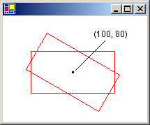
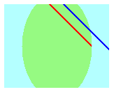
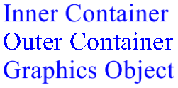

# Using Nested Graphics Containers
[!INCLUDE[ndptecgdiplus](../../../../includes/ndptecgdiplus-md.md)] provides containers that you can use to temporarily replace or augment part of the state in a <xref:System.Drawing.Graphics> object. You create a container by calling the <xref:System.Drawing.Graphics.BeginContainer%2A> method of a <xref:System.Drawing.Graphics> object. You can call <xref:System.Drawing.Graphics.BeginContainer%2A> repeatedly to form nested containers. Each call to <xref:System.Drawing.Graphics.BeginContainer%2A> must be paired with a call to <xref:System.Drawing.Graphics.EndContainer%2A>.  
  
## Transformations in Nested Containers  
 The following example creates a <xref:System.Drawing.Graphics> object and a container within that <xref:System.Drawing.Graphics> object. The world transformation of the <xref:System.Drawing.Graphics> object is a translation 100 units in the x direction and 80 units in the y direction. The world transformation of the container is a 30-degree rotation. The code makes the call `DrawRectangle(pen, -60, -30, 120, 60)` twice. The first call to <xref:System.Drawing.Graphics.DrawRectangle%2A> is inside the container; that is, the call is in between the calls to <xref:System.Drawing.Graphics.BeginContainer%2A> and <xref:System.Drawing.Graphics.EndContainer%2A>. The second call to <xref:System.Drawing.Graphics.DrawRectangle%2A> is after the call to <xref:System.Drawing.Graphics.EndContainer%2A>.  
  
 [!code-csharp[System.Drawing.MiscLegacyTopics#61](../../../../samples/snippets/csharp/VS_Snippets_Winforms/System.Drawing.MiscLegacyTopics/CS/Class1.cs#61)]
 [!code-vb[System.Drawing.MiscLegacyTopics#61](../../../../samples/snippets/visualbasic/VS_Snippets_Winforms/System.Drawing.MiscLegacyTopics/VB/Class1.vb#61)]  
  
 In the preceding code, the rectangle drawn from inside the container is transformed first by the world transformation of the container (rotation) and then by the world transformation of the <xref:System.Drawing.Graphics> object (translation). The rectangle drawn from outside the container is transformed only by the world transformation of the <xref:System.Drawing.Graphics> object (translation). The following illustration shows the two rectangles.  
  
   
  
## Clipping in Nested Containers  
 The following example demonstrates how nested containers handle clipping regions. The code creates a <xref:System.Drawing.Graphics> object and a container within that <xref:System.Drawing.Graphics> object. The clipping region of the <xref:System.Drawing.Graphics> object is a rectangle, and the clipping region of the container is an ellipse. The code makes two calls to the <xref:System.Drawing.Graphics.DrawLine%2A> method. The first call to <xref:System.Drawing.Graphics.DrawLine%2A> is inside the container, and the second call to <xref:System.Drawing.Graphics.DrawLine%2A> is outside the container (after the call to <xref:System.Drawing.Graphics.EndContainer%2A>). The first line is clipped by the intersection of the two clipping regions. The second line is clipped only by the rectangular clipping region of the <xref:System.Drawing.Graphics> object.  
  
 [!code-csharp[System.Drawing.MiscLegacyTopics#62](../../../../samples/snippets/csharp/VS_Snippets_Winforms/System.Drawing.MiscLegacyTopics/CS/Class1.cs#62)]
 [!code-vb[System.Drawing.MiscLegacyTopics#62](../../../../samples/snippets/visualbasic/VS_Snippets_Winforms/System.Drawing.MiscLegacyTopics/VB/Class1.vb#62)]  
  
 The following illustration shows the two clipped lines.  
  
   
  
 As the two preceding examples show, transformations and clipping regions are cumulative in nested containers. If you set the world transformations of the container and the <xref:System.Drawing.Graphics> object, both transformations will apply to items drawn from inside the container. The transformation of the container will be applied first, and the transformation of the <xref:System.Drawing.Graphics> object will be applied second. If you set the clipping regions of the container and the <xref:System.Drawing.Graphics> object, items drawn from inside the container will be clipped by the intersection of the two clipping regions.  
  
## Quality Settings in Nested Containers  
 Quality settings (<xref:System.Drawing.Graphics.SmoothingMode%2A>, <xref:System.Drawing.Graphics.TextRenderingHint%2A>, and the like) in nested containers are not cumulative; rather, the quality settings of the container temporarily replace the quality settings of a <xref:System.Drawing.Graphics> object. When you create a new container, the quality settings for that container are set to default values. For example, suppose you have a <xref:System.Drawing.Graphics> object with a smoothing mode of <xref:System.Drawing.Drawing2D.SmoothingMode.AntiAlias>. When you create a container, the smoothing mode inside the container is the default smoothing mode. You are free to set the smoothing mode of the container, and any items drawn from inside the container will be drawn according to the mode you set. Items drawn after the call to <xref:System.Drawing.Graphics.EndContainer%2A> will be drawn according to the smoothing mode (<xref:System.Drawing.Drawing2D.SmoothingMode.AntiAlias>) that was in place before the call to <xref:System.Drawing.Graphics.BeginContainer%2A>.  
  
## Several Layers of Nested Containers  
 You are not limited to one container in a <xref:System.Drawing.Graphics> object. You can create a sequence of containers, each nested in the preceding, and you can specify the world transformation, clipping region, and quality settings of each of those nested containers. If you call a drawing method from inside the innermost container, the transformations will be applied in order, starting with the innermost container and ending with the outermost container. Items drawn from inside the innermost container will be clipped by the intersection of all the clipping regions.  
  
 The following example creates a <xref:System.Drawing.Graphics> object and sets its text rendering hint to <xref:System.Drawing.Drawing2D.SmoothingMode.AntiAlias>. The code creates two containers, one nested within the other. The text rendering hint of the outer container is set to <xref:System.Drawing.Text.TextRenderingHint.SingleBitPerPixel>, and the text rendering hint of the inner container is set to <xref:System.Drawing.Drawing2D.SmoothingMode.AntiAlias>. The code draws three strings: one from the inner container, one from the outer container, and one from the <xref:System.Drawing.Graphics> object itself.  
  
 [!code-csharp[System.Drawing.MiscLegacyTopics#63](../../../../samples/snippets/csharp/VS_Snippets_Winforms/System.Drawing.MiscLegacyTopics/CS/Class1.cs#63)]
 [!code-vb[System.Drawing.MiscLegacyTopics#63](../../../../samples/snippets/visualbasic/VS_Snippets_Winforms/System.Drawing.MiscLegacyTopics/VB/Class1.vb#63)]  
  
 The following illustration shows the three strings. The strings drawn from the inner container and from the <xref:System.Drawing.Graphics> object are smoothed by antialiasing. The string drawn from the outer container is not smoothed by antialiasing because the <xref:System.Drawing.Graphics.TextRenderingHint%2A> property is set to <xref:System.Drawing.Text.TextRenderingHint.SingleBitPerPixel>.  
  
   
  
## See also
 <xref:System.Drawing.Graphics>  
 [Managing the State of a Graphics Object](../../../../docs/framework/winforms/advanced/managing-the-state-of-a-graphics-object.md)
