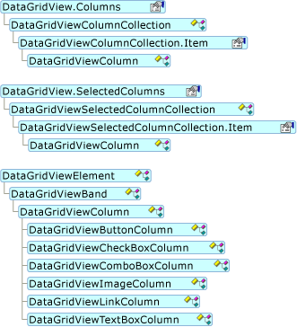
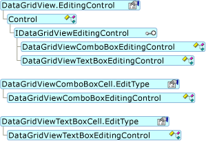
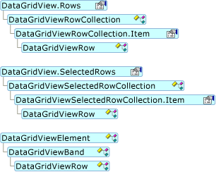

# DataGridView Control Architecture (Windows Forms)
The <xref:System.Windows.Forms.DataGridView> control and its related classes are designed to be a flexible, extensible system for displaying and editing tabular data. These classes are all contained in the <xref:System.Windows.Forms?displayProperty=fullName> namespace, and they are all named with the "DataGridView" prefix.  
  
## Architecture Elements  
 The primary <xref:System.Windows.Forms.DataGridView> companion classes derive from <xref:System.Windows.Forms.DataGridViewElement>. The following object model illustrates the <xref:System.Windows.Forms.DataGridViewElement> inheritance hierarchy.  
  
   
DataGridViewElement object model  
  
 The <xref:System.Windows.Forms.DataGridViewElement> class provides a reference to the parent <xref:System.Windows.Forms.DataGridView> control and has a <xref:System.Windows.Forms.DataGridViewElement.State%2A> property, which holds a value that represents a combination of values from the <xref:System.Windows.Forms.DataGridViewElementStates> enumeration.  
  
 The following sections describe the <xref:System.Windows.Forms.DataGridView> companion classes in more detail.  
  
### DataGridViewElementStates  
 The <xref:System.Windows.Forms.DataGridViewElementStates> enumeration contains the following values:  
  
-   <xref:System.Windows.Forms.DataGridViewElementStates.None>  
  
-   <xref:System.Windows.Forms.DataGridViewElementStates.Frozen>  
  
-   <xref:System.Windows.Forms.DataGridViewElementStates.ReadOnly>  
  
-   <xref:System.Windows.Forms.DataGridViewElementStates.Resizable>  
  
-   <xref:System.Windows.Forms.DataGridViewElementStates.ResizableSet>  
  
-   <xref:System.Windows.Forms.DataGridViewElementStates.Selected>  
  
-   <xref:System.Windows.Forms.DataGridViewElementStates.Visible>  
  
 The values of this enumeration can be combined with the bitwise logical operators, so the <xref:System.Windows.Forms.DataGridViewElement.State%2A> property can express more than one state at once. For example, a <xref:System.Windows.Forms.DataGridViewElement> can be simultaneously <xref:System.Windows.Forms.DataGridViewElementStates.Frozen>, <xref:System.Windows.Forms.DataGridViewElementStates.Selected>, and <xref:System.Windows.Forms.DataGridViewElementStates.Visible>.  
  
### Cells and Bands  
 The <xref:System.Windows.Forms.DataGridView> control comprises two fundamental kinds of objects: cells and bands. All cells derive from the <xref:System.Windows.Forms.DataGridViewCell> base class. The two kinds of bands, <xref:System.Windows.Forms.DataGridViewColumn> and <xref:System.Windows.Forms.DataGridViewRow>, both derive from the <xref:System.Windows.Forms.DataGridViewBand> base class.  
  
 The <xref:System.Windows.Forms.DataGridView> control interoperates with several classes, but the most commonly encountered are <xref:System.Windows.Forms.DataGridViewCell>, <xref:System.Windows.Forms.DataGridViewColumn>, and <xref:System.Windows.Forms.DataGridViewRow>.  
  
### DataGridViewCell  
 The cell is the fundamental unit of interaction for the <xref:System.Windows.Forms.DataGridView>. Display is centered on cells, and data entry is often performed through cells. You can access cells by using the <xref:System.Windows.Forms.DataGridViewRow.Cells%2A> collection of the <xref:System.Windows.Forms.DataGridViewRow> class, and you can access the selected cells by using the <xref:System.Windows.Forms.DataGridView.SelectedCells%2A> collection of the <xref:System.Windows.Forms.DataGridView> control. The following object model illustrates this usage and shows the <xref:System.Windows.Forms.DataGridViewCell> inheritance hierarchy.  
  
   
DataGridViewCell object model  
  
 The <xref:System.Windows.Forms.DataGridViewCell> type is an abstract base class, from which all cell types derive. <xref:System.Windows.Forms.DataGridViewCell> and its derived types are not Windows Forms controls, but some host Windows Forms controls. Any editing functionality supported by a cell is typically handled by a hosted control.  
  
 <xref:System.Windows.Forms.DataGridViewCell> objects do not control their own appearance and painting features in the same way as Windows Forms controls. Instead, the <xref:System.Windows.Forms.DataGridView> is responsible for the appearance of its <xref:System.Windows.Forms.DataGridViewCell> objects. You can significantly affect the appearance and behavior of cells by interacting with the <xref:System.Windows.Forms.DataGridView> control's properties and events. When you have special requirements for customizations that are beyond the capabilities of the <xref:System.Windows.Forms.DataGridView> control, you can implement your own class that derives from <xref:System.Windows.Forms.DataGridViewCell> or one of its child classes.  
  
 The following list shows the classes derived from <xref:System.Windows.Forms.DataGridViewCell>:  
  
-   <xref:System.Windows.Forms.DataGridViewTextBoxCell>  
  
-   <xref:System.Windows.Forms.DataGridViewButtonCell>  
  
-   <xref:System.Windows.Forms.DataGridViewLinkCell>  
  
-   <xref:System.Windows.Forms.DataGridViewCheckBoxCell>  
  
-   <xref:System.Windows.Forms.DataGridViewComboBoxCell>  
  
-   <xref:System.Windows.Forms.DataGridViewImageCell>  
  
-   <xref:System.Windows.Forms.DataGridViewHeaderCell>  
  
-   <xref:System.Windows.Forms.DataGridViewRowHeaderCell>  
  
-   <xref:System.Windows.Forms.DataGridViewColumnHeaderCell>  
  
-   <xref:System.Windows.Forms.DataGridViewTopLeftHeaderCell>  
  
-   Your custom cell types  
  
### DataGridViewColumn  
 The schema of the <xref:System.Windows.Forms.DataGridView> control's attached data store is expressed in the <xref:System.Windows.Forms.DataGridView> control's columns. You can access the <xref:System.Windows.Forms.DataGridView> control's columns by using the <xref:System.Windows.Forms.DataGridView.Columns%2A> collection. You can access the selected columns by using the <xref:System.Windows.Forms.DataGridView.SelectedColumns%2A> collection. The following object model illustrates this usage and shows the <xref:System.Windows.Forms.DataGridViewColumn> inheritance hierarchy.  
  
   
DataGridViewColumn object model  
  
 Some of the key cell types have corresponding column types. These are derived from the <xref:System.Windows.Forms.DataGridViewColumn> base class.  
  
 The following list shows the classes derived from <xref:System.Windows.Forms.DataGridViewColumn>:  
  
-   <xref:System.Windows.Forms.DataGridViewButtonColumn>  
  
-   <xref:System.Windows.Forms.DataGridViewCheckBoxColumn>  
  
-   <xref:System.Windows.Forms.DataGridViewComboBoxColumn>  
  
-   <xref:System.Windows.Forms.DataGridViewImageColumn>  
  
-   <xref:System.Windows.Forms.DataGridViewTextBoxColumn>  
  
-   <xref:System.Windows.Forms.DataGridViewLinkColumn>  
  
-   Your custom column types  
  
### DataGridView Editing Controls  
 Cells that support advanced editing functionality typically use a hosted control that is derived from a Windows Forms control. These controls also implement the <xref:System.Windows.Forms.IDataGridViewEditingControl> interface. The following object model illustrates the usage of these controls.  
  
   
DataGridView editing control object model  
  
 The following editing controls are provided with the <xref:System.Windows.Forms.DataGridView> control:  
  
-   <xref:System.Windows.Forms.DataGridViewComboBoxEditingControl>  
  
-   <xref:System.Windows.Forms.DataGridViewTextBoxEditingControl>  
  
 For information about creating your own editing controls, see [How to: Host Controls in Windows Forms DataGridView Cells](../../../../docs/framework/winforms/controls/how-to-host-controls-in-windows-forms-datagridview-cells.md).  
  
 The following table illustrates the relationship among cell types, column types, and editing controls.  
  
|Cell type|Hosted control|Column type|  
|---------------|--------------------|-----------------|  
|<xref:System.Windows.Forms.DataGridViewButtonCell>|n/a|<xref:System.Windows.Forms.DataGridViewButtonColumn>|  
|<xref:System.Windows.Forms.DataGridViewCheckBoxCell>|n/a|<xref:System.Windows.Forms.DataGridViewCheckBoxColumn>|  
|<xref:System.Windows.Forms.DataGridViewComboBoxCell>|<xref:System.Windows.Forms.DataGridViewComboBoxEditingControl>|<xref:System.Windows.Forms.DataGridViewComboBoxColumn>|  
|<xref:System.Windows.Forms.DataGridViewImageCell>|n/a|<xref:System.Windows.Forms.DataGridViewImageColumn>|  
|<xref:System.Windows.Forms.DataGridViewLinkCell>|n/a|<xref:System.Windows.Forms.DataGridViewLinkColumn>|  
|<xref:System.Windows.Forms.DataGridViewTextBoxCell>|<xref:System.Windows.Forms.DataGridViewTextBoxEditingControl>|<xref:System.Windows.Forms.DataGridViewTextBoxColumn>|  
  
### DataGridViewRow  
 The <xref:System.Windows.Forms.DataGridViewRow> class displays a record's data fields from the data store to which the <xref:System.Windows.Forms.DataGridView> control is attached. You can access the <xref:System.Windows.Forms.DataGridView> control's rows by using the <xref:System.Windows.Forms.DataGridView.Rows%2A> collection. You can access the selected rows by using the <xref:System.Windows.Forms.DataGridView.SelectedRows%2A> collection. The following object model illustrates this usage and shows the <xref:System.Windows.Forms.DataGridViewRow> inheritance hierarchy.  
  
   
DataGridViewRow object model  
  
 You can derive your own types from the <xref:System.Windows.Forms.DataGridViewRow> class, although this will typically not be necessary. The <xref:System.Windows.Forms.DataGridView> control has several row-related events and properties for customizing the behavior of its <xref:System.Windows.Forms.DataGridViewRow> objects.  
  
 If you enable the <xref:System.Windows.Forms.DataGridView> control's <xref:System.Windows.Forms.DataGridView.AllowUserToAddRows%2A> property, a special row for adding new rows appears as the last row. This row is part of the <xref:System.Windows.Forms.DataGridView.Rows%2A> collection, but it has special functionality that may require your attention. For more information, see [Using the Row for New Records in the Windows Forms DataGridView Control](../../../../docs/framework/winforms/controls/using-the-row-for-new-records-in-the-windows-forms-datagridview-control.md).  
  
## See Also  
 [DataGridView Control Overview](../../../../docs/framework/winforms/controls/datagridview-control-overview-windows-forms.md)   
 [Customizing the Windows Forms DataGridView Control](../../../../docs/framework/winforms/controls/customizing-the-windows-forms-datagridview-control.md)   
 [Using the Row for New Records in the Windows Forms DataGridView Control](../../../../docs/framework/winforms/controls/using-the-row-for-new-records-in-the-windows-forms-datagridview-control.md)
