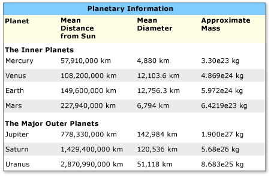

# How to: Define a Table with XAML
The following example demonstrates how to define a <xref:System.Windows.Documents.Table> using [!INCLUDE[TLA#tla_xaml](../../../../includes/tlasharptla-xaml-md.md)].  The example table has four columns (represented by <xref:System.Windows.Documents.TableColumn> elements) and several rows (represented by <xref:System.Windows.Documents.TableRow> elements) containing data as well as title, header, and footer information.  Rows must be contained in a <xref:System.Windows.Documents.TableRowGroup> element.  Each row in the table is comprised of one or more cells (represented by <xref:System.Windows.Documents.TableCell> elements).  Content in a table cell must be contained in a <xref:System.Windows.Documents.Block> element; in this case <xref:System.Windows.Documents.Paragraph> elements are used.  The table also hosts a hyperlink (represented by the <xref:System.Windows.Documents.Hyperlink> element) in the footer row.  
  
## Example  
 [!code-xaml[TableSnippetsXAML#_TableXAML](../../../../samples/snippets/csharp/VS_Snippets_Wpf/TableSnippetsXAML/CS/Window1.xaml#_tablexaml)]  
  
 The following figure shows how the table defined in this example renders.  
  
 
