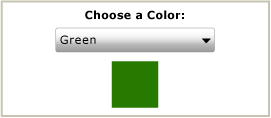

# How to: Bind the Properties of Two Controls
This example shows how to bind the property of one instantiated control to that of another using the <xref:System.Windows.Data.Binding.ElementName%2A> property.  
  
## Example  
 The following example shows how to bind the <xref:System.Windows.Controls.Panel.Background%2A> property of a <xref:System.Windows.Controls.Canvas> to the <xref:System.Windows.Controls.Primitives.Selector.SelectedItem%2A>.<xref:System.Windows.Controls.ContentControl.Content%2A> property of a <xref:System.Windows.Controls.ComboBox>:  
  
 [!code-xaml[BindDptoDp#1](../../../../samples/snippets/csharp/VS_Snippets_Wpf/BindDPtoDP/CS/Window1.xaml#1)]  
  
 When this example is rendered it looks like the following:  
  
   
  
 **Note** The binding target property (in this example, the <xref:System.Windows.Controls.Panel.Background%2A> property) must be a dependency property. For more information, see [Data Binding Overview](../../../../docs/framework/wpf/data/data-binding-overview.md).  
  
## See Also  
 [Specify the Binding Source](../../../../docs/framework/wpf/data/how-to-specify-the-binding-source.md)   
 [How-to Topics](../../../../docs/framework/wpf/data/data-binding-how-to-topics.md)
