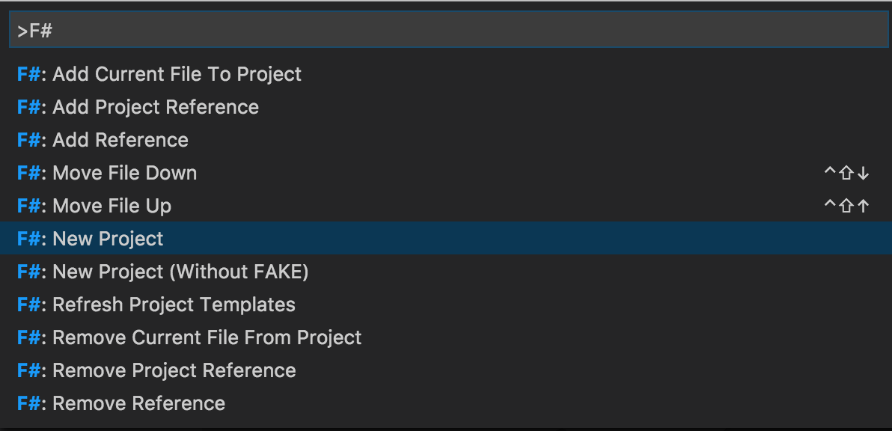
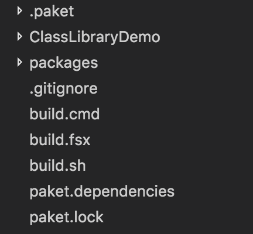

# Getting Started with F# in Visual Studio Code with Ionide

> [!NOTE]
This is still in-progress.

You can write F# in [Visual Studio Code](https://code.visualstudio.com) with the [Ionide plugin](https://marketplace.visualstudio.com/items?itemName=Ionide.Ionide-fsharp), to get a cross-platform, lightweight IDE experience with IntelliSense and basic code refactorings.

## Prerequisites

F# 4.0 or higher must be installed on your machine to use Ionide.

### Windows

If you're on Windows, the easiest way to do that is to install [Visual Studio with the Visual F# Tools](getting-started-visual-studio.md#installing-the-visual-f#-tools).

Alternatively, you can following the following instructions:

1. Install [.NET Framework 4.5 or higher](https://www.microsoft.com/en-US/download/details.aspx?id=30653) if you're running Windows 7.  If you're using Windows 8 or higher, you do not need to do this.

2. Install the Windows SDK for your OS:

    * [Windows 10 SDK](https://dev.windows.com/en-US/downloads/windows-10-sdk)
    * [Windows 8.1 SDK](http://msdn.microsoft.com/windows/desktop/bg162891)
    * [Windows 8 SDK](http://msdn.microsoft.com/windows/hardware/hh852363.aspx)
    * [Windows 7 SDK](http://www.microsoft.com/download/details.aspx?id=8279)

3. Install the [Microsoft Build Tools 2015](https://www.microsoft.com/en-us/download/details.aspx?id=48159).

4. Install the [Visual F# Tools](https://www.microsoft.com/en-us/download/details.aspx?id=48179).

On 64-bit Windows, the compiler and tools are located here:

```
C:\Program Files (x86)\Microsoft SDKs\F#\4.0\Framework\v4.0\fsc.exe
C:\Program Files (x86)\Microsoft SDKs\F#\4.0\Framework\v4.0\fsi.exe
C:\Program Files (x86)\Microsoft SDKs\F#\4.0\Framework\v4.0\fsiAnyCpu.exe
```

On 32-bit Windows, the compiler tools are located here:

```
C:\Program Files\Microsoft SDKs\F#\4.0\Framework\v4.0\fsc.exe
C:\Program Files\Microsoft SDKs\F#\4.0\Framework\v4.0\fsi.exe
C:\Program Files\Microsoft SDKs\F#\4.0\Framework\v4.0\fsiAnyCpu.exe
```

You will need to add these to your PATH for Ionide to work.

### macOS

On macOS, Ionide uses Mono.  The easiest way to install Mono on macOS is via Homebrew.  Simply type the following into your terminal:

```
brew install mono
```

### Linux

On Linux, Ionide also uses Mono.  If you're on Debian or Linux, you can use the following:

```
sudo apt-get update
sudo apt-get install mono-complete fsharp
```

## Installing Visual Studio Code and the Ionide plugin

You can install Visual Studio Code on the [code.visualstudio.com](https://code.visualstudio.com) website.  After that, there are a two ways to find the Ionide plugin:

1. Use the Command Palette (ctrl-P on Windows, ⌘-P on macOS, ctrl-shift-P on Linux) and type the following:

    ```
    ext install Ionide
    ```

2. Click the Extensions icon and search for "Ionide":

    

The only plugin required is **Ionide-fsharp**.  However, you can also install **Ionide-FAKE** and **Ionide-Paket** to get [FAKE](http://fsharp.github.io/FAKE/) and [Paket](https://fsprojects.github.io/Paket/) support.

## Creating your first project Ionide

To create a new F# project, open the Command Palette (ctrl-P on Windows, ⌘-P on macOS, ctrl-shift-P on Linux) and type the following:

```
>f#: New Project
```

You should see something like this:



Select it by hitting **Enter**, which will take you to this step:


This will select a template for a specific type of project.  There are quite a few options here, such as an FsLab template for Data Science or Suave template for Web Programming.  This article uses the `classlib` template, so highlight that and hit **Enter**.  You will then reach this step:


Here you can choose to create the project in a specific directory.  If you leave it blank, it will choose the current directory Visual Studio Code is opened in.  This article uses the current directory.  Once you've made your decision, hit **Enter** to bring up the final stage:


This lets you name your project.  F# uses PascalCase for project names.  This article uses `ClassLibrarySample` as the name.  Once you've entered the name you want for your project, hit **Enter**.

If you followed these steps, you should get the Explorer on the left-hand side to look something like this:



This template generates a few things you'll find useful:

1. The F# project itself, underneath the `ClassLibraryDemo` folder.
2. The correct directory structure for adding packages via [`Paket`](http://fsprojects.github.io/Paket/).
3. A cross-platform build script with [`FAKE`](http://fsharp.github.io/FAKE/).
4. The `paket.exe` executable which can fetch packages and resolve dependencies for you.
5. A useful `.gitignore` file if you wish to add this project to Git-based source control.

## Writing some code