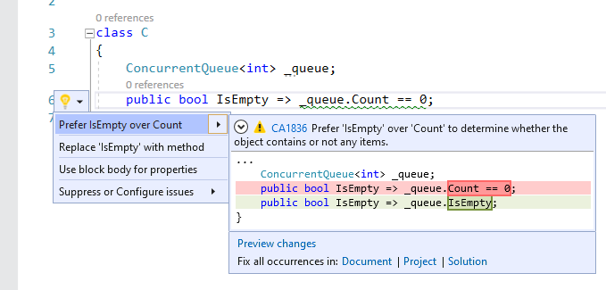

# CA1836: Prefer IsEmpty over Count when available

| | Value |
|-|-|
| **Rule ID** |CA1836|
| **Category** |[Microsoft.Performance](performance-warnings.md)|
| **Fix is breaking or non-breaking** |Non-breaking|

## Cause

The `Count` or `Length` property or the <xref:System.Linq.Enumerable.Count%60%601%28System.Collections.Generic.IEnumerable%7B%60%600%7D%29> extension method was used to determine whether or not the object contains any items by comparing the value to `0` or `1`, and the object has a more efficient `IsEmpty` property that could be used instead.

## Rule description

This rule flags the calls to the `Count` and `Length` properties or <xref:System.Linq.Enumerable.Count%60%601%28System.Collections.Generic.IEnumerable%7B%60%600%7D%29> and <xref:System.Linq.Enumerable.LongCount%60%601%28System.Collections.Generic.IEnumerable%7B%60%600%7D%29> LINQ methods when they are used to determine if the object contains any items and the object has a more efficient `IsEmpty` property.

The analysis of this rule originally overlapped with similar rules CA1827, CA1828, and CA1829; the analyzers of such rules were merged along with the one for CA1836 to report the best diagnosis in case of overlap.

## How to fix violations

To fix a violation, replace the <xref:System.Linq.Enumerable.Count%60%601%28System.Collections.Generic.IEnumerable%7B%60%600%7D%29> or <xref:System.Linq.Enumerable.LongCount%60%601%28System.Collections.Generic.IEnumerable%7B%60%600%7D%29> method call or the `Length` or `Count` property access when it's used in an operation that determines if the object is empty with use of the `IsEmpty` property access. For example, the following two code snippets show a violation of the rule and how to fix it:

```csharp
using System.Collections.Concurrent;

class C
{
    ConcurrentQueue<int> _queue;
    public bool IsEmpty => _queue.Count == 0;
}
```

```csharp
using System.Collections.Concurrent;

class C
{
    ConcurrentQueue<int> _queue;
    public bool IsEmpty => _queue.IsEmpty;
}
```

> [!TIP]
> A code fix is available for this rule in Visual Studio. To use it, position the cursor on the violation and press **Ctrl**+**.** (period). Choose **Prefer 'IsEmpty' over 'Count' to determine whether the object contains or not any items** from the list of options that's presented.
>
> 

## When to suppress warnings

It's safe to suppress a violation of this rule if you're not concerned about the performance impact from unnecessary item enumeration to compute the count.

## Related rules

- [CA1827: Do not use Count/LongCount when Any can be used](ca1827.md)
- [CA1828: Do not use CountAsync/LongCountAsync when AnyAsync can be used](ca1828.md)
- [CA1829: Do not use CountAsync/LongCountAsync when AnyAsync can be used](ca1828.md)

## See also

- [Performance rules](performance-warnings.md)
