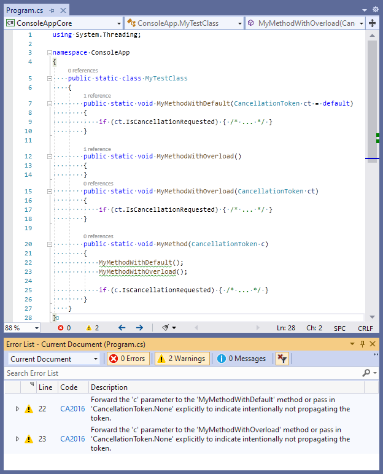

# CA2016: Forward the CancellationToken parameter to methods that take one

|Item|Value|
|-|-|
|TypeName|ForwardCancellationTokenToInvocations|
|RuleId|CA2016|
|Category|Microsoft.Performance|
|Breaking Change|Non-breaking|

## Cause

This rule locates method invocations that could accept a <xref:System.Threading.CancellationToken> parameter, but are not passing any, and suggests to forward the parent method's `CancellationToken` to them.

## Rule description

This rule analyzes method definitions that take a `CancellationToken` as their last parameter, then analyzes all methods invoked in its body. If any of the method invocations can either accept a `CancellationToken` as the last parameter, or have an overload that takes a `CancellationToken` as the last parameter, then the rule suggests using that option instead to ensure that the cancellation notification gets propagated to all operations that can listen to it.

> [!NOTE]
> Rule CA2016 is available in all .NET versions where the `CancellationToken` type is available. See [CancellationToken "Applies to" section](/dotnet/api/system.threading.cancellationtoken#moniker-applies-to)

## How to fix violations

You can either fix them manually, or you can opt to let Visual Studio do it for you, by hovering over the light bulb that shows up next to the method invocation, and selecting the suggested change.

The following example shows two suggested changes:



It's safe to suppress a violation of this rule if you're not concerned about forwarding the canceled operation notification to lower method invocations. You can also explicitly pass `default` in C# (`Nothing` in Visual Basic) or <xref:System.Threading.CancellationToken.None> to suppress the rule violation.

The rule can detect a variety of violations. The following examples show cases that the rule can detect:

##### Example 1

The rule will suggest forwarding the `c` parameter from `MyMethod` to the `MyMethodWithDefault` invocation, because the method defines an optional token parameter:

```csharp
using System.Threading;

namespace ConsoleApp
{
    public static class MyTestClass
    {
        public static void MyMethodWithDefault(CancellationToken ct = default)
        {
        }

        public static void MyMethod(CancellationToken c)
        {
            MyMethodWithDefault();
        }
    }
}
```

##### Fix

Forward the `c` parameter:

```csharp
        public static void MyMethod(CancellationToken c)
        {
            MyMethodWithDefault(c);
        }
```

If you are not concerned about forwarding cancellation notifications to lower invocations, you can either:

Explicitly pass `default`:

```csharp
        public static void MyMethod(CancellationToken c)
        {
            MyMethodWithDefault(default);
        }
```

Or explicitly pass `CancellationToken.None`:

```csharp
        public static void MyMethod(CancellationToken c)
        {
            MyMethodWithDefault(CancellationToken.None);
        }
```

##### Example 2

The rule will suggest forwarding the `c` parameter from `MyMethod` to the `MyMethodWithDefault` invocation, because the method has an overload that takes a `CancellationToken` parameter:

```csharp
using System.Threading;

namespace ConsoleApp
{
    public static class MyTestClass
    {
        public static void MyMethodWithOverload()
        {
        }

        public static void MyMethodWithOverload(CancellationToken ct = default)
        {
        }

        public static void MyMethod(CancellationToken c)
        {
            MyMethodWithOverload();
        }
    }
}
```

##### Fix

Forward the `c` parameter:

```csharp
        public static void MyMethod(CancellationToken c)
        {
            MyMethodWithOverload(c);
        }
```

If you are not concerned about forwarding cancellation notifications to lower invocations, you can either:

Explicitly pass `default`:

```csharp
        public static void MyMethod(CancellationToken c)
        {
            MyMethodWithOverload(default);
        }
```

Or explicitly pass `CancellationToken.None`:

```csharp
        public static void MyMethod(CancellationToken c)
        {
            MyMethodWithOverload(CancellationToken.None);
        }
```

#### No diagnosis

##### Example 1

The `CancellationToken` parameter in the parent method is not in the last position:

```csharp
using System.Threading;

namespace ConsoleApp
{
    public static class MyTestClass
    {
        public static void MyMethodWithDefault(CancellationToken ct = default)
        {
        }

        public static void MyMethod(CancellationToken c, int lastParameter)
        {
            MyMethodWithDefault();
        }
    }
}
```

##### Example 2

The `CancellationToken` parameter in the default method is not in the last position:

```csharp
using System.Threading;

namespace ConsoleApp
{
    public static class MyTestClass
    {
        public static void MyMethodWithDefault(CancellationToken ct = default, int lastParameter = 0)
        {
        }

        public static void MyMethod(CancellationToken c)
        {
            MyMethodWithDefault();
        }
    }
}
```

##### Example 3

The `CancellationToken` parameter in the overload method is not in the last position:

```csharp
using System.Threading;

namespace ConsoleApp
{
    public static class MyTestClass
    {
        public static void MyMethodWithOverload(int lastParameter)
        {
        }
        public static void MyMethodWithOverload(CancellationToken ct, int lastParameter)
        {
        }

        public static void MyMethod(CancellationToken c)
        {
            MyMethodWithOverload();
        }
    }
}
```

##### Example 4

The parent method defines more than one `CancellationToken` parameter:

```csharp
using System.Threading;

namespace ConsoleApp
{
    public static class MyTestClass
    {
        public static void MyMethodWithDefault(CancellationToken ct = default)
        {
        }

        public static void MyMethod(CancellationToken c1, CancellationToken c2)
        {
            MyMethodWithDefault();
        }
    }
}
```

##### Example 5

The method with defaults defines more than one `CancellationToken` parameter:

```csharp
using System.Threading;

namespace ConsoleApp
{
    public static class MyTestClass
    {
        public static void MyMethodWithDefault(CancellationToken c1 = default, CancellationToken c2 = default)
        {
        }

        public static void MyMethod(CancellationToken c)
        {
            MyMethodWithDefault();
        }
    }
}
```

##### Example 6

The method overload defines more than one `CancellationToken` parameter:

```csharp
using System.Threading;

namespace ConsoleApp
{
    public static class MyTestClass
    {
        public static void MyMethodWithOverload(CancellationToken c1, CancellationToken c2)
        {
        }

        public static void MyMethodWithOverload()
        {
        }

        public static void MyMethod(CancellationToken c)
        {
            MyMethodWithOverload();
        }
    }
}
```
