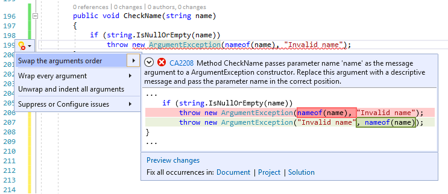
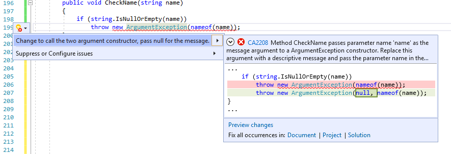

# CA2208: Instantiate argument exceptions correctly

|Item|Value|
|-|-|
|RuleId|CA2208|
|Category|Microsoft.Usage|
|Breaking change|Non-breaking|

## Cause

When a method has a parameter, and it throws an exception type that is, or derives from, <xref:System.ArgumentException>, it expected to call a constructor accepting a `paramName` parameter correctly. Possible causes include the following situations:

- A call is made to the default (parameterless) constructor of an exception type that is, or derives from, <xref:System.ArgumentException> that has a constructor accepting a `paramName` parameter.

- An incorrect string argument is passed to a parameterized constructor of an exception type that is, or derives from, <xref:System.ArgumentException>.

- One of the parameters' names is passed for the `message` argument of the constructor of exception type that is, or derives from, <xref:System.ArgumentException>.

## Rule description

Instead of calling the default constructor, call one of the constructor overloads that allows a more meaningful exception message to be provided. The exception message should target the developer and clearly explain the error condition and how to correct or avoid the exception.

The signatures of the one and two string constructors of <xref:System.ArgumentException> and its derived types are not consistent with respect to the position `message` and `paramName` parameters. Make sure these constructors are called with the correct string arguments. The signatures are as follows:

- <xref:System.ArgumentException>(string `message`)
- <xref:System.ArgumentException>(string `message`, string `paramName`)
- <xref:System.ArgumentNullException>(string `paramName`)
- <xref:System.ArgumentNullException>(string `paramName`, string `message`)
- <xref:System.ArgumentOutOfRangeException>(string `paramName`)
- <xref:System.ArgumentOutOfRangeException>(string `paramName`, string `message`)
- <xref:System.DuplicateWaitObjectException>(string `parameterName`)
- <xref:System.DuplicateWaitObjectException>(string `parameterName`, string `message`)

## How to fix violations

To fix a violation of this rule, call a constructor that takes a message, a parameter name, or both, and make sure the arguments are proper for the type of <xref:System.ArgumentException> being called.

> [!TIP]
> A code fix is available for incorrectly positioned parameter name in Visual Studio. To use it, position the cursor on the warning row and press **Ctrl**+**.** (period). Choose **Swap the arguments order** from the list of options that's presented.
>
> 
>
> In case the <xref:System.ArgumentException>(string `message`) overload is used mistakenly with a parameter name, the fixer would provide the option to use a two arguments constructor with `null` message.
>
> 

## When to suppress warnings

It's safe to suppress a warning from this rule only if a parameterized constructor is called with the correct string arguments.

## Configurability

If you're running this rule from [FxCop analyzers](install-fxcop-analyzers.md) (and not with legacy analysis), you can configure which parts of your codebase to run this rule on, based on their accessibility. For example, to specify that the rule should run only against the public API surface, add the following key-value pair to an .editorconfig file in your project:

```ini
dotnet_code_quality.ca2208.api_surface = public
```

By default CA2208 rules apply for all API surface (public, internal and private). You can configure this option for just this rule, for all rules, or for all rules in this category (Design). For more information, see [Configure FxCop analyzers](configure-fxcop-analyzers.md).

## Example

The following code shows a constructor that incorrectly instantiates an instance of <xref:System.ArgumentNullException>.

[!code-csharp[FxCop.Usage.InstantiateArgumentExceptionsCorrectly#1](../code-quality/codesnippet/CSharp/ca2208-instantiate-argument-exceptions-correctly_1.cs?range=3-6)]
[!code-vb[FxCop.Usage.InstantiateArgumentExceptionsCorrectly#1](../code-quality/codesnippet/VisualBasic/ca2208-instantiate-argument-exceptions-correctly_1.vb)]

The following code fixes the previous violation by switching the constructor arguments.

[!code-csharp[FxCop.Usage.InstantiateArgumentExceptionsCorrectly#2](../code-quality/codesnippet/CSharp/ca2208-instantiate-argument-exceptions-correctly_2.cs?range=3-6)]
[!code-vb[FxCop.Usage.InstantiateArgumentExceptionsCorrectly#2](../code-quality/codesnippet/VisualBasic/ca2208-instantiate-argument-exceptions-correctly_2.vb)]

## Related rules

- [CA1507: Use nameof in place of string](ca1507.md)
