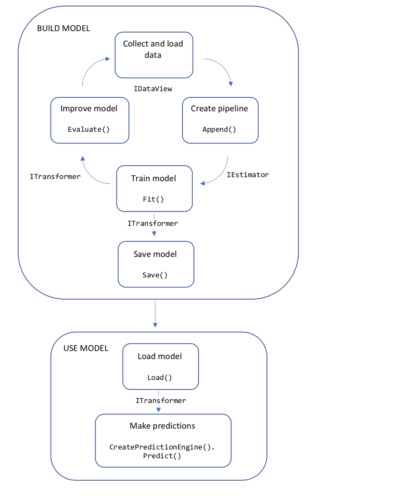
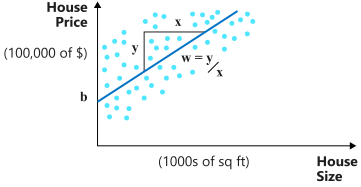
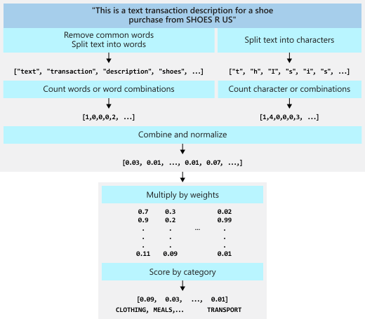
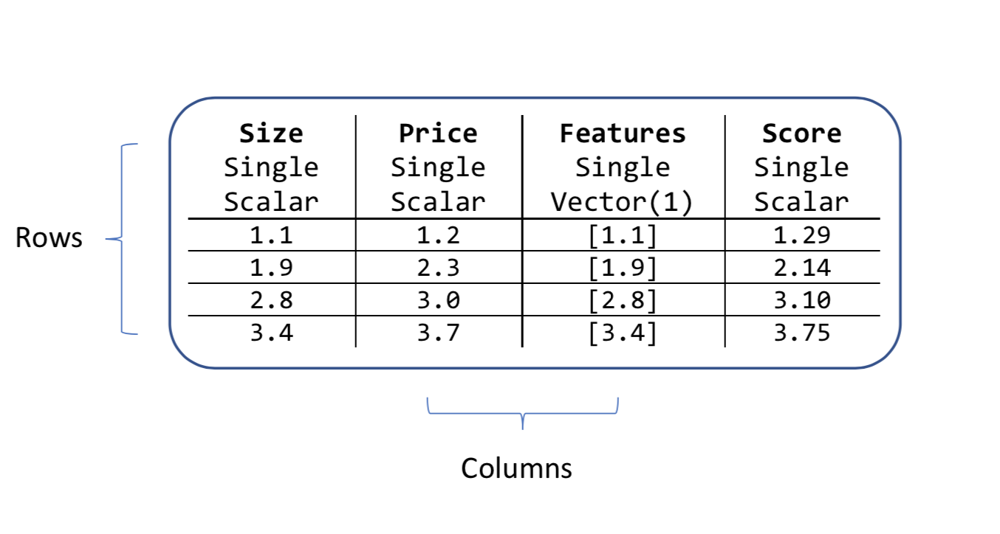

# What is ML.NET and how does it work?

ML.NET gives you the ability to add machine learning to .NET applications hosted in the cloud or on-premises. With this capability, you can make automatic predictions using the data available to your application. This article explains the basics of machine learning in ML.NET. 

Examples of the type of predictions that you can make with ML.NET include:

|||
|-|-|
|Classification/Categorization|Automatically divide customer feedback into positive and negative categories|
|Regression/Predict continuous values|Predict the price of houses based on size and location|
|Anomaly Detection|Detect fraudulent banking transactions |
|Recommendations|Suggest products that online shoppers may want to buy, based on their previous purchases|

## Hello ML.NET World

The code in the following snippet demonstrates the simplest ML.NET application. This example constructs a linear regression model to predict house prices using house size and price data. In your real-life applications, your data and model will be much more complex.

 ```csharp
    using System;
    using Microsoft.ML;
    using Microsoft.ML.Data;
    
    class Program
    {
        public class HouseData
        {
            public float Size { get; set; }
            public float Price { get; set; }
        }
    
        public class Prediction
        {
            [ColumnName("Score")]
            public float Price { get; set; }
        }
    
        static void Main(string[] args)
        {
            MLContext mlContext = new MLContext();
    
            // 1. Import or create training data
            HouseData[] houseData = {
                new HouseData() { Size = 1.1F, Price = 1.2F },
                new HouseData() { Size = 1.9F, Price = 2.3F },
                new HouseData() { Size = 2.8F, Price = 3.0F },
                new HouseData() { Size = 3.4F, Price = 3.7F } };
            IDataView trainingData = mlContext.Data.LoadFromEnumerable(houseData);

            // 2. Specify data preparation and model training pipeline
            var pipeline = mlContext.Transforms.Concatenate("Features", new[] { "Size" })
                .Append(mlContext.Regression.Trainers.Sdca(labelColumnName: "Price", maximumNumberOfIterations: 100));
    
            // 3. Train model
            var model = pipeline.Fit(trainingData);
    
            // 4. Make a prediction
            var size = new HouseData() { Size = 2.5F };
            var price = mlContext.Model.CreatePredictionEngine<HouseData, Prediction>(model).Predict(size);

            Console.WriteLine($"Predicted price for size: {size.Size*1000} sq ft= {price.Price*100:C}k");

            // Predicted price for size: 2500 sq ft= $261.98k
        }
    } 
```

## Code workflow

The following diagram represents the application code structure, as well as the iterative process of model development:
- Collect and load training data into an **IDataView** object
- Specify a pipeline of operations to extract features and apply a machine learning algorithm
- Train a model by calling **Fit()** on the pipeline
- Evaluate the model and iterate to improve
- Save the model into binary format, for use in an application
- Load the model back into an **ITransformer** object
- Make predictions by calling **CreatePredictionEngine.Predict()**

 

Let's dig a little deeper into those concepts.

## Machine learning model

An ML.NET model is an object that contains transformations to perform on your input data to arrive at the predicted output.

### Basic

The most basic model is two-dimensional linear regression, where one continuous quantity is proportional to another, as in the house price example above. 



The model is simply: $Price = b + Size * w$. The parameters $b$ and $w$ are estimated by fitting a line on a set of (size, price) pairs. The data used to find the parameters of the model is called **training data**. The inputs of a machine learning model are called **features**. In this example, $Size$ is the only feature. The ground-truth values used to train a machine learning model are called **labels**. Here, the $Price$ values in the training data set are the labels.

### More complex

A more complex model classifies financial transactions into categories using the transaction text description.

Each transaction description is broken down into a set of features by removing redundant words and characters, and counting word and character combinations. The feature set is used to train a linear model based on the set of categories in the training data. The more similar a new description is to the ones in the training set, the more likely it will be assigned to the same category. 



Both the house price model and the text classification model are **linear** models. Depending on the nature of your data and the problem you are solving, you can also use **decision tree** models, **generalized additive** models, and others. You can find out more about the models in [Tasks](./resources/tasks.md).

## Data preparation

In most cases, the data that you have available isn't suitable to be used directly to train a machine learning model. The raw data needs to be prepared, or pre-processed before it can be used to find the parameters of your model. Your data may need to be converted from string values to a numerical representation. You might have redundant information in your input data. You may need to reduce or expand the dimensions of your input data. Your data might need to be normalized or scaled.

The [ML.NET tutorials](./tutorials/index.md) teach you about different data processing pipelines for text, image, numerical, and time-series data used for specific machine learning tasks.

[How to prepare your data](./how-to-guides/prepare-data-ml-net.md) shows you how to applied data preparation more generally.

You can find an appendix of all of the [available transformations](./resources/transforms.md) in the resources section.

## Model evaluation

Once you have trained your model, how do you know how well it will make future predictions? With ML.NET, you can evaluate your model against some new test data. 

Each type of machine learning task has metrics used to evaluate the accuracy and precision of the model against the test data set.

For our house price example, we used the **Regression** task. To evaluate the model, add the following code to the original sample.

```csharp
        HouseData[] testHouseData =
        {
            new HouseData() { Size = 1.1F, Price = 0.98F },
            new HouseData() { Size = 1.9F, Price = 2.1F },
            new HouseData() { Size = 2.8F, Price = 2.9F },
            new HouseData() { Size = 3.4F, Price = 3.6F }
        };

        var testHouseDataView = mlContext.Data.LoadFromEnumerable(testHouseData);
        var testPriceDataView = model.Transform(testHouseDataView);
                
        var metrics = mlContext.Regression.Evaluate(testPriceDataView, labelColumnName: "Price");

        Console.WriteLine($"R^2: {metrics.RSquared:0.##}");
        Console.WriteLine($"RMS error: {metrics.RootMeanSquaredError:0.##}");

        // R^2: 0.96
        // RMS error: 0.19
```

The evaluation metrics tell you that the error is low-ish, and that correlation between the predicted output and the test output is high. That was easy! In real examples, it takes more tuning to achieve good model metrics.

## ML.NET architecture

In this section, we go through the architectural patterns of ML.NET. If you are an experienced .NET developer, some of these patterns will be familiar to you, and some will be less familiar. Hold tight, while we dive in!

An ML.NET application starts with an <xref:Microsoft.ML.MLContext> object. This singleton object contains **catalogs**. A catalog is a factory for data loading and saving, transforms, trainers, and model operation components. Each catalog object has methods to create the different types of components:

|||||
|-|-|-|-|
|Data loading and saving||<xref:Microsoft.ML.DataOperationsCatalog>||
|Data preparation||<xref:Microsoft.ML.TransformsCatalog>||
|Training algorithms|Binary classification|<xref:Microsoft.ML.BinaryClassificationCatalog>||
||Multiclass classification|<xref:Microsoft.ML.MulticlassClassificationCatalog>||
||Anomaly detection|<xref:Microsoft.ML.AnomalyDetectionCatalog>||
||Clustering|<xref:Microsoft.ML.ClusteringCatalog>||
||Forecasting|<xref:Microsoft.ML.ForecastingCatalog>||
||Ranking|<xref:Microsoft.ML.RankingCatalog>||
||Regression|<xref:Microsoft.ML.RegressionCatalog>||
||Recommendation|<xref:Microsoft.ML.RecommendationCatalog>|add the `Microsoft.ML.Recommender` NuGet package|
||TimeSeries|<xref:Microsoft.ML.TimeSeriesCatalog>|add the `Microsoft.ML.TimeSeries` NuGet package|
|Model usage ||<xref:Microsoft.ML.ModelOperationsCatalog>||

You can navigate to the creation methods in each of the above categories. Using Visual Studio, the catalogs show up via IntelliSense.

   

### Build the pipeline

Inside each catalog is a set of extension methods. Let's look at how extension methods are used to create a training pipeline.

```csharp
    var pipeline = mlContext.Transforms.Concatenate("Features", new[] { "Size" })
        .Append(mlContext.Regression.Trainers.Sdca(labelColumnName: "Price", maximumNumberOfIterations: 100));
```

In the snippet, `Concatenate` and `Sdca` are both methods in the catalog. They each create an [IEstimator](xref:Microsoft.ML.IEstimator%601) object that is appended to the pipeline.

At this point, the objects are created only. No execution has happened.

### Train the model

Once the objects in the pipeline have been created, data can be used to train the model.

```csharp
    var model = pipeline.Fit(trainingData);
```

Calling `Fit()` uses the input training data to estimate the parameters of the model. This is known as training the model. Remember, the linear regression model above had two model parameters: **bias** and **weight**. After the `Fit()` call, the values of the parameters are known. Most models will have many more parameters than this.

You can learn more about model training in [How to train your model](./how-to-guides/train-machine-learning-model-ml-net.md)

The resulting model object implements the <xref:Microsoft.ML.ITransformer> interface. That is, the model transforms input data into predictions.

```csharp
   IDataView predictions = model.Transform(inputData);
```

### Use the model

You can transform input data into predictions in bulk, or one input at a time. In the house price example, we did both: in bulk for the purpose of evaluating the model, and one at a time to make a new prediction. Let's look at making single predictions.

```csharp
    var size = new HouseData() { Size = 2.5F };
    var predEngine = mlContext.CreatePredictionEngine<HouseData, Prediction>(model);
    var price = predEngine.Predict(size);
```
 
The `CreatePredictionEngine()` method takes an input class and an output class. The field names and/or code attributes determine the names of the data columns used during model training and prediction. You can read about  [How to make a single prediction](./how-to-guides/single-predict-model-ml-net.md) in the How-to section.

### Data models and schema

At the core of an ML.NET machine learning pipeline are [DataView](xref:Microsoft.ML.IDataView) objects.

Each transformation in the pipeline has an input schema (data names, types, and sizes that the transform expects to see on its input); and an output schema (data names, types, and sizes that the transform produces after the transformation). 

If the output schema from one transform in the pipeline doesn't match the input schema of the next transform, ML.NET will throw an exception.

A data view object has columns and rows. Each column has a name and a type and a length. For example: the input columns in the house price example are **Size** and **Price**. They are both type  and they are scalar quantities rather than vector ones.

   

All ML.NET algorithms look for an input column that is a vector. By default this vector column is called **Features**. This is why we concatenated the **Size** column into a new column called **Features** in our house price example.

 ```csharp
    var pipeline = mlContext.Transforms.Concatenate("Features", new[] { "Size" })
 ```

All algorithms also create new columns after they have performed a prediction. The fixed names of these new columns depend on the type of machine learning algorithm. For the regression task, one of the new columns is called **Score**. This is why we attributed our price data with this name.

```csharp
    public class Prediction
    {
        [ColumnName("Score")]
        public float Price { get; set; }
    }
```    

You can find out more about output columns of different machine learning tasks in the [Machine Learning Tasks](resources/tasks.md) guide.

An important property of DataView objects is that they are evaluated **lazily**. Data views are only loaded and operated on during model training and evaluation, and data prediction. While you are writing and testing your ML.NET application, you can use the Visual Studio debugger to take a peek at any data view object by calling the [Preview](xref:Microsoft.ML.DebuggerExtensions.Preview*) method.

```csharp
    var debug = testPriceDataView.Preview();
```

You can watch the `debug` variable in the debugger and examine its contents. Do not use the Preview method in production code, as it significantly degrades performance.

### Model Deployment

In real-life applications, your model training and evaluation code will be separate from your prediction. In fact, these two activities are often performed by separate teams. Your model development team can save the model for use in the prediction application.

```csharp   
   mlContext.Model.Save(model, trainingData.Schema,"model.zip");
```

## Where to now?

You can learn how to build applications using different machine learning tasks with more realistic data sets in the [tutorials](./tutorials/index.md).

Or you can learn about specific topics in more depth in the [How To Guides](./how-to-guides/index.md).

And if you're super keen, you can dive straight into the [API Reference documentation](https://docs.microsoft.com/dotnet/api/?view=ml-dotnet)!
