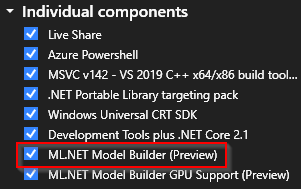
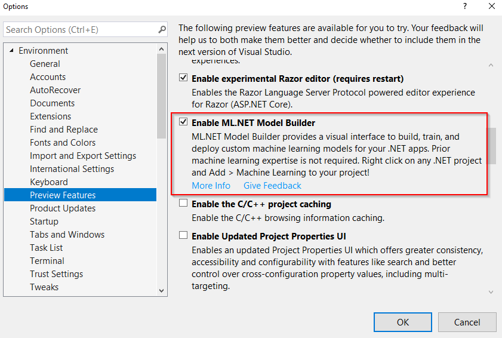

# How to install ML.NET Model Builder

Learn how to install ML.NET Model Builder to add machine learning to your .NET applications.

> [!NOTE]
> Model Builder is currently in Preview.

## Prerequisites

- Visual Studio 2019
- .NET Core 3.0 SDK or later.

## Limitations

- ML.NET Model Builder Extension currently only works on Visual Studio on Windows.
- Training dataset limit of 1GB
- SQL Server has a limit of 100 thousand rows for training
- Microsoft SQL Server Data Tools for Visual Studio 2017 is not supported

## Install

ML.NET Model builder can be installed either through the Visual Studio Marketplace or from within Visual Studio.

### Visual Studio Marketplace

1. Download from [Visual Studio Marketplace](https://marketplace.visualstudio.com/items?itemName=MLNET.07)
1. Follow prompts to install onto respective Visual Studio version

### Visual Studio 2019

1. Open the Visual Studio Installer and select to modify your current version of Visual Studio.

1. Check the **ML.NET Model Builder (Preview)** item is selected

    

1. On the menu bar, select **Tools** > **Options**

1. Navigate to the **Environment** > **Preview Features** section

1. Check **Enable ML.NET Model Builder**

    

## Uninstall

### Visual Studio 2019

1. On the menu bar, select **Extensions** > **Manage Extensions**

    

1. Inside the *Extension and Updates* prompt, expand the *Installed* node and select *Tools*
1. Select ML.NET Model Builder (Preview) from the list of tools and then, select *Uninstall*

    

1. Follow the prompts to complete the uninstallation.

## Upgrade

The upgrade process is similar to the installation process. Either download the latest version from Visual Studio Marketplace or use the Extensions Manager in Visual Studio.
