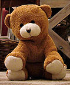
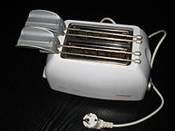
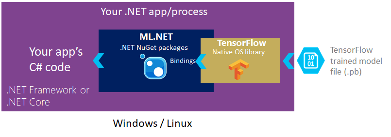
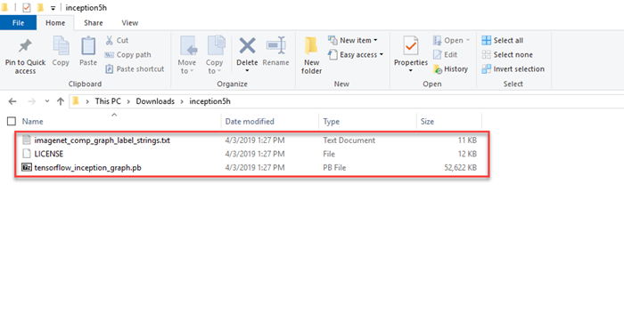

# Tutorial: Retrain a TensorFlow image classifier with transfer learning and ML.NET

Learn how to retrain an image classification TensorFlow model with transfer learning and ML.NET. The original model was trained to classify individual images. After retraining, the new model organizes the images into broad categories. 

Training an [Image Classification](https://en.wikipedia.org/wiki/Outline_of_object_recognition) model from scratch requires setting millions of parameters, a ton of labeled training data and a vast amount of compute resources (hundreds of GPU hours). While not as effective as training a custom model from scratch, transfer learning allows you to shortcut this process by working with thousands of images vs. millions of labeled images and build a customized model fairly quickly (within an hour on a machine without a GPU).

In this tutorial, you learn how to:
> [!div class="checklist"]
> * Understand the problem
> * Reuse and tune the pre-trained model
> * Classify Images

## What is transfer learning?

What if you could reuse a model that's already been pre trained to solve a similar problem and retrain either all or some of the layers of that model to make it solve your problem? This technique of reusing part of an already trained model to build a new model is known as [transfer learning](https://en.wikipedia.org/wiki/Transfer_learning).

## Image classification sample overview

The sample is a console application that uses ML.NET to build an image classifier by reusing a pre-trained model to classify images with a small amount of training data.

You can find the source code for this tutorial at the [dotnet/samples](https://github.com/dotnet/samples/tree/master/machine-learning/tutorials/TransferLearningTF) repository. Note that by default, the .NET project configuration for this tutorial targets .NET core 2.2.

## Prerequisites

* [Visual Studio 2017 15.6 or later](https://visualstudio.microsoft.com/downloads/?utm_medium=microsoft&utm_source=docs.microsoft.com&utm_campaign=inline+link&utm_content=download+vs2017) with the ".NET Core cross-platform development" workload installed. 

* Microsoft.ML 1.0.0 Nuget package
* Microsoft.ML.ImageAnalytics 1.0.0 Nuget package
* Microsoft.ML.TensorFlow 0.12.0 Nuget package

* [The tutorial assets directory .ZIP file](https://download.microsoft.com/download/0/E/5/0E5E0136-21CE-4C66-AC18-9917DED8A4AD/image-classifier-assets.zip)

* [The InceptionV1 machine learning model](https://storage.googleapis.com/download.tensorflow.org/models/inception5h.zip)

## Select the appropriate machine learning task

[Deep learning](https://en.wikipedia.org/wiki/Deep_learning) is a subset of Machine Learning, which is revolutionizing areas like Computer Vision and Speech Recognition.

Deep learning models are trained by using large sets of [labeled data](https://en.wikipedia.org/wiki/Labeled_data) and [neural networks](https://en.wikipedia.org/wiki/Artificial_neural_network) that contain multiple learning layers. Deep learning:

* Performs better on some tasks like Computer Vision.

* Performs well on huge data amounts.

Image Classification is a common Machine Learning task that allows us to automatically classify images into multiple categories such as:

* Detecting a human face in an image or not.
* Detecting Cats vs. dogs.

 Or as in the following images determining if an image is a(n)  food, toy, or appliance:





>[!Note]
> The preceding images belong to Wikimedia Commons and are attributed as follows:
>
> * "220px-Pepperoni_pizza.jpg" Public Domain, https://commons.wikimedia.org/w/index.php?curid=79505,
> * "119px-Nalle_-_a_small_brown_teddy_bear.jpg" By [Jonik](https://commons.wikimedia.org/wiki/User:Jonik) - Self-photographed, CC BY-SA 2.0, https://commons.wikimedia.org/w/index.php?curid=48166.
> * "193px-Broodrooster.jpg" By [M.Minderhoud](https://nl.wikipedia.org/wiki/Gebruiker:Michiel1972) - Own work, CC BY-SA 3.0, https://commons.wikimedia.org/w/index.php?curid=27403

Transfer learning includes a few strategies, such as *retrain all layers* and *penultimate layer*. This tutorial will explain and show how to use the *penultimate layer strategy*. The *penultimate layer strategy* reuses a model that's already been pre-trained to solve a specific problem. The strategy then retrains the final layer of that model to make it solve a new problem. Reusing the pre-trained model as part of your new model will save significant time and resources.

Your image classification model reuses the [Inception model](https://storage.googleapis.com/download.tensorflow.org/models/inception5h.zip), a popular image recognition model trained on the `ImageNet` dataset where the TensorFlow model tries to classify entire images into a thousand classes, like “Umbrella”, “Jersey”, and “Dishwasher”.

The `Inception v1 model` can be classified as a [deep convolutional neural network](https://en.wikipedia.org/wiki/Convolutional_neural_network) and can achieve reasonable performance on hard visual recognition tasks, matching or exceeding human performance in some domains. The model/algorithm was developed by multiple researchers and based on the original paper: ["Rethinking the Inception Architecture for Computer Vision” by Szegedy, et. al.](https://arxiv.org/abs/1512.00567)

Because the `Inception model` has already been pre trained on thousands of different images, it contains the [image features](https://en.wikipedia.org/wiki/Feature_(computer_vision)) needed for image identification. The lower image feature layers recognize simple features (such as edges) and the higher layers recognize more complex features (such as shapes). The final layer is trained against a much smaller set of data because you're starting with a pre trained model that already understands how to classify images. As your model allows you to classify more than two categories, this is an example of a [multi-class classifier](../resources/tasks.md#multiclass-classification). 

`TensorFlow` is a popular deep learning and machine learning toolkit that enables training deep neural networks (and general numeric computations), and is implemented as a `transformer` in ML.NET. For this tutorial, it's used to reuse the `Inception model`.

As shown in the following diagram, you add a reference to the ML.NET NuGet packages in your .NET Core or .NET Framework applications. Under the covers, ML.NET includes and references the native `TensorFlow` library that allows you to write code that loads an existing trained `TensorFlow` model file for scoring.  



The `Inception model` is trained to classify images into a thousand categories, but you need to classify images in a smaller category set, and only those categories. Enter the `transfer` part of `transfer learning`. You can transfer the `Inception model`'s ability to recognize and classify images to the new limited categories of your custom image classifier.  

 You're going to retrain the final layer of that model using a set of three categories:

* Food
* Toy
* Appliance

Your layer uses a [multinomial logistic regression algorithm](https://en.wikipedia.org/wiki/Multinomial_logistic_regression) to find the correct category as quickly as possible. This algorithm classifies using probabilities to determine the answer, giving a one value to the correct category and a zero value to the others.  

### DataSet

There are two data sources: the `.tsv` file, and the image files.  The `tags.tsv` file contains two columns: the first one is defined as `ImagePath` and the second one is the `Label` corresponding to the image. The following example file doesn't have a header row, and looks like this:

<!-- markdownlint-disable MD010 -->
```tags.tsv
broccoli.jpg	food
pizza.jpg	food
pizza2.jpg	food
teddy2.jpg	toy
teddy3.jpg	toy
teddy4.jpg	toy
toaster.jpg	appliance
toaster2.png	appliance
```
<!-- markdownlint-enable MD010 -->

The training and testing images are located in the assets folders that you'll download in a zip file. These images belong to Wikimedia Commons.
> *[Wikimedia Commons](https://commons.wikimedia.org/w/index.php?title=Main_Page&oldid=313158208), the free media repository.* Retrieved 10:48, October 17, 2018 from:  
> https://commons.wikimedia.org/wiki/Pizza  
> https://commons.wikimedia.org/wiki/Toaster  
> https://commons.wikimedia.org/wiki/Teddy_bear  

## Create a console application

### Create a project

1. Create a **.NET Core Console Application** called "TransferLearningTF".

2. Install the **Microsoft.ML NuGet Package**:

    In Solution Explorer, right-click on your project and select **Manage NuGet Packages**. Choose "nuget.org" as the Package source, select the Browse tab, search for **Microsoft.ML**. Click on the **Version** drop-down, select the **1.0.0** package in the list, and select the **Install** button. Select the **OK** button on the **Preview Changes** dialog and then select the **I Accept** button on the **License Acceptance** dialog if you agree with the license terms for the packages listed. Repeat these steps for **Microsoft.ML.ImageAnalytics v1.0.0** and **Microsoft.ML.TensorFlow v0.12.0**.

### Prepare your data

1. Download [The project assets directory zip file](https://download.microsoft.com/download/0/E/5/0E5E0136-21CE-4C66-AC18-9917DED8A4AD/image-classifier-assets.zip), and unzip.

2. Copy the `assets` directory into your *TransferLearningTF* project directory. This directory and its subdirectories contain the data and support files (except for the Inception model, which you'll download and add in the next step) needed for this tutorial.

3. Download the [Inception model](https://storage.googleapis.com/download.tensorflow.org/models/inception5h.zip), and unzip.

4. Copy the contents of the `inception5h` directory just unzipped into your *TransferLearningTF* project `assets\inputs-train\inception` directory. This directory contains the model and additional support files needed for this tutorial, as shown in the following image:

   

5. In Solution Explorer, right-click each of the files in the asset directory and subdirectories and select **Properties**. Under **Advanced**, change the value of **Copy to Output Directory** to **Copy if newer**.

### Create classes and define paths

Add the following additional `using` statements to the top of the *Program.cs* file:

[!code-csharp[AddUsings](../../../samples/machine-learning/tutorials/TransferLearningTF/Program.cs#AddUsings)]

Create global fields to hold the paths to the various assets, and global variables for the `LabelTokey`,`ImageReal`, and  `PredictedLabelValue`:

* `_assetsPath` has the path to the assets.
* `_trainTagsTsv` has the path to the training image data tags tsv file.
* `_predictTagsTsv` has the path to the prediction image data tags tsv file.
* `_trainImagesFolder` has the path to the images used to train the model.
* `_predictImagesFolder` has the path to the images to be classified by the trained model.
* `_inceptionPb` has the path to the pre-trained Inception model to be reused to retrain your model.
* `_inputImageClassifierZip` has the path where the trained model is loaded from.
* `_outputImageClassifierZip` has the path where the trained model is saved.
* `LabelTokey` is the `Label` value mapped to a key.
* `ImageReal`  is the column containing the predicted image value.
* `PredictedLabelValue` is the column containing the predicted label value.

Add the following code to the line right above the `Main` method to specify those paths and the other variables:

[!code-csharp[DeclareGlobalVariables](../../../samples/machine-learning/tutorials/TransferLearningTF/Program.cs#DeclareGlobalVariables)]

Create some classes for your input data, and predictions. Add a new class to your project:

1. In **Solution Explorer**, right-click the project, and then select **Add** > **New Item**.

1. In the **Add New Item** dialog box, select **Class** and change the **Name** field to *ImageData.cs*. Then, select the **Add** button.

    The *ImageData.cs* file opens in the code editor. Add the following `using` statement to the top of *ImageData.cs*:

[!code-csharp[AddUsings](../../../samples/machine-learning/tutorials/TransferLearningTF/ImageData.cs#AddUsings)]

Remove the existing class definition and add the following code for the `ImageData` class to the *ImageData.cs* file:

[!code-csharp[DeclareTypes](../../../samples/machine-learning/tutorials/TransferLearningTF/ImageData.cs#DeclareTypes)]

`ImageData` is the input image data class and has the following <xref:System.String> fields:

* `ImagePath` contains the image file name.
* `Label` contains a value for the image label.

Add a new class to your project for `ImagePrediction`:

1. In **Solution Explorer**, right-click the project, and then select **Add** > **New Item**.

1. In the **Add New Item** dialog box, select **Class** and change the **Name** field to *ImagePrediction.cs*. Then, select the **Add** button.

    The *ImagePrediction.cs* file opens in the code editor. Remove both the `System.Collections.Generic` and the `System.Text` `using` statements at the top of *ImagePrediction.cs*:

Remove the existing class definition and add the following code, which has the `ImagePrediction` class, to the *ImagePrediction.cs* file:

[!code-csharp[DeclareGlobalVariables](../../../samples/machine-learning/tutorials/TransferLearningTF/ImagePrediction.cs#DeclareTypes)]

`ImagePrediction` is the image prediction class and has the following fields:

* `Score` contains the confidence percentage for a given image classification.
* `PredictedLabelValue` contains a value for the predicted image classification label.

`ImagePrediction` is the class used for prediction after the model has been trained. It has a `string` (`ImagePath`) for the image path. The `Label` is used to reuse and retrain the model. The `PredictedLabelValue` is used during prediction and evaluation. For evaluation, an input with training data, the predicted values, and the model are used.

The [MLContext class](xref:Microsoft.ML.MLContext) is a starting point for all ML.NET operations, and initializing `mlContext` creates a new ML.NET environment that can be shared across the model creation workflow objects. It's similar, conceptually, to `DBContext` in Entity Framework.

### Initialize variables in Main

Initialize the `mlContext` variable with a new instance of `MLContext`.  Replace the `Console.WriteLine("Hello World!")` line with the following code in the `Main` method:

[!code-csharp[CreateMLContext](../../../samples/machine-learning/tutorials/TransferLearningTF/Program.cs#CreateMLContext)]

### Create a struct for default parameters

The Inception model has several default parameters you need to pass in. Create a struct to map the default parameter values to friendly names with the following code, just after the `Main()` method:

[!code-csharp[InceptionSettings](../../../samples/machine-learning/tutorials/TransferLearningTF/Program.cs#InceptionSettings)]

### Create a display utility method

Since you'll display the image data and the related predictions more than once, create a display utility method to handle displaying the image and prediction results.

The `DisplayResults()` method executes the following tasks:

* Displays the predicted results.

Create the `DisplayResults()` method, just after the `InceptionSettings` struct, using the following code:

```csharp
private static void DisplayResults(IEnumerable<ImagePrediction> imagePredictionData)
{

}
```

The `Transform()` method populated `ImagePath` in `ImagePrediction` along with the predicted fields. As the ML.NET process progresses, each component adds columns, and this makes it easy to display the results:

[!code-csharp[DisplayPredictions](../../../samples/machine-learning/tutorials/TransferLearningTF/Program.cs#DisplayPredictions)]

You'll call the `DisplayResults()` method in the two image classification methods.

### Create a .tsv file utility method

The `ReadFromTsv()` method executes the following tasks:

* Reads the image data `tags.tsv` file.
* Adds the file path to the image file name.
* Loads the file data into an IEnumerable`ImageData` object.

Create the `ReadFromTsv()` method, just after the `DisplayResults()` method, using the following code:

```csharp
public static IEnumerable<ImageData> ReadFromTsv(string file, string folder)
{

}
```

The following code parses through the `tags.tsv` file to add the file path to the image file name for the `ImagePath` property and load it and the `Label` into an `ImageData` object. Add it as the first line of the `ReadFromTsv()` method.  You need the fully qualified file path to display the prediction results.

[!code-csharp[ReadFromTsv](../../../samples/machine-learning/tutorials/TransferLearningTF/Program.cs#ReadFromTsv)]
There are three major concepts in ML.NET: [Data](../resources/glossary.md#data), [Transformers](../resources/glossary.md#transformer), and [Estimators](../resources/glossary.md#estimator).

## Reuse and tune pre-trained model

Add the following call to the `ReuseAndTuneInceptionModel()`method as the next line of code in the `Main()` method:

[!code-csharp[CallReuseAndTuneInceptionModel](../../../samples/machine-learning/tutorials/TransferLearningTF/Program.cs#CallReuseAndTuneInceptionModel)]

The `ReuseAndTuneInceptionModel()` method executes the following tasks:

* Loads the data
* Extracts and transforms the data.
* Scores the TensorFlow model.
* Tunes (retrains) the model.
* Displays model results.
* Evaluates the model.
* Returns the model.

Create the `ReuseAndTuneInceptionModel()` method, just after the `InceptionSettings` struct and just before the `DisplayResults()` method, using the following code:

```csharp
public static ITransformer ReuseAndTuneInceptionModel(MLContext mlContext, string dataLocation, string imagesFolder, string inputModelLocation, string outputModelLocation)
{

}
```

### Load the data

Data in ML.NET is represented as an [IDataView class](xref:Microsoft.ML.IDataView). `IDataView` is a flexible, efficient way of describing tabular data (numeric and text). Data can be loaded from a text file or in real time (for example, SQL database or log files) to an `IDataView` object.

Load the data using the `MLContext.Data.LoadFromTextFile` wrapper. Add the following code as the next line in the `ReuseAndTuneInceptionModel()` method:

[!code-csharp[LoadData](../../../samples/machine-learning/tutorials/TransferLearningTF/Program.cs#LoadData "Load the data")]

### Extract Features and transform the data

Pre-processing and cleaning data are important tasks that occur before a dataset is used effectively for machine learning.  Using data without these modeling tasks can produce misleading results.

Machine learning algorithms understand [featurized](../resources/glossary.md#feature) data, and when dealing with deep neural networks you must adapt the images to the format expected by the network. That format is a [numeric vector](../resources/glossary.md#numerical-feature-vector).

After training and evaluation, predict with the **Label** column values. As you're using a pre-trained model, map fields to the new model with the [MapValueToKey()](xref:Microsoft.ML.ConversionsExtensionsCatalog.MapValueToKey%2A) method. This method transforms the `Label` into a numeric key type (`LabelTokey`) column and add it as new dataset column:  Name this `estimator` as you'll also add the trainer to it. Add the next line of code:

[!code-csharp[MapValueToKey1](../../../samples/machine-learning/tutorials/TransferLearningTF/Program.cs#MapValueToKey1)]

Your image processing estimator uses pre-trained [Deep Neural Network(DNN)](https://en.wikipedia.org/wiki/Deep_learning#Deep_neural_networks) featurizers for feature extraction. When dealing with deep neural networks, you  adapt the images to the expected network format. This is the reason you use several image transforms to get the image data into the model's expected form:

1. The `LoadImages`transform images are loaded in memory as a Bitmap type.
2. The `ResizeImages` transform resizes the images as the pre-trained model has a defined input image width and height.
3. The `ExtractPixels` transform extracts the pixels from the input images and converts them into a numeric vector.

Add these image transforms as the next lines of code:

[!code-csharp[ImageTransforms](../../../samples/machine-learning/tutorials/TransferLearningTF/Program.cs#ImageTransforms)]

The `LoadTensorFlowModel` is a convenience method that allows the `TensorFlow` model to be loaded once and then creates the `TensorFlowEstimator` using `ScoreTensorFlowModel`. The `ScoreTensorFlowModel` extracts specified outputs (the `Inception model`'s image features `softmax2_pre_activation`), and scores a dataset using the pre-trained `TensorFlow` model.

`softmax2_pre_activation` assists the model with determining which class the images belongs to. `softmax2_pre_activation` returns a probability for each of the categories for an image, and all of those probabilities must add up to 1. It assumes that an image will belong to only one category, as shown in the following example:

| Class         | Probability   |
| ------------- | ------------- |
| `Food`        |  0.001        |
| `Toy`         |  0.95         |
| `Appliance`   |  0.06         |

Append the `TensorFlowTransform` to the `estimator` with the following line of code:

[!code-csharp[ScoreTensorFlowModel](../../../samples/machine-learning/tutorials/TransferLearningTF/Program.cs#ScoreTensorFlowModel)]

### Choose a training algorithm

To add the training algorithm, call the `mlContext.MulticlassClassification.Trainers.LbfgsMaximumEntropy()` wrapper method.  The [LbfgsMaximumEntropy](xref:Microsoft.ML.Trainers.LbfgsMaximumEntropyMulticlassTrainer) is appended to the `estimator` and accepts the Inception image features (`softmax2_pre_activation`) and the `Label` input parameters to learn from the historic data.  Add the trainer with the following code:

[!code-csharp[AddTrainer](../../../samples/machine-learning/tutorials/TransferLearningTF/Program.cs#AddTrainer)]

You also need to map the `predictedlabel` to the `predictedlabelvalue`:

[!code-csharp[MapValueToKey2](../../../samples/machine-learning/tutorials/TransferLearningTF/Program.cs#MapValueToKey2)]

The `Fit()` method trains your model by transforming the dataset and applying the training. Fit the model to the training dataset and return the trained model by adding the following as the next line of code in the `ReuseAndTuneInceptionModel()` method:

[!code-csharp[TrainModel](../../../samples/machine-learning/tutorials/TransferLearningTF/Program.cs#TrainModel)]

The [Transform()](xref:Microsoft.ML.ITransformer.Transform%2A) method makes predictions for multiple provided input rows of a test dataset.  Transform the `Training` data by adding the following code to `ReuseAndTuneInceptionModel()`:

[!code-csharp[TransformData](../../../samples/machine-learning/tutorials/TransferLearningTF/Program.cs#TransformData)]

Convert your image data and prediction `DataViews` into strongly-typed `IEnumerables` to pair for easier display. Use the `MLContext.CreateEnumerable()` method to do that, using the following code:

[!code-csharp[EnumerateDataViews](../../../samples/machine-learning/tutorials/TransferLearningTF/Program.cs#EnumerateDataViews)]

Call the `DisplayResults()` method to display your data and predictions as the next line in the `ReuseAndTuneInceptionModel()` method:

[!code-csharp[CallDisplayResults1](../../../samples/machine-learning/tutorials/TransferLearningTF/Program.cs#CallDisplayResults1)]

Once you have the prediction set, the [Evaluate()](xref:Microsoft.ML.RecommendationCatalog.Evaluate%2A) method:

* Assesses the model (compares the predicted values with the actual dataset `Labels`).

* Returns the model performance metrics.

Add the following code to the `ReuseAndTuneInceptionModel()` method as the next line:

[!code-csharp[Evaluate](../../../samples/machine-learning/tutorials/TransferLearningTF/Program.cs#Evaluate)]

The following metrics are evaluated for image classification:

* `Log-loss` - see [Log Loss](../resources/glossary.md#log-loss). You want Log-loss to be as close to zero as possible.

* `Per class Log-loss`. You want per class Log-loss to be as close to zero as possible.

Use the following code to display the metrics, share the results, and then act on them:

[!code-csharp[DisplayMetrics](../../../samples/machine-learning/tutorials/TransferLearningTF/Program.cs#DisplayMetrics)]

 Add the following code to return the trained model as the next line:

[!code-csharp[SaveModel](../../../samples/machine-learning/tutorials/TransferLearningTF/Program.cs#ReturnModel)]

## Classify images with a loaded model

Add the following call to the `ClassifyImages()` method as the next line of code in the `Main` method:

[!code-csharp[CallClassifyImages](../../../samples/machine-learning/tutorials/TransferLearningTF/Program.cs#CallClassifyImages)]

The `ClassifyImages()` method executes the following tasks:

* Reads .TSV file into `IEnumerable`.
* Predicts image classifications based on test data.

Create the `ClassifyImages()` method, just after the `ReuseAndTuneInceptionModel()` method and just before the `DisplayResults()` method, using the following code:

```csharp
public static void ClassifyImages(MLContext mlContext, string dataLocation, string imagesFolder, string outputModelLocation, ITransformer model)
{

}
```

First, call the `ReadFromTsv()` method to create an `IEnumerable<ImageData>` class that contains the fully qualified path for each `ImagePath`. You need that file path to pair your data and prediction results. You also need to convert the `IEnumerable<ImageData>` class to an `IDataView` that you will use to predict. Add the following code as the next two lines in the `ClassifyImages()` method:

[!code-csharp[CallReadFromTSV](../../../samples/machine-learning/tutorials/TransferLearningTF/Program.cs#CallReadFromTSV)]

As you did previously with the training image data, predict the category of the test image data using the [Transform()](xref:Microsoft.ML.ITransformer.Transform%2A) method of the model passed in. Add the following code to the `ClassifyImages()` method for the predictions and to convert the `predictions` `IDataView` into an `IEnumerable` for pairing and display:

[!code-csharp[Predict](../../../samples/machine-learning/tutorials/TransferLearningTF/Program.cs#Predict)]

To pair and display your test image data and predictions, add the following code to call the `DisplayResults()` method previously created as the next line in the `ClassifyImages()` method:

[!code-csharp[CallDisplayResults2](../../../samples/machine-learning/tutorials/TransferLearningTF/Program.cs#CallDisplayResults2)]

## Classify a single image with a loaded model

Add the following call to the `ClassifySingleImage()` method as the next line of code in the `Main` method:

[!code-csharp[CallClassifySingleImage](../../../samples/machine-learning/tutorials/TransferLearningTF/Program.cs#CallClassifySingleImage)]

The `ClassifySingleImage()` method executes the following tasks:

* Loads an `ImageData` instance.
* Predicts image classification based on test data.

Create the `ClassifySingleImage()` method, just after the `ClassifyImages()` method and just before the `DisplayResults()` method, using the following code:

```csharp
public static void ClassifySingleImage(MLContext mlContext, string imagePath, string outputModelLocation, ITransformer model)
{

}
```

First, create an `ImageData` class that contains the fully qualified path and image file name for the single `ImagePath`. Add the following code as the next  lines in the `ClassifySingleImage()` method:

[!code-csharp[LoadImageData](../../../samples/machine-learning/tutorials/TransferLearningTF/Program.cs#LoadImageData)]

The [PredictionEngine class](xref:Microsoft.ML.PredictionEngine%602) is a convenience API that performs a prediction on a single instance of data. The [Predict()](xref:Microsoft.ML.PredictionEngine%602.Predict%2A) function makes a prediction on a single column of data. Pass `imageData` to the `PredictionEngine` to predict the image category by adding the following code to `ClassifySingleImage()`:

[!code-csharp[PredictSingle](../../../samples/machine-learning/tutorials/TransferLearningTF/Program.cs#PredictSingle)]

Display the prediction result as the next line of code in the `ClassifySingleImage()` method:

[!code-csharp[DisplayPrediction](../../../samples/machine-learning/tutorials/TransferLearningTF/Program.cs#DisplayPrediction)]

## Results

After following the previous steps, run your console app (Ctrl + F5). Your results should be similar to the following output.  You may see warnings or processing messages, but these messages have been removed from the following results for clarity.

```console
=============== Training classification model ===============
Image: broccoli.jpg predicted as: food with score: 0.976743
Image: pizza.jpg predicted as: food with score: 0.9751652
Image: pizza2.jpg predicted as: food with score: 0.9660203
Image: teddy2.jpg predicted as: toy with score: 0.9748783
Image: teddy3.jpg predicted as: toy with score: 0.9829691
Image: teddy4.jpg predicted as: toy with score: 0.9868168
Image: toaster.jpg predicted as: appliance with score: 0.9769174
Image: toaster2.png predicted as: appliance with score: 0.9800823
=============== Classification metrics ===============
LogLoss is: 0.0228266745633507
PerClassLogLoss is: 0.0277501705149937 , 0.0186303530571291 , 0.0217359128952187
=============== Making classifications ===============
Image: broccoli.png predicted as: food with score: 0.905548
Image: pizza3.jpg predicted as: food with score: 0.9709008
Image: teddy6.jpg predicted as: toy with score: 0.9750155
=============== Making single image classification ===============
Image: toaster3.jpg predicted as: appliance with score: 0.9625379

C:\Program Files\dotnet\dotnet.exe (process 4304) exited with code 0.
Press any key to close this window . . .
```

Congratulations! You've now successfully built a machine learning model for image classification by reusing a pre-trained `TensorFlow` model in ML.NET.

You can find the source code for this tutorial at the [dotnet/samples](https://github.com/dotnet/samples/tree/master/machine-learning/tutorials/TransferLearningTF) repository.

In this tutorial, you learned how to:
> [!div class="checklist"]
> * Understand the problem
> * Reuse and tune the pre-trained model
> * Classify images with a loaded model

Check out the Machine Learning samples GitHub repository to explore an expanded image classification sample.
> [!div class="nextstepaction"]
> [dotnet/machinelearning-samples GitHub repository](https://github.com/dotnet/machinelearning-samples/)
