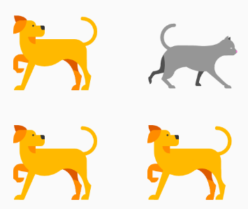
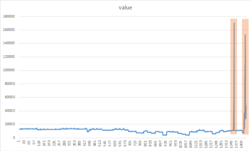
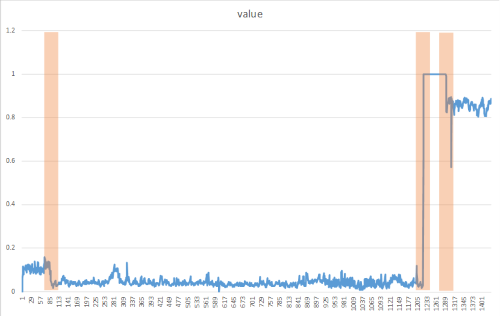

# Tutorial: Detect anomalies in product sales with ML.NET

Learn how to build an anomaly detection application for product sales data. This tutorial creates a .NET Core console application using C# in Visual Studio.

In this tutorial, you learn how to:
> [!div class="checklist"]
>
> * Load the data
> * Create a transform for spike anomaly detection
> * Detect spike anomalies with the transform
> * Create a transform for change point anomaly detection
> * Detect change point anomalies with the transform

You can find the source code for this tutorial at the [dotnet/samples](https://github.com/dotnet/samples/tree/master/machine-learning/tutorials/ProductSalesAnomalyDetection) repository.

## Prerequisites

* [Visual Studio 2017 version 15.6 or later](https://visualstudio.microsoft.com/downloads/?utm_medium=microsoft&utm_source=docs.microsoft.com&utm_campaign=inline+link&utm_content=download+vs2019) with the ".NET Core cross-platform development" workload installed.

* [The product-sales.csv dataset](https://raw.githubusercontent.com/dotnet/machinelearning-samples/master/samples/csharp/getting-started/AnomalyDetection_Sales/SpikeDetection/Data/product-sales.csv)

>[!NOTE]
> The data format in `product-sales.csv` is based on the dataset “Shampoo Sales Over a Three Year Period” originally sourced from DataMarket and provided by Time Series Data Library (TSDL), created by Rob Hyndman.
> “Shampoo Sales Over a Three Year Period” Dataset Licensed Under the DataMarket Default Open License.

## Create a console application

1. Create a **.NET Core Console Application** called "ProductSalesAnomalyDetection".

2. Create a directory named *Data* in your project to save your data set files.

3. Install the **Microsoft.ML NuGet Package**:

    In Solution Explorer, right-click on your project and select **Manage NuGet Packages**. Choose "nuget.org" as the Package source, select the Browse tab, search for **Microsoft.ML**, select the **v1.0.0** package in the list, and select the **Install** button. Select the **OK** button on the **Preview Changes** dialog and then select the **I Accept** button on the **License Acceptance** dialog if you agree with the license terms for the packages listed. Repeat these steps for **Microsoft.ML.TimeSeries v0.12.0**.

4. Add the following `using` statements at the top of your *Program.cs* file:

    [!code-csharp[AddUsings](~/samples/machine-learning/tutorials/ProductSalesAnomalyDetection/Program.cs#AddUsings "Add necessary usings")]

### Download your data

1. Download the dataset and save it to the *Data* folder you previously created:

   * Right click on [*product-sales.csv*](https://raw.githubusercontent.com/dotnet/machinelearning-samples/master/samples/csharp/getting-started/AnomalyDetection_Sales/SpikeDetection/Data/product-sales.csv) and select "Save Link (or Target) As..."

     Make sure you either save the \*.csv file to the *Data* folder, or after you save it elsewhere, move the \*.csv file to the *Data* folder.

2. In Solution Explorer, right-click the \*.csv file and select **Properties**. Under **Advanced**, change the value of **Copy to Output Directory** to **Copy if newer**.

The following table is a data preview from your \*.csv file:

|Month  |ProductSales |
|-------|-------------|
|1-Jan  |    271      |
|2-Jan  |    150.9    |
|.....  |    .....    |
|1-Feb  |    199.3    |
|.....  |    .....    |

### Create classes and define paths

Next, define your input and prediction class data structures.

Add a new class to your project:

1. In **Solution Explorer**, right-click the project, and then select **Add > New Item**.

2. In the **Add New Item dialog box**, select **Class** and change the **Name** field to *ProductSalesData.cs*. Then, select the **Add** button.

   The *ProductSalesData.cs* file opens in the code editor.

3. Add the following `using` statement to the top of *ProductSalesData.cs*:

   ```csharp
   using Microsoft.ML.Data;
   ```

4. Remove the existing class definition and add the following code, which has two classes `ProductSalesData` and `ProductSalesPrediction`, to the *ProductSalesData.cs* file:

    [!code-csharp[DeclareTypes](~/samples/machine-learning/tutorials/ProductSalesAnomalyDetection/ProductSalesData.cs#DeclareTypes "Declare data record types")]

    `ProductSalesData` specifies an input data class. The [LoadColumn](xref:Microsoft.ML.Data.LoadColumnAttribute.%23ctor%28System.Int32%29) attribute specifies which columns (by column index) in the dataset should be loaded.

    `ProductSalesPrediction` specifies the prediction data class. For anomaly detection, the prediction consists of an alert to indicate whether there is an anomaly, a raw score, and p-value. The closer the p-value is to 0, the more likely an anomaly has occurred.

5. Create two global fields to hold the recently downloaded dataset file path and the saved model file path:

    * `_dataPath` has the path to the dataset used to train the model.
    * `_docsize` has the number of records in dataset file. You'll use `_docSize` to calculate `pvalueHistoryLength`.

6. Add the following code to the line right above the `Main` method to specify those paths:

    [!code-csharp[Declare global variables](~/samples/machine-learning/tutorials/ProductSalesAnomalyDetection/Program.cs#DeclareGlobalVariables "Declare global variables")]

### Initialize variables in Main

1. Replace the `Console.WriteLine("Hello World!")` line in the `Main` method with the following code to declare and initialize the `mlContext` variable:

    [!code-csharp[CreateMLContext](~/samples/machine-learning/tutorials/ProductSalesAnomalyDetection/Program.cs#CreateMLContext "Create the ML Context")]

    The [MLContext class](xref:Microsoft.ML.MLContext) is a starting point for all ML.NET operations, and initializing `mlContext` creates a new ML.NET environment that can be shared across the model creation workflow objects. It's similar, conceptually, to `DBContext` in Entity Framework.

### Load the data

Data in ML.NET is represented as an [IDataView class](xref:Microsoft.ML.IDataView). `IDataView` is a flexible, efficient way of describing tabular data (numeric and text). Data can be loaded from a text file or from other sources (for example, SQL database or log files) to an `IDataView` object.

1. Add the following code as the next line of the `Main()` method:

    [!code-csharp[LoadData](~/samples/machine-learning/tutorials/ProductSalesAnomalyDetection/Program.cs#LoadData "loading dataset")]

    The [LoadFromTextFile()](xref:Microsoft.ML.TextLoaderSaverCatalog.LoadFromTextFile%60%601%28Microsoft.ML.DataOperationsCatalog,System.String,System.Char,System.Boolean,System.Boolean,System.Boolean,System.Boolean%29) defines the data schema and reads in the file. It takes in the data path variables and returns an `IDataView`.

## Time series anomaly detection

Anomaly detection flags unexpected or unusual events or behaviors. It gives clues where to look for problems and helps you answer the question "Is this weird?".



Anomaly detection is the process of detecting time-series data outliers; points on a given input time-series where the behavior isn't what was expected, or "weird".

Anomaly detection can be useful in lots of ways. For instance:

If you have a car, you might want to know: Is this oil gauge reading normal, or do I have a leak?
If you're monitoring power consumption, you’d want to know: Is there an outage?

There are two types of time series anomalies that can be detected:

* **Spikes** indicate temporary bursts of anomalous behavior in the system.

* **Change points** indicate the beginning of persistent changes over time in the system.

In ML.NET, The IID Spike Detection or IID Change point Detection algorithms are suited for [independent and identically distributed datasets](https://en.wikipedia.org/wiki/Independent_and_identically_distributed_random_variables).

Unlike the models in the other tutorials, the time series anomaly detector transforms operate directly on input data. The `IEstimator.Fit()` method does not need training data to produce the transform. It does need the data schema though, which is provided by a data view generated from an empty list of `ProductSalesData`.

You'll analyze the same product sales data to detect spikes and change points. The building and training model process is the same for spike detection and change point detection; the main difference is the specific detection algorithm used.

## Spike detection

The goal of spike detection is to identify sudden yet temporary bursts that significantly differ from the majority of the time series data values. It's important to detect these suspicious rare items, events, or observations in a timely manner to be minimized. The following approach can be used to detect a variety of anomalies such as: outages, cyber-attacks, or viral web content. The following image is an example of spikes in a time series dataset:



### Add the CreateEmptyDataView() method

Add the following method to `Program.cs`:

[!code-csharp[CreateEmptyDataView](~/samples/machine-learning/tutorials/ProductSalesAnomalyDetection/Program.cs#CreateEmptyDataView)]

The `CreateEmptyDataView()` produces an empty data view object with the correct schema to be used as input to the `IEstimator.Fit()` method.

### Create the DetectSpike() method

The `DetectSpike()` method:

* Creates the transform from the estimator.
* Detects spikes based on historical sales data.
* Displays the results.

1. Create the `DetectSpike()` method, just after the `Main()` method, using the following code:

    ```csharp
    static void DetectSpike(MLContext mlContext, int docSize, IDataView productSales)
    {

    }
    ```

1. Use the [IidSpikeEstimator](xref:Microsoft.ML.Transforms.TimeSeries.IidSpikeEstimator) to train the model for spike detection. Add it to the `DetectSpike()` method with the following code:

    [!code-csharp[AddSpikeTrainer](~/samples/machine-learning/tutorials/ProductSalesAnomalyDetection/Program.cs#AddSpikeTrainer)]

1. Create the spike detection transform by adding the following as the next line of code in the `DetectSpike()` method:

    [!code-csharp[TrainModel1](~/samples/machine-learning/tutorials/ProductSalesAnomalyDetection/Program.cs#TrainModel1)]

1. Add the following line of code to transform the `productSales` data as the next line in the `DetectSpike()` method:

    [!code-csharp[TransformData1](~/samples/machine-learning/tutorials/ProductSalesAnomalyDetection/Program.cs#TransformData1)]

    The previous code uses the [Transform()](xref:Microsoft.ML.ITransformer.Transform%2A) method to make predictions for multiple input rows of a dataset.

1. Convert your `transformedData` into a strongly-typed `IEnumerable` for easier display using the [CreateEnumerable()](xref:Microsoft.ML.DataOperationsCatalog.CreateEnumerable%2A) method with the following code:

    [!code-csharp[CreateEnumerable1](~/samples/machine-learning/tutorials/ProductSalesAnomalyDetection/Program.cs#CreateEnumerable1)]

1. Create a display header line using the following <xref:System.Console.WriteLine?displayProperty=nameWithType> code:

    [!code-csharp[DisplayHeader1](~/samples/machine-learning/tutorials/ProductSalesAnomalyDetection/Program.cs#DisplayHeader1)]

    You'll display the following information in your spike detection results:

    * `Alert` indicates a spike alert for a given data point.
    * `Score` is the `ProductSales` value for a given data point in the dataset.
    * `P-Value` The "P" stands for probability. The closer the p-value is to 0, the more likely the data point is an anomaly.

1. Use the following code to iterate through the `predictions` `IEnumerable` and display the results:

    [!code-csharp[DisplayResults1](~/samples/machine-learning/tutorials/ProductSalesAnomalyDetection/Program.cs#DisplayResults1)]

1. Add the call to the `DetectSpike()`method in the `Main()` method:

    [!code-csharp[CallDetectSpike](~/samples/machine-learning/tutorials/ProductSalesAnomalyDetection/Program.cs#CallDetectSpike)]

## Spike detection results

Your results should be similar to the following. During processing, messages are displayed. You may see warnings, or processing messages. Some of the messages have been removed from the following results for clarity.

```console
Detect temporary changes in pattern
=============== Training the model ===============
=============== End of training process ===============
Alert   Score   P-Value
0       271.00  0.50
0       150.90  0.00
0       188.10  0.41
0       124.30  0.13
0       185.30  0.47
0       173.50  0.47
0       236.80  0.19
0       229.50  0.27
0       197.80  0.48
0       127.90  0.13
1       341.50  0.00 <-- Spike detected
0       190.90  0.48
0       199.30  0.48
0       154.50  0.24
0       215.10  0.42
0       278.30  0.19
0       196.40  0.43
0       292.00  0.17
0       231.00  0.45
0       308.60  0.18
0       294.90  0.19
1       426.60  0.00 <-- Spike detected
0       269.50  0.47
0       347.30  0.21
0       344.70  0.27
0       445.40  0.06
0       320.90  0.49
0       444.30  0.12
0       406.30  0.29
0       442.40  0.21
1       580.50  0.00 <-- Spike detected
0       412.60  0.45
1       687.00  0.01 <-- Spike detected
0       480.30  0.40
0       586.30  0.20
0       651.90  0.14
```

## Change point detection

`Change points` are persistent changes in a time series event stream distribution of values, like level changes and trends. These persistent changes last much longer than `spikes` and could indicate catastrophic event(s). `Change points` are not usually visible to the naked eye, but can be detected in your data using approaches such as in the following method.  The following image is an example of a change point detection:



### Create the DetectChangepoint() method

The `DetectChangepoint()` method executes the following tasks:

* Creates the transform from the estimator.
* Detects change points based on historical sales data.
* Displays the results.

1. Create the `DetectChangepoint()` method, just after the `Main()` method, using the following code:

    ```csharp
    static void DetectChangepoint(MLContext mlContext, int docSize, IDataView productSales)
    {

    }
    ```

1. Create the [iidChangePointEstimator](xref:Microsoft.ML.Transforms.TimeSeries.IidChangePointEstimator) in the `DetectChangepoint()` method with the following code:

    [!code-csharp[AddChangepointTrainer](~/samples/machine-learning/tutorials/ProductSalesAnomalyDetection/Program.cs#AddChangepointTrainer)]

1. As you did previously, create the transform from the estimator by adding the following line of code in the `DetectChangePoint()` method:

    [!code-csharp[TrainModel2](~/samples/machine-learning/tutorials/ProductSalesAnomalyDetection/Program.cs#TrainModel2)]

1. Use the `Transform()` method to transform the data by adding the following code to `DetectChangePoint()`:

    [!code-csharp[TransformData2](~/samples/machine-learning/tutorials/ProductSalesAnomalyDetection/Program.cs#TransformData2)]

1. As you did previously, convert your `transformedData` into a strongly-typed `IEnumerable` for easier display using the `CreateEnumerable()`method with the following code:

    [!code-csharp[CreateEnumerable2](~/samples/machine-learning/tutorials/ProductSalesAnomalyDetection/Program.cs#CreateEnumerable2)]

1. Create a display header with the following code as the next line in the `DetectChangePoint()` method:

    [!code-csharp[DisplayHeader2](~/samples/machine-learning/tutorials/ProductSalesAnomalyDetection/Program.cs#DisplayHeader2)]

    You'll display the following information in your change point detection results:

    * `Alert` indicates a change point alert for a given data point.
    * `Score` is the `ProductSales` value for a given data point in the dataset.
    * `P-Value` The "P" stands for probability. The closer the P-value is to 0, the more likely the data point is an anomaly.
    * `Martingale value` is used to identify how "weird" a data point is, based on the sequence of P-values.

1. Iterate through the `predictions` `IEnumerable` and display the results with the following code:

    [!code-csharp[DisplayResults2](~/samples/machine-learning/tutorials/ProductSalesAnomalyDetection/Program.cs#DisplayResults2)]

1. Add the following call to the `DetectChangepoint()`method in the `Main()` method:

    [!code-csharp[CallDetectChangepoint](~/samples/machine-learning/tutorials/ProductSalesAnomalyDetection/Program.cs#CallDetectChangepoint)]

## Change point detection results

Your results should be similar to the following. During processing, messages are displayed. You may see warnings, or processing messages. Some messages have been removed from the following results for clarity.

```console
Detect Persistent changes in pattern
=============== Training the model Using Change Point Detection Algorithm===============
=============== End of training process ===============
Alert   Score   P-Value Martingale value
0       271.00  0.50    0.00
0       150.90  0.00    2.33
0       188.10  0.41    2.80
0       124.30  0.13    9.16
0       185.30  0.47    9.77
0       173.50  0.47    10.41
0       236.80  0.19    24.46
0       229.50  0.27    42.38
1       197.80  0.48    44.23 <-- alert is on, predicted changepoint
0       127.90  0.13    145.25
0       341.50  0.00    0.01
0       190.90  0.48    0.01
0       199.30  0.48    0.00
0       154.50  0.24    0.00
0       215.10  0.42    0.00
0       278.30  0.19    0.00
0       196.40  0.43    0.00
0       292.00  0.17    0.01
0       231.00  0.45    0.00
0       308.60  0.18    0.00
0       294.90  0.19    0.00
0       426.60  0.00    0.00
0       269.50  0.47    0.00
0       347.30  0.21    0.00
0       344.70  0.27    0.00
0       445.40  0.06    0.02
0       320.90  0.49    0.01
0       444.30  0.12    0.02
0       406.30  0.29    0.01
0       442.40  0.21    0.01
0       580.50  0.00    0.01
0       412.60  0.45    0.01
0       687.00  0.01    0.12
0       480.30  0.40    0.08
0       586.30  0.20    0.03
0       651.90  0.14    0.09
```

Congratulations! You've now successfully built machine learning models for detecting spikes and change point anomalies in sales data.

You can find the source code for this tutorial at the [dotnet/samples](https://github.com/dotnet/samples/tree/master/machine-learning/tutorials/ProductSalesAnomalyDetection) repository.

In this tutorial, you learned how to:
> [!div class="checklist"]
>
> * Load the data
> * Train the model for spike anomaly detection
> * Detect spike anomalies with the trained model
> * Train the model for change point anomaly detection
> * Detect change point anomalies with the trained mode

## Next steps

Check out the Machine Learning samples GitHub repository to explore a Power Consumption Anomaly Detection sample.
> [!div class="nextstepaction"]
> [dotnet/machinelearning-samples GitHub repository](https://github.com/dotnet/machinelearning-samples/tree/master/samples/csharp/getting-started/AnomalyDetection_PowerMeterReadings)
