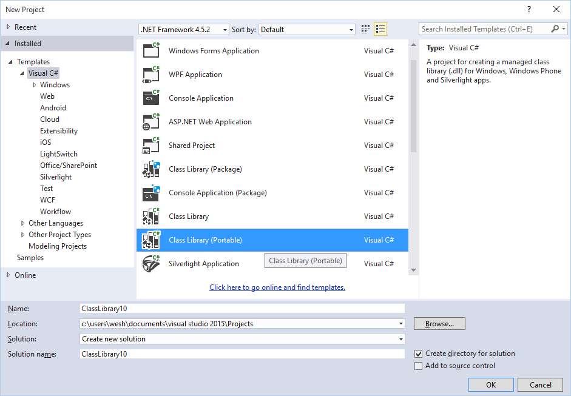
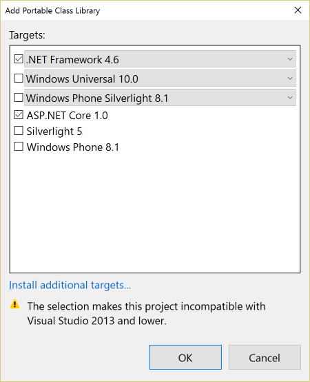

Using MSBuild to build .NET Core projects
=========================================

by [Daniel Plaisted](https://github.com/dsplaisted)

The .NET Core tooling is going to [move from project.json to MSBuild based projects](https://blogs.msdn.microsoft.com/dotnet/2016/05/23/changes-to-project-json/).
We expect the first version of the .NET Core tools that use MSBuild to ship along with the next version of Visual Studio.  However, it is possible to use MSBuild for .NET Core
projects today, and this page shows how.

We recommend that most people targeting .NET Core with *new* projects today use the default tooling experience with project.json because of the following
reasons:

- MSBuild doesn't yet support a lot of the benefits of project.json
- A lot of the ASP.NET based tooling doesn't currently work with MSBuild projects
- When we do release the .NET Core tooling that uses MSBuild, it will be able to automatically convert from project.json to MSBuild projects 

You may want to use MSBuild to target .NET Core for existing projects that already use MSBuild that you want to port to .NET Core, or if you are using
MSBuild's extensibility in your build for scenarios that are not well supported for project.json projects.

Prerequisites
-------------

- [Visual Studio 2015 Update 3 RC](https://www.visualstudio.com/downloads/visual-studio-prerelease-downloads#sec1) or higher
- [.NET Core tools for Visual Studio](https://www.visualstudio.com/downloads/download-visual-studio-vs)
- NuGet Visual Studio extension [v3.5.0-beta](https://dist.nuget.org/visualstudio-2015-vsix/v3.5.0-beta/NuGet.Tools.vsix) or later

Creating a library targeting .NET Core
--------------------------------------

1. In the Visual Studio menu bar, choose **File** | **New** | **Project** and select **Class Library (Portable)**

  

2. Choose a name and location for your project and click **OK**

3. The "Add Portable Class Library" dialog will appear.  Select **.NET Framework 4.6** and **ASP.NET Core 1.0** as targets and click **OK**

  

4. In Solution Explorer, right click on your project and choose **Properties**
5. In the **Library** tab of the project properties, click on the **Target .NET Platform Standard** link, and click **Yes** in the dialog that is shown
6. Open the the `project.json` file in your project, and make the following changes:
    - Change the version number of the `NETStandard.Library` package to `1.5.0-rc2-24027` (this is the .NET Core RC2 version of the package)
    - Add the below `imports` definition inside the `netstandard1.5` framework definition.  This will allow your project to reference .NET Core compatible 
NuGet packages that haven't been updated to target .NET Standard

        ```json
        "netstandard1.5": {
            "imports": [ "dnxcore50", "portable-net452" ]
        }
        ```

Creating a .NET Core console application
----------------------------------------
Building a console application for .NET Core requires some customization of the MSBuild build process.  You can find a sample project for a .NET Core console
application called [CoreApp](https://github.com/dotnet/corefxlab/tree/master/samples/NetCoreSample/CoreApp) in the
[corefxlab](https://github.com/dotnet/corefxlab) repo.  Another good option is to start with [coretemplate](https://github.com/mellinoe/coretemplate),
which uses separate MSBuild targets files to target .NET Core instead of putting the changes directly in the project file.  

It is also possible to start by creating a project in Visual Studio and modify it to target .NET Core.  The instructions below show the minimal steps
to get this working.  In contrast to [CoreApp](https://github.com/dotnet/corefxlab/tree/master/samples/NetCoreSample/CoreApp) or
[coretemplate](https://github.com/mellinoe/coretemplate), a project created this way won't include configurations for targeting Linux and OS X.

Creating a .NET Core console application from Visual Studio
-----------------------------------------------------------

1. In the Visual Studio menu bar, choose **File** | **New** | **Project** and select **Console Application**
2. Choose a name and location for your project and click **OK**
3. In Solution Explorer, right click on your project, choose **Properties**, and then go to the **Build** tab
4. In the **Configuration** dropdown (at the top of the properties page), select **All Configurations**, and then change the **Platform Target** to **x64**
5. Delete the `app.config` file from the project
6. Add a `project.json` file to the project with the following contents:

    ```json
    {
        "dependencies": {
            "Microsoft.NETCore.App": "1.0.0-rc2-3002702"
        },
        "runtimes": {
            "win7-x64": { },
            "ubuntu.14.04-x64": { },
            "osx.10.10-x64": { }
        },
        "frameworks": {
            "netcoreapp1.0": {
                "imports": [ "dnxcore50", "portable-net452" ]
            }
        }
    }
    ```

7. In Solution Explorer, right click on the project, choose **Unload Project**, then right click again and choose
**Edit _MyProj.csproj_**, and make the following changes
    - Remove all the default `Reference` items (to `System`, `System.Core`, etc.)
    - Add the following properties to the first `PropertyGroup` in the project:

        ```xml
        <TargetFrameworkIdentifier>.NETCoreApp</TargetFrameworkIdentifier>
        <TargetFrameworkVersion>v1.0</TargetFrameworkVersion>
        <BaseNuGetRuntimeIdentifier>win7</BaseNuGetRuntimeIdentifier>
        <NoStdLib>true</NoStdLib>
        <NoWarn>$(NoWarn);1701</NoWarn>
        ```

    - Add the following at the end of the file (after the import of `Microsoft.CSharp.Targets`):

        ```xml
        <PropertyGroup>
            <!-- We don't use any of MSBuild's resolution logic for resolving the framework, so just set these two
                    properties to any folder that exists to skip the GetReferenceAssemblyPaths task (not target) and
                    to prevent it from outputting a warning (MSB3644).
                -->
            <_TargetFrameworkDirectories>$(MSBuildThisFileDirectory)</_TargetFrameworkDirectories>
            <_FullFrameworkReferenceAssemblyPaths>$(MSBuildThisFileDirectory)</_FullFrameworkReferenceAssemblyPaths>

            <!-- MSBuild thinks all EXEs need binding redirects, not so for CoreCLR! -->
            <AutoUnifyAssemblyReferences>true</AutoUnifyAssemblyReferences>
            <AutoGenerateBindingRedirects>false</AutoGenerateBindingRedirects>

            <!-- Set up debug options to run with host, and to use the CoreCLR debug engine -->
            <StartAction>Program</StartAction>
            <StartProgram>$(TargetDir)dotnet.exe</StartProgram>
            <StartArguments>$(TargetPath)</StartArguments>
            <DebugEngines>{2E36F1D4-B23C-435D-AB41-18E608940038}</DebugEngines>
        </PropertyGroup>
        ```

    - Close the .csproj file, and reload the project in Visual Studio

8. You should be able to run your program with F5 in Visual Studio, or from the command line in the output folder with `dotnet MyApp.exe` 