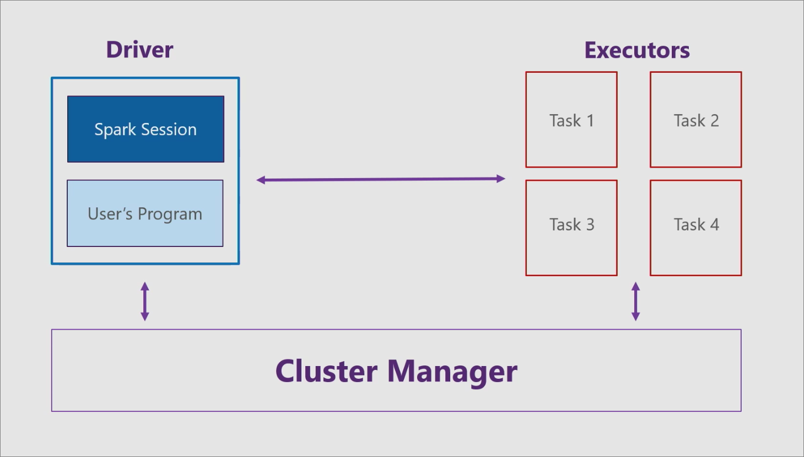

# What is Apache Spark?

[Apache Spark](https://spark.apache.org/) is an open-source parallel processing framework that supports in-memory processing to boost the performance of applications that analyze big data. A Spark job can repeatedly query data that is loaded and cached into memory, which is much faster than disk-based alternatives.

## Common Big Data scenarios

Spark is a general-purpose distributed processing engine that can be used in many big data scenarios. This section describes scenarios.

- Extract, transform, and load (ETL) functions
- Real-time data stream processing through Spark Streaming
- Batch processing
- Machine learning through MLlib
- Ad-hoc querying
- Graph processing through GraphX
- SQL and structured data processing with Spark SQL
- Data visualization

## Apache Spark architecture

Apache Spark, which uses the master/worker architecture, has three main components: the driver, executors, and cluster manager.

### Driver

The driver consists of your program, like a C# console app, and a Spark session. The Spark session takes your program and divides it into smaller tasks that are handled by the executors.

### Executors

Each executor, or worker node, receives a task from the driver and executes that task. The executors reside on an entity known as a cluster.

### Cluster manager

The cluster manager communicates with both the driver and the executors to:

- Manage resource allocation
- Manage program division
- Manage program execution

## Language support

Apache Spark supports the following programming languages:

- Scala
- Python
- Java
- SQL
- R
- .NET

## Spark APIs

Apache Spark supports the following APIs:

- [Spark Scala API](https://spark.apache.org/docs/2.2.0/api/scala/index.html)
- [Spark Java API](https://spark.apache.org/docs/2.2.0/api/java/index.html)
- [Spark Python API](https://spark.apache.org/docs/2.2.0/api/python/index.html)
- [Spark R API](https://spark.apache.org/docs/2.2.0/api/R/index.html)
- [Spark SQL](https://spark.apache.org/docs/latest/api/sql/index.html), built-in functions

## Next steps

Learn how you can use Apache Spark in your .NET application. With .NET for Apache Spark, developers with .NET experience and business logic can write big data queries in C# and F#.
> [!div class="nextstepaction"]
> [What is .NET for Apache Spark](what-is-apache-spark-dotnet.md)