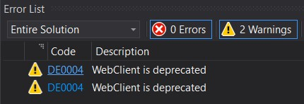

# .NET API analyzer

The .NET API Analyzer is a Roslyn analyzer that discovers potential compatibility risks for C# APIs on different platforms and detects calls to deprecated APIs. It can be useful for all C# developers at any stage of development.

API Analyzer comes as a NuGet package [Microsoft.DotNet.Analyzers.Compatibility](https://www.nuget.org/packages/Microsoft.DotNet.Analyzers.Compatibility/) and after you reference it in a project, it automatically monitors the code and indicates problematic API usage. You can also get suggestions on possible fixes by clicking on the light bulb. The drop-down menu includes an option to suppress the warnings.

> [!NOTE]
> The .NET API analyzer is still a pre-release version.

## Discovering deprecated APIs

**What are deprecated APIs?**

The .NET family is a set of large products that are constantly upgraded to better serve customer needs. It is natural to deprecate some APIs and replace them with new ones. One way to inform that an API is deprecated and should not be used is to mark it with the `[Obsolete]` attribute. The disadvantage of this approach is that there is only one diagnostic ID for all obsolete APIs (for C#, [CS0612](../../csharp/misc/cs0612.md)) that leads to one description for all cases and ability to suppress warnings for either all cases or none of them. The API Analyzer uses API-specific error codes that begin with DE (which stands for Deprecation Error), which allows control over the display of individual warnings. To avoid confusion with the `[Obsolete]` attribute, this concept is called deprecation.

When a deprecated API, such as <xref:System.Net.WebClient>, is used in a code, API Analyzer highlights it with a green squiggly line and shows a light bulb on the left as in the following example:


The **Error List** window contains warnings with a unique ID per deprecated API, as shown in the following example (`DE004`): 



By clicking on the ID, you go to a webpage with detailed information about why the API was deprecated and suggestions regarding alternative APIs that can be used.

Any warnings can be suppressed by right-clicking on the highlighted member and selecting **Quick Actions and Refactorings**. There are two ways to supress warnings: 

* locally (in source)
* globally (in a suppression file)

We encourage developers to use global suppression to ensure consistency of API usage across their projects.

## Discovering cross-platform issues

Similar to deprecated APIs, the analyzer identifies all APIs that are not cross-platform supported. For example, <xref:System.Console.WindowWidth?displayProperty=nameWithType> works on Windows but not on Linux and macOS. The diagnostic ID is shown in **Error List** window. You can suppress that warning by right clicking and choosing **Quick Actions and Refactorings**. Unlike deprecation cases where you have two options (either keep using deprecated member and suppress warnings or not use it at all), here if you're developing your code only for certain platform you can suppress all warnings for all other platforms you don't plan to run your code on. To do so, you just need to edit your project file and add the `PlatformCompatIgnore` property that lists all platforms to be ignored. The accepted values are: `Linux`, `MacOSX`, and `Windows`.

```xml
<PropertyGroup>
    <PlatformCompatIgnore>Linux;MacOSX</PlatformCompatIgnore>
</PropertyGroup>
```

If your code targets multiple platforms and you want to take advantage of an API not supported on some of them, you can guard that part of the code with an `if` statement:

```csharp
if (RuntimeInformation.IsOSPlatform(OSPlatform.Windows))
{
     var w = Console.WindowWidth;
     // More code
}
```
You can also conditionally compile per target framework/operating system, but you currently need to do that manually.

## Supported diagnostics

Currently, the analyzer handles the following cases:

* Usage of a .NET Standard API that throws <xref:System.PlatformNotSupportedException> (PC001).
* Usage of a .NET Standard API that isn't available on the .NET Framework 4.6.1 (PC002).
* Usage of a native API that doesn’t exist in UWP (PC003).
* Usage of an API that is marked as deprecated (DEXXXX).

## CI machine
All these diagnostics are available not only in the IDE, but also on the command line as part of building your project, which includes the CI server.

## Configuration

The user decides how the diagnostics should be treated: as warnings, errors, suggestions, or to be turned off. For example, as an architect, you can decide that compatibility issues should be treated as errors, calls to some deprecated APIs generate warnings, while others only generate suggestions. You can configure this separately by diagnostic ID and by project. To do so in **Solution Explorer**, navigate to the **Dependencies** node under your project. Expand the nodes **Dependencies** > **Analyzers** > **Microsoft.DotNet.Analyzers.Compatibility**, right click on the diagnostic ID and **Set Rule Set Severity** and pick the desired option. 


 
## See also

* [Introducing API Analyzer](https://blogs.msdn.microsoft.com/dotnet/2017/10/31/introducing-api-analyzer/) blog post.
* [API Analyzer](https://youtu.be/eeBEahYXGd0) demo video.
