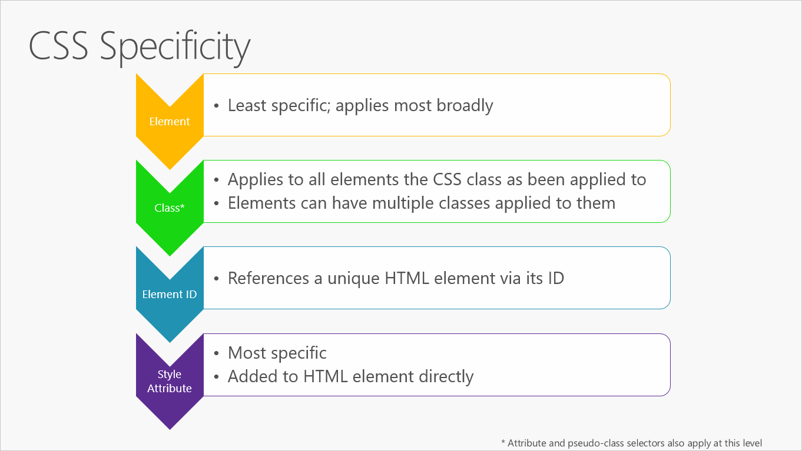

# CSS

CSS (Cascading Style Sheets) is used to control the look and layout of HTML elements. CSS styles can be applied directly to an HTML element, defined separately on the same page, or defined in a separate file and referenced by the page. Styles cascade based on how they are used to select a given HTML element. For instance, a style might apply to an entire document, but would be overridden by a style that applied to a particular element. Likewise, an element-specific style would be overridden by a style that applied to a CSS class that was applied to the element, which in turn would be overridden by a style targeting a specific instance of that element (via its id). Figure 7-X

**Figure 7-X.** CSS Specificity rules, in order.

It's best to keep styles in their own separate stylesheet files, and to use selection-based cascading to implement consistent and reusable styles within the application. Placing style rules within HTML should be avoided, and applying styles to specific individual elements (rather than whole classes of elements, or elements that have had a particular CSS class applied to them) should be the exception, not the rule.

### CSS Preprocessors

CSS stylesheets lack support for conditional logic, variables, and other programming language features. Thus, large stylesheets often include a lot of repetition, as the same color, font, or other setting is applied to many different variations of HTML elements and CSS classes. CSS preprocessors can help your stylesheets follow the [DRY principle](http://deviq.com/don-t-repeat-yourself/) by adding support for variables and logic.

The most popular CSS preprocessors are Sass and LESS. Both extend CSS and are backward compatible with it, meaning that a plain CSS file is a valid Sass or LESS file. Sass is Ruby-based and LESS is JavaScript based, and both typically run as part of your local development process. Both have command line tools available, as well as built-in support in Visual Studio for running them using Gulp or Grunt tasks.

>[!div class="step-by-step"]
[Previous] (html.md)
[Next] (javascript.md)
