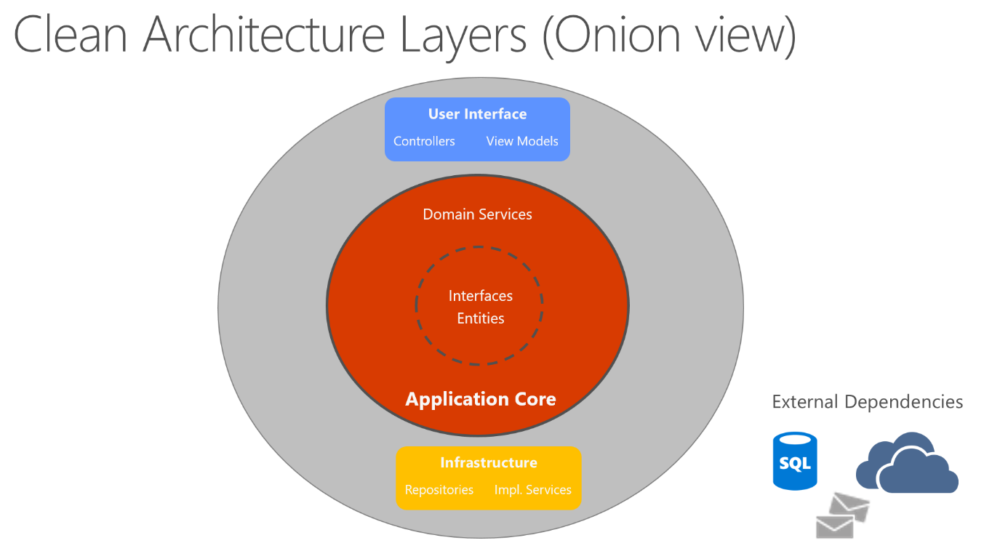
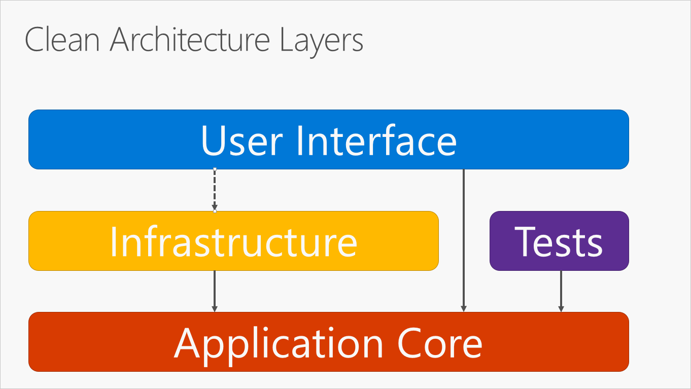
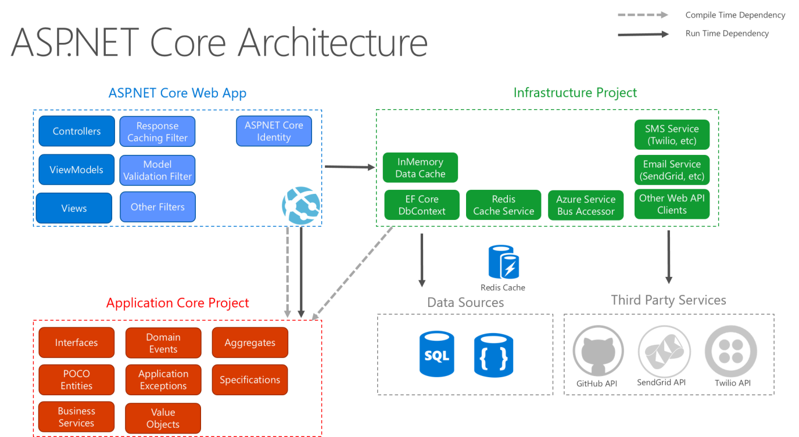
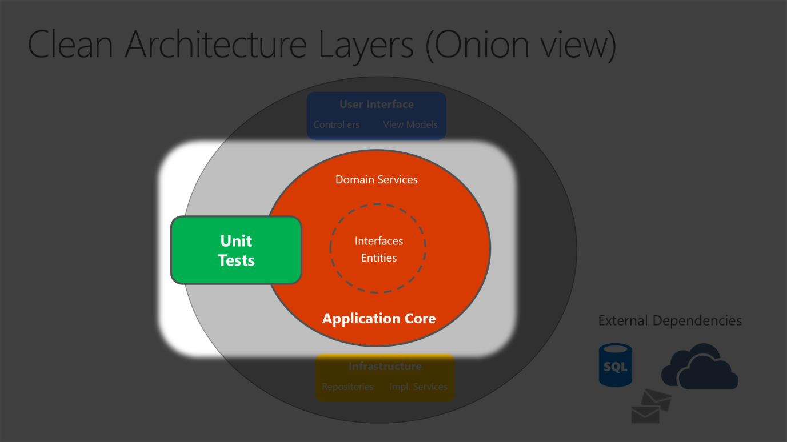

# Clean architecture

Applications that follow the Dependency Inversion Principle as well as Domain-Driven Design (DDD) principles tend to arrive at a similar architecture. This architecture has gone by many names over the years. One of the first names was Hexagonal Architecture, followed by Ports-and-Adapters. More recently, it's been cited as the [Onion Architecture](http://jeffreypalermo.com/blog/the-onion-architecture-part-1/) or [Clean Architecture](https://8thlight.com/blog/uncle-bob/2012/08/13/the-clean-architecture.html). It is this last name, Clean Architecture, that is used as the basis for describing the architecture in this eBook.

> [!NOTE]
> The term Clean Architecture can be applied to applications that are built using DDD Principles as well as to those that are not built using DDD. In the case of the former, this combination may be referred to as "Clean DDD Architecture".

Clean architecture puts the business logic and application model at the center of the application. Instead of having business logic depend on data access or other infrastructure concerns, this dependency is inverted: infrastructure and implementation details depend on the Application Core. This is achieved by defining abstractions, or interfaces, in the Application Core, which are then implemented by types defined in the Infrastructure layer. A common way of visualizing this architecture is to use a series of concentric circles, similar to an onion. Figure 5-X shows an example of this style of architectural representation.

**Figure 5-X.** Clean Architecture; onion view

In this diagram, dependencies flow toward the innermost circle. Thus, you can see that the Application Core (which takes its name from its position at the core of this diagram) has no dependencies on other application layers. At the very center are the application's entities and interfaces. Just outside, but still in the Application Core, are domain services, which typically implement interfaces defined in the inner circle. Outside of the Application Core, both the User Interface and the Infrastructure layers depend on the Application Core, but not on one another (necessarily).

Figure 5-X shows a more traditional horizontal layer diagram that better reflects the dependency between the UI and other layers.

**Figure 5-X.** Clean Architecture; horizontal layer view

Note that the solid arrows represent compile-time dependencies, while the dashed arrow represents a runtime-only dependency. Using the clean architecture, the UI layer works with interfaces defined in the Application Core at compile time, and ideally should not have any knowledge of the implementation types defined in the Infrastructure layer. At runtime, however, these implementation types will be required for the app to execute, so they will need to be present and wired up to the Application Core interfaces via dependency injection.

Figure 5-X shows a more detailed view of an ASP.NET Core application's architecture when built following these recommendations.

**Figure 5-X.** ASP.NET Core architecture diagram following Clean Architecture.

Because the Application Core doesn't depend on Infrastructure, it is very easy to write automated unit tests for this layer. Figures 5-X and 5-X show how tests fit into this architecture.

**Figure 5-X.** Unit testing Application Core in isolation.

**Figure 5-X.** Integration testing Infrastructure implementations with external dependencies.

Since the UI layer doesn't have any direct dependency on types defined in the Infrastructure project, it is likewise very easy to swap out implementations, either to facilitate testing or in response to changing application requirements. ASP.NET Core's built-in use of and support for dependency injection makes this architecture the most appropriate way to structure non-trivial monolithic applications.

For monolithic applications the Application Core, Infrastructure, and User Interface projects are all run as a single application. The runtime application architecture might look something like Figure 5-X.

**Figure 5-X.** A sample ASP.NET Core app's runtime architecture.

### Organizing Code in Clean Architecture

In a Clean Architecture solution, each project has clear responsibilities. As such, certain types will belong in each project and you'll frequently find folders corresponding to these types in the appropriate project.

The Application Core holds the business model, which includes entities, services, and interfaces. These interfaces include abstractions for operations that will be performed using Infrastructure, such as data access, file system access, network calls, etc. Sometimes services or interfaces defined at this layer will need to work with non-entity types that have no dependencies on UI or Infrastructure. These can be defined as simple Data Transfer Objects (DTOs).

> ### Application Core Types
> -   Entities (business model classes that are persisted)
> -   Interfaces
> -   Services
> -   DTOs

The Infrastructure project will typically include data access implementations. In a typical ASP.NET Core web application, this will include the Entity Framework DbContext, any EF Core Migrations that have been defined, and data access implementation classes. The most common way to abstract data access implementation code is through the use of the [Repository design pattern](http://deviq.com/repository-pattern/).

In addition to data access implementations, the Infrastructure project should contain implementations of services that must interact with infrastructure concerns. These services should implement interfaces defined in the Application Core, and so Infrastructure should have a reference to the Application Core project.

> ### Infrastructure Types
> -   EF Core types (DbContext, Migrations)
> -   Data access implementation types (Repositories)
> -   Infrastructure-specific services (FileLogger, SmtpNotifier, etc.)

The user interface layer in an ASP.NET Core MVC application will be the entry point for the application, and will be an ASP.NET Core MVC project. This project should reference the Application Core project, and its types should interact with infrastructure strictly through interfaces defined in Application Core. No direct instantiation of (or static calls to) Infrastructure layer types should be permitted in the UI layer.

> ### UI Layer Types
> -   Controllers
> -   Filters
> -   Views
> -   ViewModels
> -   Startup

The Startup class is responsible for configuring the application, and for wiring up implementation types to interfaces, allowing dependency injection to work properly at run time.

> [!NOTE]
> In order to wire up dependency injection in ConfigureServices in the Startup.cs file of the UI project, the project may need to reference the Infrastructure project. This dependency can be eliminated, most easily by using a custom DI container. For the purposes of this sample, the simplest approach is to allow the UI project to reference the Infrastructure project.

>[!div class="step-by-step"]
[Previous] (traditional-"n-layer"-architecture-applications.md)
[Next] (monolithic-applications-and-containers-.md)
