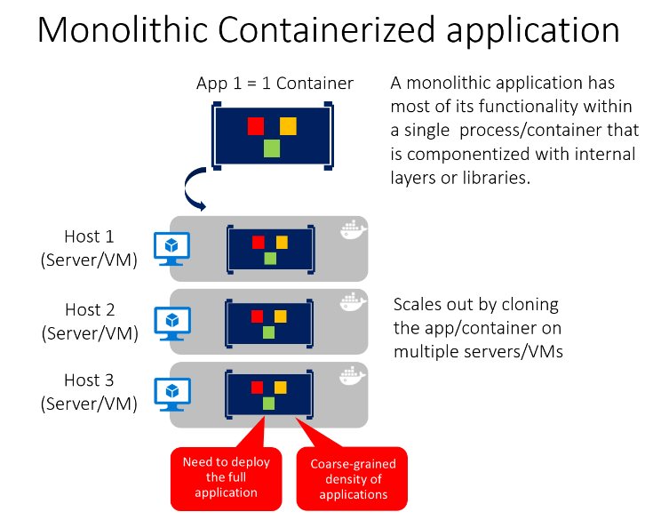

# Monolithic Applications and Containers 

You can build a single and monolithic-deployment based Web Application or Service and deploy it as a container. Within the application, it might not be monolithic but organized into several libraries, components or layers. Externally it is a single container like a single process, single web application or single service.

To manage this model, you deploy a single container to represent the application. To scale, just add additional copies with a load balancer in front. The simplicity comes from managing a single deployment in a single container or VM.

You can include multiple components/libraries or internal layers within each container, as illustrated in Figure 5-X. But, following the container principal of *"a container does one thing, and does it in one process*", the monolithic pattern might be a conflict.

The downside of this approach comes if/when the application grows, requiring it to scale. If the entire application scaled, it's not really a problem. However, in most cases, a few parts of the application are the choke points requiring scaling, while other components are used less.

Using the typical eCommerce example; what you likely need to scale is the product information component. Many more customers browse products than purchase them. More customers use their basket than use the payment pipeline. Fewer customers add comments or view their purchase history. And you likely only have a handful of employees, in a single region, that need to manage the content and marketing campaigns. By scaling the monolithic design, all the code is deployed multiple times.

In addition to the scale everything problem, changes to a single component require complete retesting of the entire application, and a complete redeployment of all the instances.

The monolithic approach is common, and many organizations are developing with this architectural approach. Many are having good enough results, while others are hitting limits. Many designed their applications in this model, because the tools and infrastructure were too difficult to build service oriented architectures (SOA), and they didn't see the need - until the app grew. If you find you're hitting the limits of the monolithic approach, breaking the app up to enable it to better leverage containers and microservices may be the next logical step.

 Deploying monolithic applications in Microsoft Azure can be achieved using dedicated VMs for each instance. Using [Azure VM Scale Sets](https://azure.microsoft.com/en-us/documentation/services/virtual-machine-scale-sets/), you can easily scale the VMs. [Azure App Services](https://azure.microsoft.com/en-us/services/app-service/) can run monolithic applications and easily scale instances without having to manage the VMs. Azure App Services can run single instances of Docker containers as well, simplifying the deployment. Using Docker, you can deploy a single VM as a Docker host, and run multiple instances. Using the Azure balancer, as shown in the Figure 5-X, you can manage scaling.

The deployment to the various hosts can be managed with traditional deployment techniques. The Docker hosts can be managed with commands like **docker run** performed manually, or through automation such as Continuous Delivery (CD) pipelines.

## Monolithic application deployed as a container

There are benefits of using containers to manage monolithic application deployments. Scaling the instances of containers is far faster and easier than deploying additional VMs. Even when using VM Scale Sets to scale VMs, they take time to instance. When deployed as app instances, the configuration of the app is managed as part of the VM.

Deploying updates as Docker images is far faster and network efficient. Docker Images typically start in seconds, speeding rollouts. Tearing down a Docker instance is as easy as issuing a **docker stop** command, typically completing in less than a second.

As containers are inherently immutable by design, you never need to worry about corrupted VMs, whereas update scripts might forget to account for some specific configuration or file left on disk.

While monolithic apps can benefit from Docker, breaking up the monolithic application into sub systems which can be scaled, developed and deployed individually may be your entry point into the realm of microservices.

> ### References – Common Web Architectures
> - **Creating N-Tier Applications in C\#**  
> <https://www.pluralsight.com/courses/n-tier-apps-part1>
> - **The Clean Architecture**  
> <https://8thlight.com/blog/uncle-bob/2012/08/13/the-clean-architecture.html>
> - **The Onion Architecture**  
> <http://jeffreypalermo.com/blog/the-onion-architecture-part-1/>
> - **The Repository Pattern**  
> <http://deviq.com/repository-pattern/>
> - **Clean Architecture Solution Sample**  
> <https://github.com/ardalis/cleanarchitecture>
> - **Architecting Microservices eBook** <http://aka.ms/MicroservicesEbook>

>[!div class="step-by-step"]
[Previous] (clean-architecture.md)
[Next] (../common-client-side-web-technologies/index.md)
