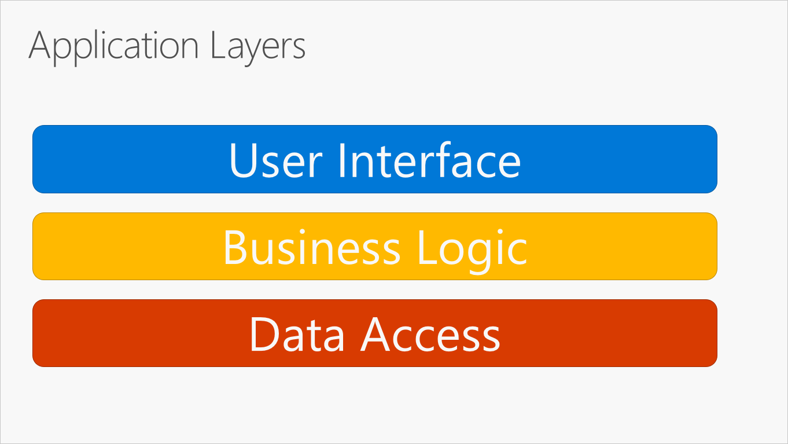
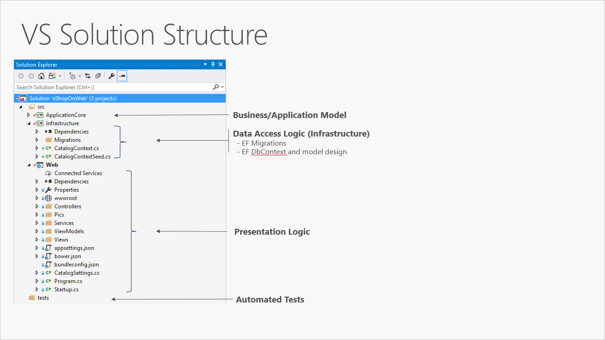
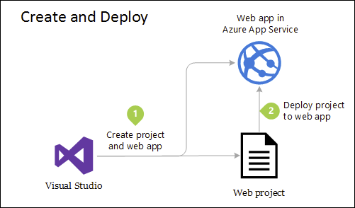

# Traditional "N-Layer" architecture applications

The most common organization of application logic into layers it shown in Figure 5-2.

**Figure 5-2.** Typical application layers.

These layers are frequently abbreviated as UI, BLL (Business Logic Layer), and DAL (Data Access Layer). Using this architecture, users make requests through the UI layer, which interacts only with the BLL. The BLL, in turn, can call the DAL for data access requests. The UI layer should not make any requests to the DAL directly, nor should it interact with persistence directly through other means. Likewise, the BLL should only interact with persistence by going through the DAL. In this way, each layer has its own well-known responsibility.

One disadvantage of this traditional layering approach is that compile-time dependencies run from the top to the bottom. That is, the UI layer depends on the BLL, which depends on the DAL. This means that the BLL, which usually holds the most important logic in the application, is dependent on data access implementation details (and often on the existence of a database). Testing business logic in such an architecture is often difficult, requiring a test database. The dependency inversion principle can be used to address this issue, as you'll see in the next section.

Figure 5-3 shows an example solution, breaking the application into three projects by responsibility (or layer).

**Figure 5-3.** A simple monolithic application with three projects.

Although this application uses several projects for organizational purposes, it is still deployed as a single unit and its clients will interact with it as a single web app. This allows for very simple deployment process. Figure 5-4 shows how such an app might be hosted using Windows Azure.

**Figure 5-4.** Simple deployment of Azure Web App

As application needs grow, more complex and robust deployment solutions may be required. Figure 5-5 shows an example of a more complex deployment plan that supports additional capabilities.

**Figure 5-5.** Deploying a web app to an Azure App Service

Internally, this project's organization into multiple projects based on responsibility improves the maintainability of the application.

This unit can be scaled up or out to take advantage of cloud-based on-demand scalability. Scaling up means adding additional CPU, memory, disk space, or other resources to the server(s) hosting your app. Scaling out means adding additional instances of such servers, whether these are physical servers or virtual machines. When your app is hosted across multiple instances, a load balancer is used to assign requests to individual app instances.

The simplest approach to scaling a web application in Azure is to configure scaling manually in the application's App Service Plan. Figure 5-6 show the appropriate Azure dashboard screen to configure how many instances are serving an app.

**Figure 5-X.** App Service Plan scaling in Azure.

>[!div class="step-by-step"]
[Previous] (what-are-layers.md)
[Next] (clean-architecture.md)
