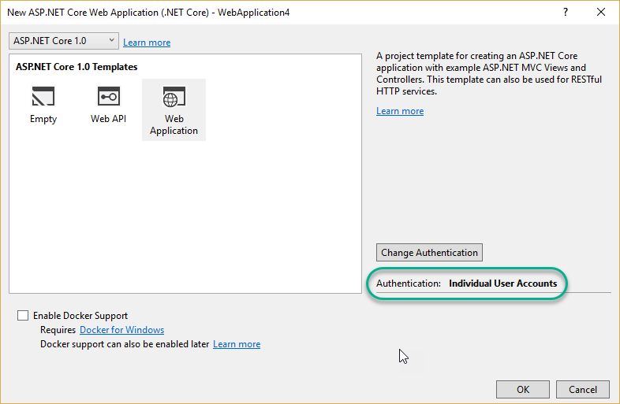
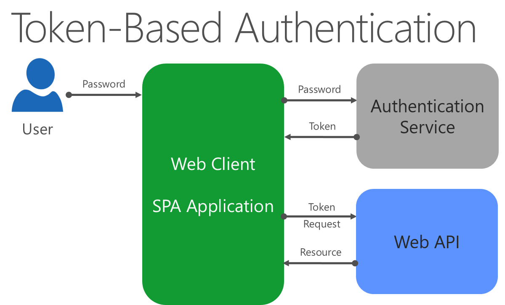

# Security

Securing web applications is a large topic, with many considerations. At its most basic level, security involves ensuring you know who a given request is coming from, and then ensuring that that request only has access to resources it should. Authentication is the process of comparing credentials provided with a request to those in a trusted data store, to see if the request should be treated as coming from a known entity. Authorization is the process of restricting access to certain resources based on user identity. A third security concern is protecting requests from eavesdropping by third parties, for which you should at least [ensure that SSL is used by your application](https://docs.microsoft.com/en-us/aspnet/core/security/enforcing-ssl).

## Authentication

ASP&period;NET Core Identity is a membership system you can use to support login functionality for your application. It has support for local user accounts as well as external login provider support from providers like Microsoft Account, Twitter, Facebook, Google, and more. In addition to ASP&period;NET Core Identity, your application can use windows authentication, or a third-party identity provider like [Identity Server](https://github.com/IdentityServer/IdentityServer4).

ASP&period;NET Core Identity is included in new project templates if the Individual User Accounts option is selected. This template includes support for registration, login, external logins, forgotten passwords, and additional functionality.



Figure 7-X Select Individual User Accounts to have Identity preconfigured.

Identity support is configured in Startup, both in ConfigureServices and Configure:

```cs
public void ConfigureServices(IServiceCollection services)
{
    // Add framework services.
    services.AddDbContext<ApplicationDbContext>(options =>
    options.UseSqlServer(Configuration.GetConnectionString("DefaultConnection")));
    services.AddIdentity<ApplicationUser, IdentityRole>()
    .AddEntityFrameworkStores<ApplicationDbContext>()
    .AddDefaultTokenProviders();
    services.AddMvc();
}

public void Configure(IApplicationBuilder app)
{
    app.UseStaticFiles();
    app.UseIdentity();
    app.UseMvc(routes =>
    {
        routes.MapRoute(
        name: "default",
        template: "{controller=Home}/{action=Index}/{id?}");
    });
}
```

It's important that UseIdentity appear before UseMvc in the Configure method. When configuring Identity in ConfigureServices, you'll notice a call to AddDefaultTokenProviders. This has nothing to do with tokens that may be used to secure web communications, but instead refers to providers that create prompts that can be sent to users via SMS or email in order for them to confirm their identity.

You can learn more about [configuring two-factor authentication](https://docs.microsoft.com/en-us/aspnet/core/security/authentication/2fa) and [enabling external login providers](https://docs.microsoft.com/en-us/aspnet/core/security/authentication/social/) from the official ASP&period;NET Core docs.

## Authorization

The simplest form of authorization involves restricting access to anonymous users. This can be achieved by simply applying the \[Authorize\] attribute to certain controllers or actions. If roles are being used, the attribute can be further extended to restrict access to users who belong to certain roles, as shown:

```cs
[Authorize(Roles = "HRManager,Finance")]
public class SalaryController : Controller
{

}
```

In this case, users belonging to either the HRManager or Finance roles (or both) would have access to the SalaryController. To require that a user belong to multiple roles (not just one of several), you can apply the attribute multiple times, specifying a required role each time.

Specifying certain sets of roles as strings in many different controllers and actions can lead to undesirable repetition. You can configure authorization policies, which encapsulate authorization rules, and then specify the policy instead of individual roles when applying the \[Authorize\] attribute:

```cs
[Authorize(Policy = "CanViewPrivateReport")]
public IActionResult ExecutiveSalaryReport()
{
    return View();
}
```

Using policies in this way, you can separate the kinds of actions being restricted from the specific roles or rules that apply to it. Later, if you create a new role that needs to have access to certain resources, you can just update a policy, rather than updating every list of roles on every \[Authorize\] attribute.

### Claims

Claims are name value pairs that represent properties of an authenticated user. For example, you might store users' employee number as a claim. Claims can then be used as part of authorization policies. You could create a policy called "EmployeeOnly" that requires the existence of a claim called "EmployeeNumber", as shown in this example:

```cs
public void ConfigureServices(IServiceCollection services)
{
    services.AddMvc();
    services.AddAuthorization(options =>
    {
        options.AddPolicy("EmployeeOnly", policy => policy.RequireClaim("EmployeeNumber"));
    });
}
```

This policy could then be used with the \[Authorize\] attribute to protect any controller and/or action, as described above.

### Securing Web APIs

Most web APIs should implement a token-based authentication system. Token authentication is stateless and designed to be scalable. In a token-based authentication system, the client must first authenticate with the authentication provider. If successful, the client is issued a token, which is simply a cryptographically meaningful string of characters. When the client then needs to issue a request to an API, it adds this token as a header on the request. The server then validates the token found in the request header before completing the request. Figure 7-X demonstrates this process.



**Figure 7-X.** Token-based authentication for Web APIs.

> ### References – Security
> - **Security Docs Overview**  
> https://docs.microsoft.com/en-us/aspnet/core/security/
> - **Enforcing SSL in an ASP&period;NET Core App**  
> <https://docs.microsoft.com/en-us/aspnet/core/security/enforcing-ssl>
> - **Introduction to Identity**  
> <https://docs.microsoft.com/en-us/aspnet/core/security/authentication/identity>
> - **Introduction to Authorization**  
> <https://docs.microsoft.com/en-us/aspnet/core/security/authorization/introduction>
> - **Authentication and Authorization for API Apps in Azure App Service**  
> <https://docs.microsoft.com/en-us/azure/app-service-api/app-service-api-authentication>


>[!div class="step-by-step"]
[Previous] (structuring-the-application.md)
[Next] (client-communication.md)
