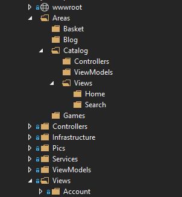

# Structuring the Application

Monolithic applications typically have a single entry point. In the case of an ASP&period;NET Core web application, the entry point will be the ASP&period;NET Core web project. However, that doesn't mean the solution should consist of just a single project. It's useful to break up the application into different layers in order to follow separation of concerns. Once broken up into layers, it's helpful to go beyond folders to separate projects, which can help achieve better encapsulation. The best approach to achieve these goals with an ASP&period;NET Core application is a variation of the Clean Architecture discussed in chapter 5. Following this approach, the application's solution will be comprised of separate libraries for the UI, Infrastructure, and ApplicationCore.

In addition to these projects, separate test projects are included as well (Testing is discussed in Chapter 9).

The application's object model and interfaces should be placed in the ApplicationCore project. This project will have as few dependencies as possible, and the other projects in the solution will reference it. Business entities that need to be persisted are defined in the ApplicationCore project, as are services that do not directly depend on infrastructure.

Implementation details, such as how persistence is performed or how notifications might be sent to a user, are kept in the Infrastructure project. This project will reference implementation-specific packages such as Entity Framework Core, but should not expose details about these implementations outside of the project. Infrastructure services and repositories should implement interfaces that are defined in the ApplicationCore project, and its persistence implementations are responsible for retrieving and storing entities defined in ApplicationCore.

The ASP&period;NET Core project itself is responsible for any UI level concerns, but should not include business logic or infrastructure details. In fact, ideally it shouldn't even have a dependency on the Infrastructure project, which will help ensure no dependency between the two projects is introduced accidentally. This can be achieved using a third-party DI container like StructureMap, which allows you to define DI rules in Registry classes in each project.

Another approach to decoupling the application from implementation details is to have the application call microservices, perhaps deployed in individual Docker containers. This provides even greater separation of concerns and decoupling than leveraging DI between two projects, but has additional complexity.

## Feature Organization

By default, ASP&period;NET Core applications organize their folder structure to include Controllers and Views, and frequently ViewModels. Client-side code to support these server-side structures is typically stored separately in the wwwroot folder. However, large applications may encounter problems with this organization, since working on any given feature often requires jumping between these folders. This gets more and more difficult as the number of files and subfolders in each folder grows, resulting in a great deal of scrolling through Solution Explorer. One solution to this problem is to organize application code by *feature* instead of by file type. This organizational style is typically referred to as feature folders or feature slices (see also: [Vertical Slices](http://bit.ly/2abpJ7t)).

ASP&period;NET Core MVC supports Areas for this purpose. Using areas, you can create separate sets of Controllers and Views folders (as well as any associated models) in each Area folder. Figure 7-X shows an example folder structure, using Areas.



Figure 7-X Sample Area Organization

When using Areas, you must use attributes to decorate your controllers with the name of the area to which they belong:

```cs
[Area("Catalog")]
public class HomeController
{}
```

You also need to add area support to your routes:

```cs
app.UseMvc(routes =>
{
    // Areas support
    routes.MapRoute(
    name: "areaRoute",
    template: "{area:exists}/{controller=Home}/{action=Index}/{id?}");
    routes.MapRoute(
    name: "default",
    template: "{controller=Home}/{action=Index}/{id?}");
});
```

In addition to the built-in support for Areas, you can also use your own folder structure, and conventions in place of attributes and custom routes. This would allow you to have feature folders that didn't include separate folders for Views, Controllers, etc., keeping the hierarchy flatter and making it easier to see all related files in a single place for each feature.

ASP&period;NET Core uses built-in convention types to control its behavior. You can modify or replace these conventions. For example, you can create a convention that will automatically get the feature name for a given controller based on its namespace (which typically correlates to the folder in which the controller is located):

```cs
FeatureConvention : IControllerModelConvention
{
    public void Apply(ControllerModel controller)
    {
        controller.Properties.Add("feature",
        GetFeatureName(controller.ControllerType));
    }

    private string GetFeatureName(TypeInfo controllerType)
    {
        string[] tokens = controllerType.FullName.Split('.');
        if (!tokens.Any(t => t == "Features")) return "";
        string featureName = tokens
        .SkipWhile(t => !t.Equals("features",
        StringComparison.CurrentCultureIgnoreCase))
        .Skip(1)
        .Take(1)
        .FirstOrDefault();
        return featureName;
    }
}
```

You then specify this convention as an option when you add support for MVC to your application in ConfigureServices:

```cs
services.AddMvc(o => o.Conventions.Add(new FeatureConvention()));
```

ASP&period;NET Core MVC also uses a convention to locate views. You can override it with a custom convention so that views will be located in your feature folders (using the feature name provided by the FeatureConvention, above). You can learn more about this approach and download a working sample from the MSDN article, [Feature Slices for ASP.NET Core MVC](https://msdn.microsoft.com/en-us/magazine/mt763233.aspx).

## Cross-Cutting Concerns

As applications grow, it becomes increasingly important to factor out cross-cutting concerns to eliminate duplication and maintain consistency. Some examples of cross-cutting concerns in ASP&period;NET Core applications are authentication, model validation rules, output caching, and error handling, though there are many others. ASP&period;NET Core MVC [filters](https://docs.microsoft.com/en-us/aspnet/core/mvc/controllers/filters) allow you to run code before or after certain steps in the request processing pipeline. For instance, a filter can run before and after model binding, before and after an action, or before and after an action's result. You can also use an authorization filter to control access to the rest of the pipeline. Figures 7-X shows how request execution flows through filters, if configured.


Figure 7-X Request execution through filters and request pipeline.

Filters are usually implemented as attributes, so you can apply them controllers or actions. When added in this fashion, filters specified at the action level override or build upon filters specified at the controller level, which themselves override global filters. For example, the \[Route\] attribute can be used to build up routes between controllers and actions. Likewise, authorization can be configured at the controller level, and then overridden by individual actions, as the following sample demonstrates:

```cs
[Authorize]
public class AccountController : Controller

{
    [AllowAnonymous]
    public async Task<IActionResult> Login() {}
    public async Task<IActionResult> ForgotPassword() {}
}
```

The first method, Login, uses the AllowAnonymous filter (attribute) to override the Authorize filter set at the controller level. The ForgotPassword action (and any other action in the class that doesn't have an AllowAnonymous attribute) will require an authenticated request.

Filters can be used to eliminate duplication in the form of common error handling policies for APIs. For example, a typical API policy is to return a NotFound response to requests referencing keys that do not exist, and a BadRequest response if model validation fails. The following example demonstrates these two policies in action:

```cs
[HttpPut("{id}")]
public async Task<IActionResult> Put(int id, [FromBody]Author author)
{
    if ((await _authorRepository.ListAsync()).All(a => a.Id != id))
    {
        return NotFound(id);
    }
    if (!ModelState.IsValid)
    {
        return BadRequest(ModelState);
    }
    author.Id = id;
    await _authorRepository.UpdateAsync(author);
    return Ok();
}
```

Don't allow your action methods to become cluttered with conditional code like this. Instead, pull the policies into filters that can be applied on an as-needed basis. In this example, the model validation check, which should occur any time a command is sent to the API, can be replaced by the following attribute:

```cs
public class ValidateModelAttribute : ActionFilterAttribute
{
    public override void OnActionExecuting(ActionExecutingContext context)
    {
        if (!context.ModelState.IsValid)
        {
            context.Result = new BadRequestObjectResult(context.ModelState);
        }
    }
}
```

Likewise, a filter can be used to check if a record exists and return a 404 before the action is executed, eliminating the need to perform these checks in the action. Once you've pulled out common conventions and organized your solution to separate infrastructure code and business logic from your UI, your MVC action methods should be extremely thin:

```cs
// PUT api/authors2/5
[HttpPut("{id}")]
[ValidateAuthorExists\]
public async Task&lt;IActionResult&gt; Put(int id, [FromBody]Author author)
{
    await _authorRepository.UpdateAsync(author);
    return Ok();
}
```

You can read more about implementing filters and download a working sample from the MSDN article, [Real World ASP.NET Core MVC Filters](https://msdn.microsoft.com/en-us/magazine/mt767699.aspx).

> ### References – Structuring Applications
> - **Areas**  
> <https://docs.microsoft.com/en-us/aspnet/core/mvc/controllers/areas>
> - **MSDN – Feature Slices for ASP&period;NET Core MVC**
>  <https://msdn.microsoft.com/en-us/magazine/mt763233.aspx>
> - **Filters**  
> <https://docs.microsoft.com/en-us/aspnet/core/mvc/controllers/filters>
> - **MSDN – Real World ASP&period;NET Core MVC Filters**  
> <https://msdn.microsoft.com/en-us/magazine/mt767699.aspx>


>[!div class="step-by-step"]
[Previous] (working-with-dependencies.md)
[Next] (security.md)
