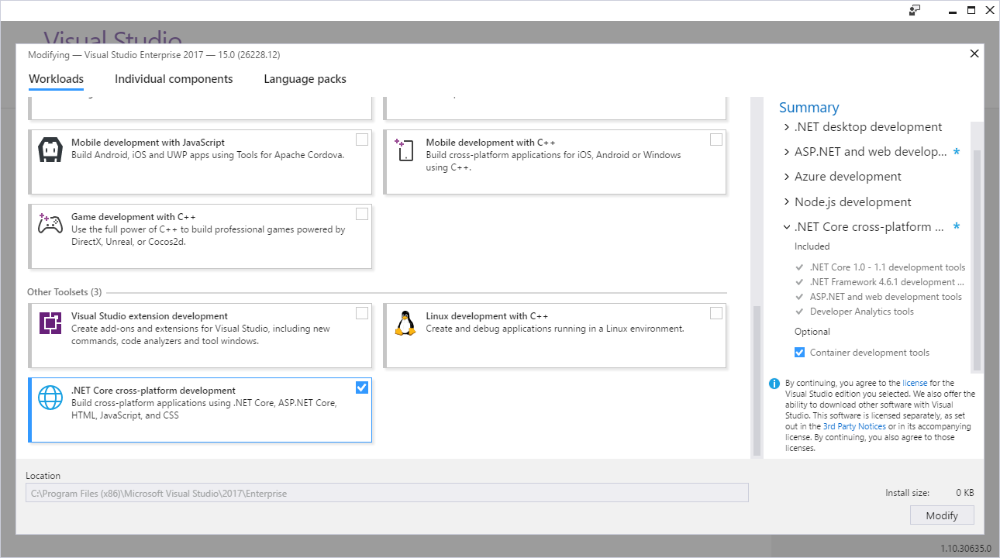

# Development environment for ASP&period;NET Core apps

## Development tools choices: IDE or editor

Whether you prefer a full and powerful IDE or a lightweight and agile editor, Microsoft has you covered when developing ASP&period;NET Core applications.

**Visual Studio 2017.** If you're using *Visual Studio 2017* you can build ASP&period;NET Core applications as long as you have the *.NET Core cross-platform development* workload installed. Figure 10-X shows the required workload in the Visual Studio 2017 setup dialog.

**Figure 10-X.** Installing the .NET Core workload in Visual Studio 2017.

[Download Visual Studio 2017](https://www.visualstudio.com/downloads/)

**Visual Studio Code and dotnet CLI** (Cross-Platform Tools for Mac, Linux and Windows). If you prefer a lightweight and cross-platform editor supporting any development language, you can use Microsoft Visual Studio Code and the dotnet CLI. These products provide a simple yet robust experience that streamlines the developer workflow. Additionally, Visual Studio Code supports extensions for C\# and web development, providing intellisense and shortcut-tasks within the editor.

[Download the .NET Core SDK](https://www.microsoft.com/net/download/core)

[Download Visual Studio Code](https://code.visualstudio.com/download)

>[!div class="step-by-step"]
[Previous] (vision.md)
[Next] (development-workflow-for-azure-hosted-asp.net-core-apps.md)
