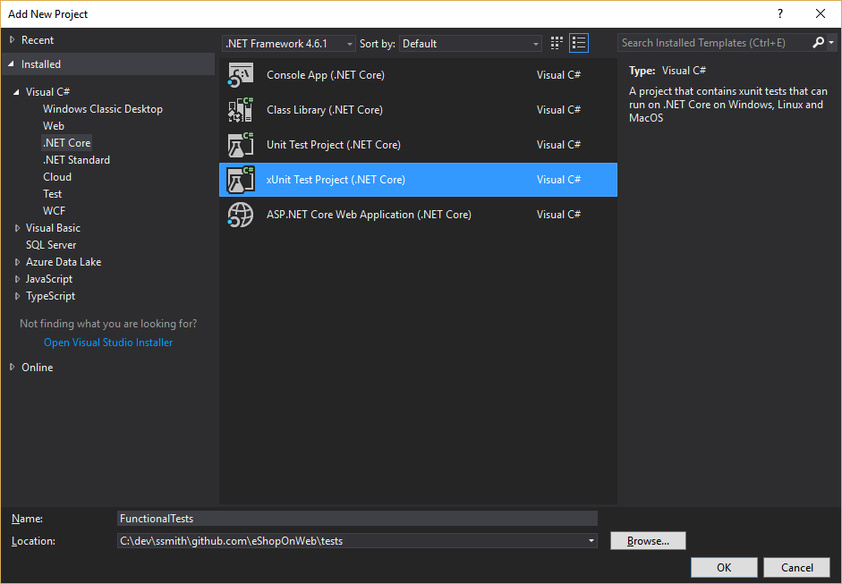

# Organizing Test Projects

Test projects can be organized however works best for you. It's a good idea to separate tests by type (unit test, integration test) and by what they are testing (by project, by namespace). Whether this separation consists of folders within a single test project, or multiple test projects, is a design decision. One project is simplest, but for large projects with many tests, or in order to more easily run different sets of tests, you might want to have several different test projects. Many teams organize test projects based on the project they are testing, which for applications with more than a few projects can result in a large number of test projects, especially if you still break these down according to what kind of tests are in each project. A compromise approach is to have one project per kind of test, per application, with folders inside the test projects to indicate the project (and class) being tested.

A common approach is to organize the application projects under a ‘src' folder, and the application's test projects under a parallel ‘tests' folder. You can create matching solution folders in Visual Studio, if you find this organization useful.

Figure 9-X Test organization in your solution

You can use whichever test framework you prefer. The xUnit framework works well and is what all of the ASP&period;NET Core and EF Core tests are written in. You can add an xUnit test project in Visual Studio using the template shown in Figure 9-X, or from the CLI using dotnet new xunit.

Figure 9-X Add an xUnit Test Project in Visual Studio

## Test Naming

You should name your tests in a consistent fashion, with names that indicate what each test does. One approach I've had great success with is to name test classes according to the class and method they are testing. This results in many small test classes, but it makes it extremely clear what each test is responsible for. With the test class name set up to identify the class and method to be tested, the test method name can be used to specify the behavior being tested. This should include the expected behavior and any inputs or assumptions that should yield this behavior. Some example test names:

-   CatalogControllerGetImage.CallsImageServiceWithId

-   CatalogControllerGetImage.LogsWarningGivenImageMissingException

-   CatalogControllerGetImage.ReturnsFileResultWithBytesGivenSuccess

-   CatalogControllerGetImage.ReturnsNotFoundResultGivenImageMissingException

A variation of this approach ends each test class name with "Should" and modifies the tense slightly:

-   CatalogControllerGetImage**Should**.**Call**ImageServiceWithId

-   CatalogControllerGetImage**Should**.**Log**WarningGivenImageMissingException

Some teams find the second naming approach clearer, though slightly more verbose. In any case, try to use a naming convention that provides insight into test behavior, so that when one or more tests fail, it's obvious from their names what cases have failed. Avoid naming you tests vaguely, such as ControllerTests.Test1, as these offer no value when you see them in test results.

If you follow a naming convention like the one above that produces many small test classes, it's a good idea to further organize your tests using folders and namespaces. Figure 9-X shows one approach to organizing tests by folder within several test projects.

**Figure 9-X.** Organizing test classes by folder based on class being tested.

Of course, if a particular application class has many methods being tested (and thus many test classes), it may make sense to place these in a folder corresponding to the application class. This organization is no different than how you might organize files into folders elsewhere. If you have more than three or four related files in a folder containing many other files, it's often helpful to move them into their own subfolder.

>[!div class="step-by-step"]
[Previous] (kinds-of-automated-tests.md)
[Next] (unit-testing-asp.net-core-apps.md)
