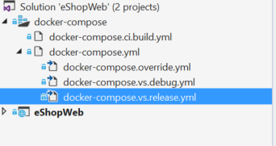

# Docker support

The eShopOnWeb project runs on .NET Core. Therefore, it can run in either Linux-based or Windows-based containers. Note that for Docker deployment, you want to use the same host type for SQL Server. Linux-based containers allow a smaller footprint and are preferred.

Visual Studio provides a project template that adds support for Docker to a solution. You right-click the project, click **Add** followed by **Docker Support**. The template adds a Dockerfile to your project, and a new **docker-compose** project that provides a starter docker-compose.yml file. This step has already been done in the eShopOnWeb project downloaded from GitHub. You will see that the solution contains the **eShopOnWeb** project and the **docker-compose** project as shown in Figure 6-1.

{width="2.3751224846894137in" height="1.2570089676290463in"}

**Figure 6-1**. The **docker-compose** project in a single-container web application

These files are standard docker-compose files, consistent with any Docker project. You can use them with Visual Studio or from the command line. This application runs on .NET Core and uses Linux containers, so you can also code, build, and run on a Mac or on a Linux machine.

The docker-compose.yml file contains information about what images to build and what containers to launch. The templates specify how to build the eshopweb image and launch the application’s containers. You need to add the dependency on SQL Server by including an image for it (for example, mssql-server-linux), and a service for the sql.data image for Docker to build and launch that container. These settings are shown in the following example:

  -----------------------------------------
  version: '2'
  
  services:
  
  eshopweb:
  
  image: eshop/web
  
  build:
  
  context: ./eShopWeb
  
  dockerfile: Dockerfile
  
  **depends\_on:**
  
  **- sql.data**
  
  **sql.data:**
  
  **image: microsoft/mssql-server-linux**
  -----------------------------------------

The depends\_on directive tells Docker that the eShopWeb image depends on the sql.data image. Lines below that are the instructions to build an image tagged sql.data using the microsoft/mssql-server-linux image.

The **docker-compose** project displays the other docker-compose files under the main docker-compose.yml node to provide a visual indication that these files are related. The docker-compose-override.yml file contains settings for both services, such as connection strings and other application settings.

The following example shows the docker-compose.vs.debug.yml file, which contains settings used for debugging in Visual Studio. In that file, the eshopweb image has the dev tag appended to it. That helps separate debug from release images so that you do not accidentally deploy the debug information to a production environment:

  ------------------------------------------------------------
  version: '2'
  
  services:
  
  eshopweb:
  
  image: eshop/web:dev
  
  build:
  
  args:
  
  source: \${DOCKER\_BUILD\_SOURCE}
  
  environment:
  
  - DOTNET\_USE\_POLLING\_FILE\_WATCHER=1
  
  volumes:
  
  - ./eShopWeb:/app
  
  - \~/.nuget/packages:/root/.nuget/packages:ro
  
  - \~/clrdbg:/clrdbg:ro
  
  entrypoint: tail -f /dev/null
  
  labels:
  
  - "com.microsoft.visualstudio.targetoperatingsystem=linux"
  ------------------------------------------------------------

The last file added is docker-compose.ci.build.yml. This would be used from the command line to build the project from a CI server. This compose file starts a Docker container that builds the images needed for your application. The following example shows the contents of the docker-compose.ci.build.yml file.

  --------------------------------------------------------------------------
  version: '2'
  
  services:
  
  ci-build:
  
  image: microsoft/aspnetcore-build:1.0-1.1
  
  volumes:
  
  - .:/src
  
  working\_dir: /src
  
  \# The following two lines in the document are one line in the YML file.
  
  command: /bin/bash -c "dotnet restore ./eShopWeb.sln && dotnet publish
  
  ./eShopWeb.sln -c Release -o ./obj/Docker/publish"
  --------------------------------------------------------------------------

Notice that the image is an ASP.NET Core build image. That image includes the SDK and build tools to build your application and create the required images. Running the **docker-compose** project using this file starts the build container from the image, then builds your application’s image in that container. You specify that docker-compose file as part of the command line to build your application in a Docker container, then launch it.

In Visual Studio, you can run your application in Docker containers by selecting the **docker-compose** project as the startup project, and then pressing Ctrl+F5 (F5 to debug), as you can with any other application. When you start the **docker-compose** project, Visual Studio runs **docker-compose** using the docker-compose.yml file, the docker-compose.override.yml file, and one of the docker-compose.vs.\* files. Once the application has started, Visual Studio launches the browser for you.

If you launch the application in the debugger, Visual Studio will attach to the running application in Docker.

>[!div class="step-by-step"]
[Previous] (application-tour.md)
[Next] (troubleshooting.md)
