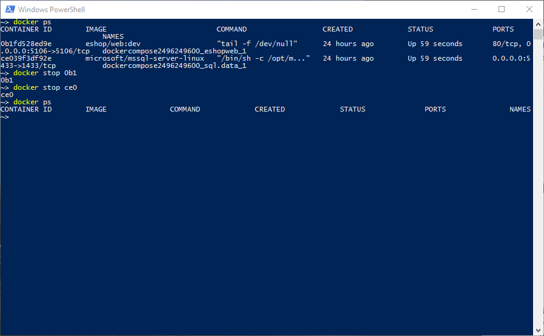

# Troubleshooting

This section describes a few issues that might arise when your run containers locally and suggests some fixes.

## Stopping Docker containers 

After you launch the containerized application, the containers continue to run, even after you have stopped debugging. You can run the docker ps command from the command line to see which containers are running. The docker stop command stops a running container, as shown in Figure 6-2.

**Figure 6-2**. Listing and stopping containers with the docker ps and docker stop CLI commands

You might need to stop running processes when you switch between different configurations. Otherwise, the container that is running the web application is using the port for your application (5106 in this example).

## Adding Docker to your projects

The wizard that adds Docker support communicates with the running Docker process. The wizard will not run correctly if Docker is not running when you start the wizard. In addition, the wizard examines your current container choice to add the correct Docker support. If you want to add support for Windows Containers, you need to run the wizard while you have Docker running with Windows Containers configured. If you want to add support for Linux containers, run the wizard while you have Docker running with Linux containers configured.

>[!div class="step-by-step"]
[Previous] (docker-support.md)
[Next] (../migrating-legacy-monolithic-net-framework-applications-to-windows-containers/index.md)
