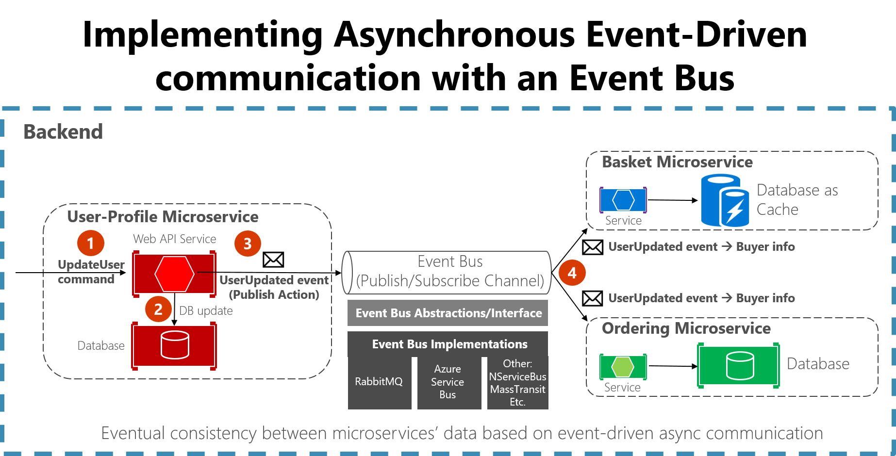
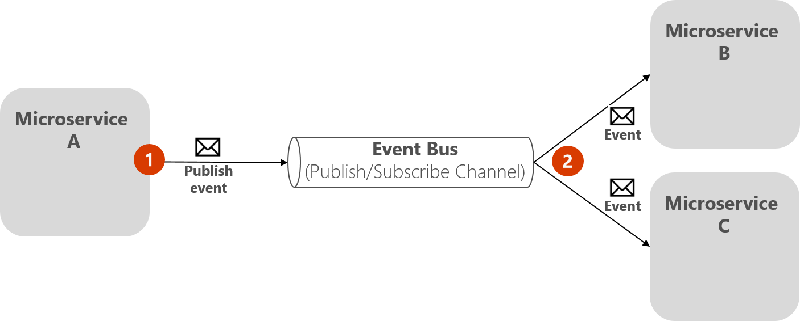
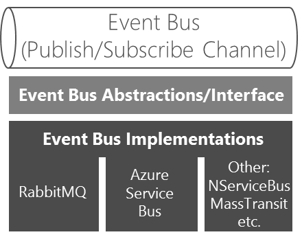
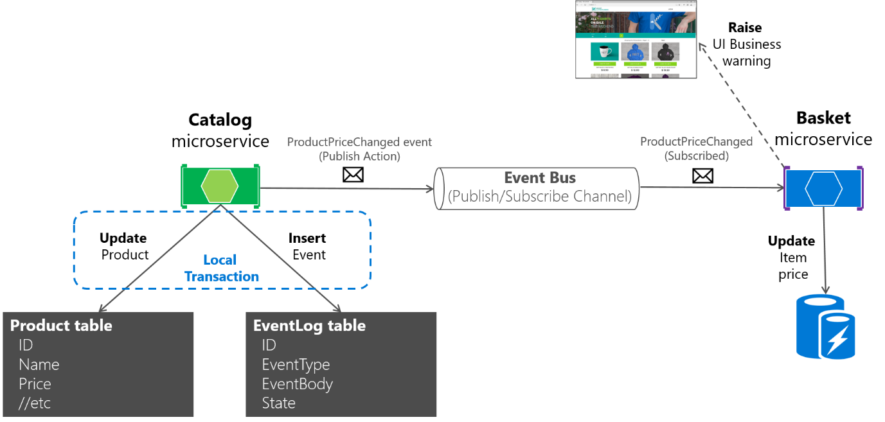
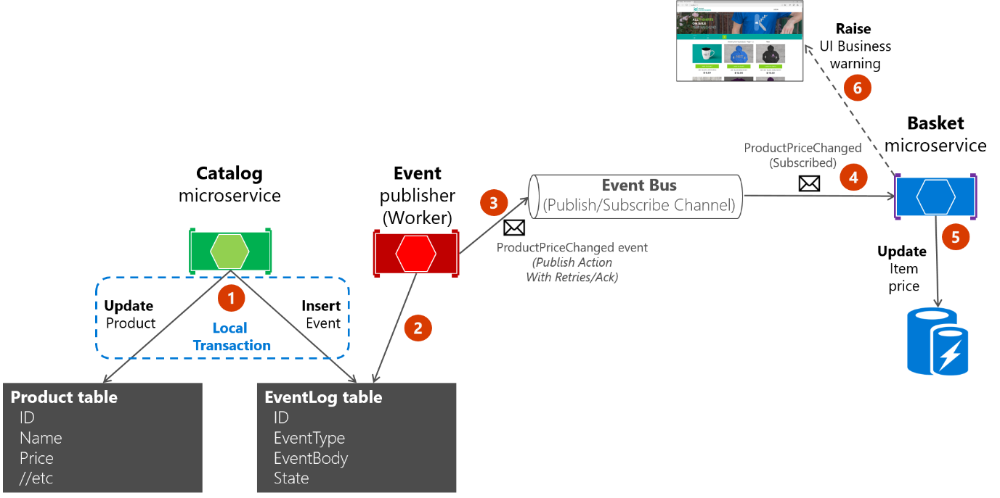
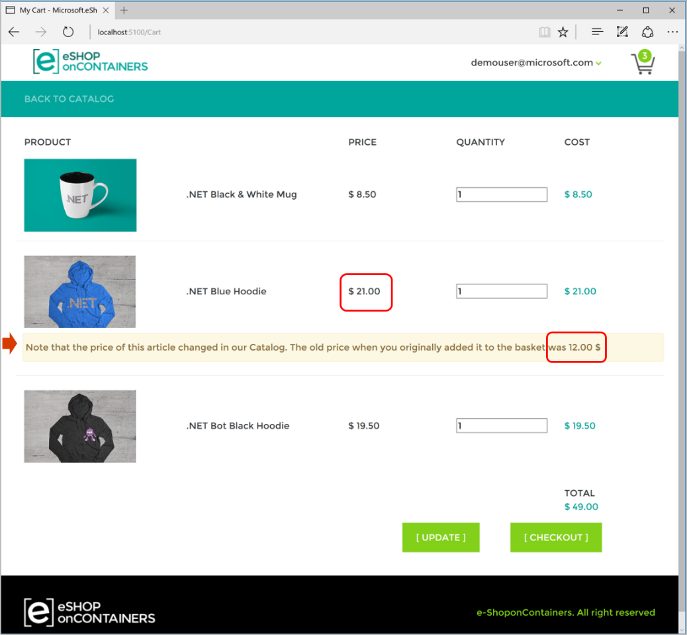

# Implementing event-based communication between microservices (integration events)

As described earlier, when you use event-based communication, a microservice publishes an event when something notable happens, such as when it updates a business entity. Other microservices subscribe to those events. When a microservice receives an event, it can update its own business entities, which might lead to more events being published. This publish/subscribe system is usually performed by using an implementation of an event bus. The event bus can be designed as an interface with the API needed to subscribe and unsubscribe to events and to publish events. It can also have one or more implementations based on any inter-process or messaging communication, such as a messaging queue or a service bus that supports asynchronous communication and a publish/subscribe model.

You can use events to implement business transactions that span multiple services, which gives you eventual consistency between those services. An eventually consistent transaction consists of a series of distributed actions. At each action, the microservice updates a business entity and publishes an event that triggers the next action.

{width="6.218792650918635in" height="3.1666666666666665in"}

**Figure 8-18**. Event-driven communication based on an event bus

This section describes how you can implement this type of communication with .NET by using a generic event bus interface, as shown in Figure 8-18. There are multiple potential implementations, each using a different technology or infrastructure such as RabbitMQ, Azure Service Bus, or any other third-party open source or commercial service bus.

## Using message brokers and services buses for production systems

As noted in the architecture section, you can choose from multiple messaging technologies for implementing your abstract event bus. But these technologies are at different levels. For instance, RabbitMQ, a messaging broker transport, is at a lower level than commercial products like Azure Service Bus, NServiceBus, MassTransit, or Brighter. Most of these products can work on top of either RabbitMQ or Azure Service Bus. Your choice of product depends on how many features and how much out-of-the-box scalability you need for your application.

For implementing just an event bus proof-of-concept for your development environment, as in the eShopOnContainers sample, a simple implementation on top of RabbitMQ running as a container might be enough. But for mission-critical and production systems that need high scalability, you might want to evaluate and use Azure Service Fabric. If you require high-level abstractions and richer features like [sagas](https://docs.particular.net/nservicebus/sagas/) for long-running processes that make distributed development easier, other commercial and open-source service buses like NServiceBus, MassTransit, and Brighter are worth evaluating. Of course, you could always build your own service bus features on top of lower-level technologies like RabbitMQ and Docker, but the work needed to reinvent the wheel might be too costly for a custom enterprise application.

To reiterate: the sample event bus abstractions and implementation showcased in the eShopOnContainers sample are intended to be used only as a proof of concept. Once you have decided that you want to have asynchronous and event-driven communication, as explained in the current section, you should choose the service bus product that best fits your needs.

## Integration events

Integration events are used for bringing domain state in sync across multiple microservices or external systems. This is done by publishing integration events outside the microservice. When an event is published to multiple receiver microservices (to as many microservices as are subscribed to the integration event), the appropriate event handler in each receiver microservice handles the event.

An integration event is basically a data-holding class, as in the following example:

  -----------------------------------------------------------------------------
  public class **ProductPriceChangedIntegrationEvent : IntegrationEvent**
  
  {
  
  public int ProductId { get; private set; }
  
  public decimal NewPrice { get; private set; }
  
  public decimal OldPrice { get; private set; }
  
  public ProductPriceChangedIntegrationEvent(int productId, decimal newPrice,
  
  decimal oldPrice)
  
  {
  
  ProductId = productId;
  
  NewPrice = newPrice;
  
  OldPrice = oldPrice;
  
  }
  
  }
  -----------------------------------------------------------------------------

The integration event class can be simple; for example, it might contain a GUID for its ID.

The integration events can be defined at the application level of each microservice, so they are decoupled from other microservices, in a way comparable to how ViewModels are defined in the server and client. What is not recommended is sharing a common integration events library across multiple microservices; doing that would be coupling those microservices with a single event definition data library. You do not want to do that for the same reasons that you do not want to share a common domain model across multiple microservices: microservices must be completely autonomous.

There are only a few kinds of libraries you should share across microservices. One is libraries that are final application blocks, like the [Event Bus client API](https://github.com/dotnet-architecture/eShopOnContainers/tree/master/src/BuildingBlocks/EventBus), as in eShopOnContainers. Another is libraries that constitute tools that could also be shared as NuGet components, like JSON serializers.

## The event bus

An event bus allows publish/subscribe-style communication between microservices without requiring the components to explicitly be aware of each other, as shown in Figure 8-19.

{width="6.259722222222222in" height="2.520138888888889in"}

**Figure 8-19**. Publish/subscribe basics with an event bus

The event bus is related to the Observer pattern and the publish-subscribe pattern.

### Observer pattern

In the [Observer pattern](https://en.wikipedia.org/wiki/Observer_pattern), your primary object (known as the Observable) notifies other interested objects (known as Observers) with relevant information (events).

### Publish-subscribe (Pub/Sub) pattern 

The purpose of the [Pub/Sub pattern](https://msdn.microsoft.com/en-us/library/ff649664.aspx) is the same as the Observer pattern: you want to notify other services when certain events take place. But there is an important semantic difference between the Observer and Pub/Sub patterns. In the Pub/Sub pattern, the focus is on broadcasting messages. In contrast, in the Observer pattern, the Observable does not know who the events are going to, just that they have gone out. In other words, the Observable (the publisher) does not know who the Observers (the subscribers) are.

### The middleman or event bus 

How do you achieve anonymity between publisher and subscriber? An easy way is let a middleman take care of all the communication. An event bus is one such middleman.

An event bus is typically composed of two parts:

-   The abstraction or interface.

-   One or more implementations.

In Figure 8-19 you can see how, from an application point of view, the event bus is nothing more than a Pub/Sub channel. The way you implement this asynchronous communication can vary. It can have multiple implementations so that you can swap between them, depending on the environment requirements (for example, production versus development environments).

In Figure 8-20 you can see an abstraction of an event bus with multiple implementations based on infrastructure messaging technologies like RabbitMQ, Azure Service Bus, or other service buses like NServiceBus, MassTransit, etc.

{width="3.1278062117235343in" height="2.4739588801399823in"}

**Figure 8- 20.** Multiple implementations of an event bus

However, as highlighted previously, using abstractions (the event bus interface) is possible only if you need basic event bus features supported by your abstractions. If you need richer service bus features, you should probably use the API provided by your preferred service bus instead of your own abstractions.

### Defining an event bus interface

Let’s start with some implementation code for the event bus interface and possible implementations for exploration purposes. The interface should be generic and straightforward, as in the following interface.

  --------------------------------------------------------------------------
  public interface **IEventBus**
  
  {
  
  void **Publish**(IntegrationEvent @event);
  
  void **Subscribe**&lt;T&gt;(IIntegrationEventHandler&lt;T&gt; handler)
  
  where T: IntegrationEvent;
  
  void **Unsubscribe**&lt;T&gt;(IIntegrationEventHandler&lt;T&gt; handler)
  
  where T : IntegrationEvent;
  
  }
  --------------------------------------------------------------------------

The Publish method is straightforward. The event bus will broadcast the integration event passed to it to any microservice subscribed to that event. This method is used by the microservice that is publishing the event.

The Subscribe method is used by the microservices that want to receive events. This method has two parts. The first is the integration event to subscribe to (IntegrationEvent). The second part is the integration event handler (or callback method) to be called (IIntegrationEventHandler&lt;T&gt;) when the microservice receives that integration event message.

### Implementing an event bus with RabbitMQ for the development or test environment

We should start by saying that if you create your custom event bus based on RabbitMQ running in a container, as the eShopOnContainers application does, it should be used only for your development and test environments. You should not use it for your production environment, unless you are building it as a part of a production-ready service bus. A simple custom event bus might be missing many production-ready critical features that a commercial service bus has.

The eShopOnContainers custom implementation of an event bus is basically a library using the RabbitMQ API. The implementation lets microservices subscribe to events, publish events, and receive events, as shown in Figure 8-21.

{width="6.07582895888014in" height="2.7130249343832022in"}

**Figure 8-21.** RabbitMQ implementation of an event bus

In the code, the EventBusRabbitMQ class implements the generic IEventBus interface. This is based on Dependency Injection so that you can swap from this dev/test version to a production version.

  ------------------------------------------------------------
  public class **EventBusRabbitMQ : IEventBus**, IDisposable
  
  {
  
  // Implementation using RabbitMQ API
  
  //...
  ------------------------------------------------------------

The RabbitMQ implementation of a sample dev/test event bus is boilerplate code. It has to handle the connection to the RabbitMQ server and provide code for publishing a message event to the queues. It also has to implement a dictionary of collections of integration event handlers for each event type; these event types can have a different instantiation and different subscriptions for each receiver microservice, as shown in Figure 8-21.

#### Implementing a simple publish method with RabbitMQ

The following code is part of the eShopOnContainers event bus implementation for RabbitMQ, so you usually do not need to code it unless you are making improvements. The code gets a connection and channel to RabbitMQ, creates a message, and then publishes the message into the queue.

  --------------------------------------------------------------------------
  public **class EventBusRabbitMQ : IEventBus, IDisposable**
  
  {
  
  // Member objects and other methods ...
  
  // ...
  
  public void **Publish(IntegrationEvent @event)**
  
  {
  
  var eventName = @event.GetType().Name;
  
  var factory = new ConnectionFactory() { HostName = \_connectionString };
  
  using (var connection = factory.CreateConnection())
  
  using (var channel = connection.CreateModel())
  
  {
  
  channel.ExchangeDeclare(exchange: \_brokerName,
  
  type: "direct");
  
  string message = JsonConvert.SerializeObject(@event);
  
  var body = Encoding.UTF8.GetBytes(message);
  
  channel.BasicPublish(exchange: \_brokerName,
  
  routingKey: eventName,
  
  basicProperties: null,
  
  body: body);
  
  }
  
  }
  
  }
  --------------------------------------------------------------------------

The [actual code](https://github.com/dotnet-architecture/eShopOnContainers/blob/master/src/BuildingBlocks/EventBus/EventBusRabbitMQ/EventBusRabbitMQ.cs) of the Publish method in the eShopOnContainers application is improved by using a [Polly](https://github.com/App-vNext/Polly) retry policy, which retries the task a certain number of times in case the RabbitMQ container is not ready. This can occur when docker-compose is starting the containers; for example, the RabbitMQ container might start more slowly than the other containers.

As mentioned earlier, there are many possible configurations in RabbitMQ, so this code should be used only for dev/test environments.

#### Implementing the subscription code with the RabbitMQ API

As with the publish code, the following code is a simplification of part of the event bus implementation for RabbitMQ. Again, you usually do not need to change it unless you are improving it.

  --------------------------------------------------------------------------------
  public **class EventBusRabbitMQ : IEventBus, IDisposable**
  
  {
  
  // Member objects and other methods ...
  
  // ...
  
  public void **Subscribe&lt;T&gt;(IIntegrationEventHandler&lt;T&gt; handler) **
  
  **where T : IntegrationEvent**
  
  {
  
  var eventName = typeof(T).Name;
  
  if (\_handlers.ContainsKey(eventName))
  
  {
  
  \_handlers\[eventName\].Add(handler);
  
  }
  
  else
  
  {
  
  var channel = GetChannel();
  
  channel.QueueBind(queue: \_queueName,
  
  exchange: \_brokerName,
  
  routingKey: eventName);
  
  \_handlers.Add(eventName, new List&lt;IIntegrationEventHandler&gt;());
  
  \_handlers\[eventName\].Add(handler);
  
  \_eventTypes.Add(typeof(T));
  
  }
  
  }
  
  }
  --------------------------------------------------------------------------------

Each event type has a related channel to get events from RabbitMQ. You can then have as many event handlers per channel and event type as needed.

The Subscribe method accepts an IIntegrationEventHandler object, which is like a callback method in the current microservice, plus its related IntegrationEvent object. The code then adds that event handler to the list of event handlers that each integration event type can have per client microservice. If the client code has not already been subscribed to the event, the code creates a channel for the event type so it can receive events in a push style from RabbitMQ when that event is published from any other service.

### Subscribing to events

The first step for using the event bus is to subscribe the microservices to the events they want to receive. That should be done in the receiver microservices.

The following simple code shows what each receiver microservice needs to implement when starting the service (that is, in the Startup class) so it subscribes to the events it needs. For instance, the basket.api microservice needs to subscribe to ProductPriceChangedIntegrationEvent messages. This makes the microservice aware of any changes to the product price and lets it warn the user about the change if that product is in the user’s basket.

  -------------------------------------------------------------------------------
  var eventBus = app.ApplicationServices.GetRequiredService&lt;IEventBus&gt;();
  
  **eventBus.Subscribe**&lt;ProductPriceChangedIntegration**Event**&gt;(
  
  ProductPriceChangedIntegration**EventHandler**);
  -------------------------------------------------------------------------------

After this code runs, the subscriber microservice will be listening through RabbitMQ channels. When any message of type ProductPriceChangedIntegrationEvent arrives, the code invokes the event handler that is passed to it and processes the event.

### Publishing events through the event bus

Finally, the message sender (origin microservice) publishes the integration events with code similar to the following example. (This is a simplified example that does not take atomicity into account.) You would implement similar code whenever an event must be propagated across multiple microservices, usually right after committing data or transactions from the origin microservice.

First, the event bus implementation object (based on RabbitMQ or based on a service bus) would be injected at the controller constructor, as in the following code:

  ---------------------------------------------------------------
  \[Route("api/v1/\[controller\]")\]
  
  public class CatalogController : ControllerBase
  
  {
  
  private readonly CatalogContext \_context;
  
  private readonly IOptionsSnapshot&lt;Settings&gt; \_settings;
  
  private readonly IEventBus \_eventBus;
  
  public CatalogController(CatalogContext context,
  
  IOptionsSnapshot&lt;Settings&gt; settings,
  
  **IEventBus eventBus**)
  
  {
  
  \_context = context;
  
  \_settings = settings;
  
  \_eventBus = eventBus;
  
  // ...
  
  }
  ---------------------------------------------------------------

Then you use it from your controller’s methods, like in the UpdateProduct method:

  -------------------------------------------------------------------------------------------
  \[Route("update")\]
  
  \[HttpPost\]
  
  public async Task&lt;IActionResult&gt; **UpdateProduct**(\[FromBody\]CatalogItem product)
  
  {
  
  var item = await \_context.CatalogItems.SingleOrDefaultAsync(
  
  i =&gt; i.Id == product.Id);
  
  // ...
  
  if (item.Price != product.Price)
  
  {
  
  var oldPrice = item.Price;
  
  item.Price = product.Price;
  
  \_context.CatalogItems.Update(item);
  
  var @event = new **ProductPriceChangedIntegrationEvent**(item.Id,
  
  item.Price,
  
  oldPrice);
  
  // Commit changes in original transaction
  
  **await \_context.SaveChangesAsync();**
  
  // Publish integration event to the event bus
  
  // (RabbitMQ or a service bus underneath)
  
  **\_eventBus.Publish(@event);**
  
  // ...
  -------------------------------------------------------------------------------------------

In this case, since the origin microservice is a simple CRUD microservice, that code is placed right into a Web API controller. In more advanced microservices, it could be implemented in the CommandHandler class, right after the original data is committed.

#### Designing atomicity and resiliency when publishing to the event bus

When you publish integration events through a distributed messaging system like your event bus, you have the problem of atomically updating the original database and publishing an event. For instance, in the simplified example shown earlier, the code commits data to the database when the product price is changed and then publishes a ProductPriceChangedIntegrationEvent message. Initially, it might look essential that these two operations be performed atomically. However, if you are using a distributed transaction involving the database and the message broker, as you do in older systems like [Microsoft Message Queuing (MSMQ)](https://msdn.microsoft.com/en-us/library/ms711472(v=vs.85).aspx), this is not recommended for the reasons described by the [CAP theorem](https://www.quora.com/What-Is-CAP-Theorem-1).

Basically, you use microservices to build scalable and highly available systems. Simplifying somewhat, the CAP theorem says that you cannot build a database (or a microservice that owns its model) that is continually available, strongly consistent, *and* tolerant to any partition. You must choose two of these three properties.

In microservices-based architectures, you should choose availability and tolerance, and you should deemphasize strong consistency. Therefore, in most modern microservice-based applications, you usually do not want to use distributed transactions in messaging, as you do when you implement [distributed transactions](https://msdn.microsoft.com/en-us/library/ms978430.aspx#bdadotnetasync2_topic3c) based on the Windows Distributed Transaction Coordinator (DTC) with [MSMQ](https://msdn.microsoft.com/en-us/library/ms711472(v=vs.85).aspx).

Let’s go back to the initial issue and its example. If the service crashes after the database is updated (in this case, right after the line of code with \_context.SaveChangesAsync()), but before the integration event is published, the overall system could become inconsistent. This might be business critical, depending on the specific business operation you are dealing with.

As mentioned earlier in the architecture section, you can have several approaches for dealing with this issue:

-   Using the full [Event Sourcing pattern](https://msdn.microsoft.com/en-us/library/dn589792.aspx).

-   Using [transaction log mining](http://www.scoop.it/t/sql-server-transaction-log-mining).

-   Using the [Outbox pattern](http://gistlabs.com/2014/05/the-outbox/). This is a transactional table to store the integration events (extending the local transaction).

For this scenario, using the full Event Sourcing (ES) pattern is one of the best approaches, if not *the* best. However, in many application scenarios, you might not be able to implement a full ES system. ES means storing only domain events in your transactional database, instead of storing current state data. Storing only domain events can have great benefits, such as having the history of your system available and being able to determine the state of your system at any moment in the past. However, implementing a full ES system requires you to rearchitect most of your system and introduces many other complexities and requirements. For example, you would want to use a database specifically made for event sourcing, such as [Event Store](https://geteventstore.com/), or a document-oriented database such as Azure Document DB, MongoDB, Cassandra, CouchDB, or RavenDB. ES is a great approach for this problem, but not the easiest solution unless you are already familiar with event sourcing.

The option to use transaction log mining initially looks very transparent. However, to use this approach, the microservice has to be coupled to your RDBMS transaction log, such as the SQL Server transaction log. This is probably not desirable. Another drawback is that the low-level updates recorded in the transaction log might not be at the same level as your high-level integration events. If so, the process of reverse-engineering those transaction log operations can be difficult.

A balanced approach is a mix of a transactional database table and a simplified ES pattern. You can use a state such as “ready to publish the event,” which you set in the original event when you commit it to the integration events table. You then try to publish the event to the event bus. If the publish-event action succeeds, you start another transaction in the origin service and move the state from “ready to publish the event” to “event already published.”

If the publish-event action in the event bus fails, the data still will not be inconsistent within the origin microservice—it is still marked as “ready to publish the event,” and with respect to the rest of the services, it will eventually be consistent. You can always have background jobs checking the state of the transactions or integration events. If the job finds an event in the “ready to publish the event” state, it can try to republish that event to the event bus.

Notice that with this approach, you are persisting only the integration events for each origin microservice, and only the events that you want to communicate to other microservices or external systems. In contrast, in a full ES system, you store all domain events as well.

Therefore, this balanced approach is a simplified ES system. You need a list of integration events with their current state (“ready to publish” versus “published”). But you only need to implement these states for the integration events. And in this approach, you do not need to store all your domain data as events in the transactional database, as you would in a full ES system.

If you are already using a relational database, you can use a transactional table to store integration events. To achieve atomicity in your application, you use a two-step process based on local transactions. Basically, you have an IntegrationEvent table in the same database where you have your domain entities. That table works as an insurance for achieving atomicity so that you include persisted integration events into the same transactions that are committing your domain data.

Step by step, the process goes like this: the application begins a local database transaction. It then updates the state of your domain entities and inserts an event into the integration event table. Finally, it commits the transaction. You get the desired atomicity.

When implementing the steps of publishing the events, you have these choices:

-   Publish the integration event right after committing the transaction and use another local transaction to mark the events in the table as being published. Then, use the table just as an artifact to track the integration events in case of issues in the remote microservices, and perform compensatory actions based on the stored integration events.

-   Use the table as a kind of queue. A separate application thread or process queries the integration event table, publishes the events to the event bus, and then uses a local transaction to mark the events as published.

Figure 8-22 shows the architecture for the first of these approaches.

{width="6.259722222222222in" height="2.9868055555555557in"}

**Figure 8-22**. Atomicity when publishing events to the event bus

The approach illustrated in Figure 8-22 is missing an additional worker microservice that is in charge of checking and confirming the success of the published integration events. In case of failure, that additional checker worker microservice can read events from the table and republish them.

About the second approach: you use the EventLog table as a queue and always use a worker microservice to publish the messages. In that case, the process is like that shown in Figure 8-23. This shows an additional microservice, and the table is the single source when publishing events.

{width="6.259722222222222in" height="3.1205457130358707in"}

**Figure 8-23**. Atomicity when publishing events to the event bus with a worker microservice

For simplicity, the eShopOnContainers sample uses the first approach (with no additional processes or checker microservices) plus the event bus. However, the eShopOnContainers is not handling all possible failure cases. In a real application deployed to the cloud, you must embrace the fact that issues will arise eventually, and you must implement that check and resend logic. Using the table as a queue can be more effective than the first approach if you have that table as a single source of events when publishing them through the event bus.

#### Implementing atomicity when publishing integration events through the event bus

The following code shows how you can create a single transaction involving multiple DbContext objects—one context related to the original data being updated, and the second context related to the IntegrationEventLog table.

Note that the transaction in the example code below will not be resilient if connections to the database have any issue at the time when the code is running. This can happen in cloud-based systems like Azure SQL DB, which might move databases across servers. For implementing resilient transactions across multiple contexts, see the [Implementing resilient Entity Framework Core SQL connections](#implementing_resilient_EFCore_SQL_conns) section later in this guide.

For clarity, the following example shows the whole process in a single piece of code. However, the eShopOnContainers implementation is actually refactored and split this logic into multiple classes so it is easier to maintain.

+-----------------------------------------------------------------------+
| // Update Product from the Catalog microservice                       |
|                                                                       |
| //                                                                    |
|                                                                       |
| public async Task&lt;IActionResult&gt;                                |
| UpdateProduct(\[FromBody\]CatalogItem\                                |
| productToUpdate)                                                      |
|                                                                       |
| {                                                                     |
|                                                                       |
| var catalogItem =                                                     |
|                                                                       |
| await \_catalogContext.CatalogItems.SingleOrDefaultAsync(i =&gt; i.Id |
| ==                                                                    |
|                                                                       |
| productToUpdate.Id);                                                  |
|                                                                       |
| if (catalogItem == null) return NotFound();                           |
|                                                                       |
| bool raiseProductPriceChangedEvent = false;                           |
|                                                                       |
| IntegrationEvent priceChangedEvent = null;                            |
|                                                                       |
| if (catalogItem.Price != productToUpdate.Price)                       |
|                                                                       |
| raiseProductPriceChangedEvent = true;                                 |
|                                                                       |
| if (raiseProductPriceChangedEvent) // Create event if price has       |
| changed                                                               |
|                                                                       |
| {                                                                     |
|                                                                       |
| var oldPrice = catalogItem.Price;                                     |
|                                                                       |
| priceChangedEvent = new                                               |
| **ProductPriceChangedIntegrationEvent**(catalogItem.Id,               |
|                                                                       |
| productToUpdate.Price,                                                |
|                                                                       |
| oldPrice);                                                            |
|                                                                       |
| }                                                                     |
|                                                                       |
| // Update current product                                             |
|                                                                       |
| catalogItem = productToUpdate;                                        |
|                                                                       |
| // Achieving atomicity between original DB and the                    |
| IntegrationEventLog                                                   |
|                                                                       |
| // with a local transaction                                           |
|                                                                       |
| using (var transaction =                                              |
| **\_catalogContext.Database.BeginTransaction()**)                     |
|                                                                       |
| {                                                                     |
|                                                                       |
| **\_catalogContext.CatalogItems.Update(catalogItem);**                |
|                                                                       |
| **await \_catalogContext.SaveChangesAsync();**                        |
|                                                                       |
| // Save to EventLog only if product price changed                     |
|                                                                       |
| if(raiseProductPriceChangedEvent)                                     |
|                                                                       |
| await                                                                 |
| **\_integrationEventLogService.SaveEventAsync(priceChangedEvent);**   |
|                                                                       |
| **transaction.Commit();**                                             |
|                                                                       |
| }                                                                     |
|                                                                       |
| // Publish to event bus only if product price changed                 |
|                                                                       |
| if (raiseProductPriceChangedEvent)                                    |
|                                                                       |
| {                                                                     |
|                                                                       |
| **\_eventBus.Publish(priceChangedEvent);**                            |
|                                                                       |
| integrationEventLogService.**MarkEventAsPublishedAsync(**             |
|                                                                       |
| **priceChangedEvent)**;                                               |
|                                                                       |
| }                                                                     |
|                                                                       |
| return Ok();                                                          |
|                                                                       |
| }                                                                     |
+-----------------------------------------------------------------------+

After the ProductPriceChangedIntegrationEvent integration event is created, the transaction that stores the original domain operation (update the catalog item) also includes the persistence of the event in the EventLog table. This makes it a single transaction, and you will always be able to check whether event messages were sent.

The event log table is updated atomically with the original database operation, using a local transaction against the same database. If any of the operations fail, an exception is thrown and the transaction rolls back any completed operation, thus maintaining consistency between the domain operations and the event messages sent.

#### Receiving messages from subscriptions: event handlers in receiver microservices

In addition to the event subscription logic, you need to implement the internal code for the integration event handlers (like a callback method). The event handler is where you specify where the event messages of a certain type will be received and processed.

An event handler first receives an event instance from the event bus. Then it locates the component to be processed related to that integration event, propagating and persisting the event as a change in state in the receiver microservice. For example, if a ProductPriceChanged event originates in the catalog microservice, it is handled in the basket microservice and changes the state in this receiver basket microservice as well, as shown in the following code.

  ----------------------------------------------------------------------------------
  Namespace Microsoft.eShopOnContainers.Services.Basket.
  
  API.IntegrationEvents.EventHandling
  
  {
  
  public class **ProductPriceChangedIntegrationEventHandler** :
  
  IIntegrationEventHandler&lt;**ProductPriceChangedIntegrationEvent**&gt;
  
  {
  
  private readonly IBasketRepository \_repository;
  
  public ProductPriceChangedIntegrationEventHandler(
  
  IBasketRepository repository)
  
  {
  
  \_repository = repository;
  
  }
  
  public async Task **Handle(ProductPriceChangedIntegrationEvent @event)**
  
  {
  
  var userIds = await \_repository.GetUsers();
  
  foreach (var id in userIds)
  
  {
  
  var basket = await \_repository.GetBasket(id);
  
  await **UpdatePriceInBasketItems**(@event.ProductId, @event.NewPrice,
  
  basket);
  
  }
  
  }
  
  private async Task **UpdatePriceInBasketItems**(int productId, decimal newPrice,
  
  CustomerBasket basket)
  
  {
  
  var itemsToUpdate = basket?.Items?.Where(x =&gt; int.Parse(x.ProductId) ==
  
  productId).ToList();
  
  if (itemsToUpdate != null)
  
  {
  
  foreach (var item in itemsToUpdate)
  
  {
  
  if(item.UnitPrice != newPrice)
  
  {
  
  var originalPrice = item.UnitPrice;
  
  item.UnitPrice = newPrice;
  
  item.OldUnitPrice = originalPrice;
  
  }
  
  }
  
  **await \_repository.UpdateBasket(basket);**
  
  }
  
  }
  
  }
  
  }
  ----------------------------------------------------------------------------------

The event handler needs to verify whether the product exists in any of the basket instances. It also updates the item price for each related basket line item. Finally, it creates an alert to be displayed to the user about the price change, as shown in Figure 8-24.

{width="4.65511154855643in" height="3.9166666666666665in"}

**Figure 8-24**. Displaying an item price change in a basket, as communicated by integration events

### Idempotency in update message events

An important aspect of update message events is that a failure at any point in the communication should cause the message to be retried. Otherwise a background task might try to publish an event that has already been published, creating a race condition. You need to make sure that the updates are either idempotent or that they provide enough information to ensure that you can detect a duplicate, discard it, and send back only one response.

As noted earlier, idempotency means that an operation can be performed multiple times without changing the result. In a messaging environment, as when communicating events, an event is idempotent if it can be delivered multiple times without changing the result for the receiver microservice. This may be necessary because of the nature of the event itself, or because of the way the system handles the event. Message idempotency is important in any application that uses messaging, not just in applications that implement the event bus pattern.

An example of an idempotent operation is a SQL statement that inserts data into a table only if that data is not already in the table. It does not matter how many times you run that insert SQL statement; the result will be the same—the table will contain that data. Idempotency like this can also be necessary when dealing with messages if the messages could potentially be sent and therefore processed more than once. For instance, if retry logic causes a sender to send exactly the same message more than once, you need to make sure that it is idempotent.

It is possible to design idempotent messages. For example, you can create an event that says "set the product price to \$25" instead of "add \$5 to the product price." You could safely process the first message any number of times and the result will be the same. That is not true for the second message. But even in the first case, you might not want to process the first event, because the system could also have sent a newer price-change event and you would be overwriting the new price.

Another example might be an order-completed event being propagated to multiple subscribers. It is important that order information be updated in other systems just once, even if there are duplicated message events for the same order-completed event.

It is convenient to have some kind of identity per event so that you can create logic that enforces that each event is processed only once per receiver.

Some message processing is inherently idempotent. For example, if a system generates image thumbnails, it might not matter how many times the message about the generated thumbnail is processed; the outcome is that the thumbnails are generated and they are the same every time. On the other hand, operations such as calling a payment gateway to charge a credit card may not be idempotent at all. In these cases, you need to ensure that processing a message multiple times has the effect that you expect.

#### Additional resources

-   **Honoring message idempotency** (subhead on this page)\
    [*https://msdn.microsoft.com/en-us/library/jj591565.aspx*](https://msdn.microsoft.com/en-us/library/jj591565.aspx)

### Deduplicating integration event messages

You can make sure that message events are sent and processed just once per subscriber at different levels. One way is to use a deduplication feature offered by the messaging infrastructure you are using. Another is to implement custom logic in your destination microservice. Having validations at both the transport level and the application level is your best bet.

#### Deduplicating message events at the EventHandler level

One way to make sure that an event is processed just once by any receiver is by implementing certain logic when processing the message events in event handlers. For example, that is the approach used in the eShopOnContainers application, as you can see in the [source code](https://github.com/dotnet-architecture/eShopOnContainers/blob/master/src/Services/Ordering/Ordering.API/Controllers/OrdersController.cs) of the OrdersController class when it receives a CreateOrderCommand command. (In this case we use an HTTP request command, not a message-based command, but the logic you need to make a message-based command idempotent is similar.)

#### Deduplicating messages when using RabbitMQ

When intermittent network failures happen, messages can be duplicated, and the message receiver must be ready to handle these duplicated messages. If possible, receivers should handle messages in an idempotent way, which is better than explicitly handling them with deduplication.

According to the [RabbitMQ documentation](https://www.rabbitmq.com/reliability.html#consumer), “If a message is delivered to a consumer and then requeued (because it was not acknowledged before the consumer connection dropped, for example) then RabbitMQ will set the redelivered flag on it when it is delivered again (whether to the same consumer or a different one).

If the “redelivered” flag is set, the receiver must take that into account, because the message might already have been processed. But that is not guaranteed; the message might never have reached the receiver after it left the message broker, perhaps because of network issues. On the other hand, if the “redelivered” flag is not set, it is guaranteed that the message has not been sent more than once. Therefore, the receiver needs to deduplicate messages or process messages in an idempotent way only if the “redelivered” flag is set in the message.

#### Additional resources

-   **Event Driven Messaging**\
    [*http://soapatterns.org/design\_patterns/event\_driven\_messaging*](http://soapatterns.org/design_patterns/event_driven_messaging)

-   **Jimmy Bogard. Refactoring Towards Resilience: Evaluating Coupling\
    **[*https://jimmybogard.com/refactoring-towards-resilience-evaluating-coupling/*](https://jimmybogard.com/refactoring-towards-resilience-evaluating-coupling/)

-   **Publish-Subscribe channel**\
    [*http://www.enterpriseintegrationpatterns.com/patterns/messaging/PublishSubscribeChannel.html*](http://www.enterpriseintegrationpatterns.com/patterns/messaging/PublishSubscribeChannel.html)

-   **Communicating Between Bounded Contexts**\
    [*https://msdn.microsoft.com/en-us/library/jj591572.aspx*](https://msdn.microsoft.com/en-us/library/jj591572.aspx)

-   **Eventual Consistency**\
    [*https://en.wikipedia.org/wiki/Eventual\_consistency*](https://en.wikipedia.org/wiki/Eventual_consistency)

-   **Philip Brown. Strategies for Integrating Bounded Contexts**\
    [*http://culttt.com/2014/11/26/strategies-integrating-bounded-contexts/*](http://culttt.com/2014/11/26/strategies-integrating-bounded-contexts/)

-   **Chris Richardson. Developing Transactional Microservices Using Aggregates, Event Sourcing and CQRS - Part 2**\
    [*https://www.infoq.com/articles/microservices-aggregates-events-cqrs-part-2-richardson*](https://www.infoq.com/articles/microservices-aggregates-events-cqrs-part-2-richardson)

-   **Chris Richardson. Event Sourcing pattern**\
    [*http://microservices.io/patterns/data/event-sourcing.html*](http://microservices.io/patterns/data/event-sourcing.html)

-   **Introducing Event Sourcing**\
    [*https://msdn.microsoft.com/en-us/library/jj591559.aspx*](https://msdn.microsoft.com/en-us/library/jj591559.aspx)

-   **Event Store database**. Official site.\
    [*https://geteventstore.com/*](https://geteventstore.com/)

-   **Patrick Nommensen. Event-Driven Data Management for Microservices**\
    *<https://dzone.com/articles/event-driven-data-management-for-microservices-1> *

-   **The CAP Theorem**\
    [*https://en.wikipedia.org/wiki/CAP\_theorem*](https://en.wikipedia.org/wiki/CAP_theorem)

-   **What is CAP Theorem?**\
    [*https://www.quora.com/What-Is-CAP-Theorem-1*](https://www.quora.com/What-Is-CAP-Theorem-1)

-   **Data Consistency Primer**\
    [*https://msdn.microsoft.com/en-us/library/dn589800.aspx*](https://msdn.microsoft.com/en-us/library/dn589800.aspx)

-   **Rick Saling. The CAP Theorem: Why “Everything is Different” with the Cloud and Internet**\
    [*https://blogs.msdn.microsoft.com/rickatmicrosoft/2013/01/03/the-cap-theorem-why-everything-is-different-with-the-cloud-and-internet/*](https://blogs.msdn.microsoft.com/rickatmicrosoft/2013/01/03/the-cap-theorem-why-everything-is-different-with-the-cloud-and-internet/)

-   **Eric Brewer. CAP Twelve Years Later: How the "Rules" Have Changed**\
    [*https://www.infoq.com/articles/cap-twelve-years-later-how-the-rules-have-changed*](https://www.infoq.com/articles/cap-twelve-years-later-how-the-rules-have-changed)

-   **Participating in External (DTC) Transactions** (MSMQ)\
    [*https://msdn.microsoft.com/en-us/library/ms978430.aspx\#bdadotnetasync2\_topic3c*](https://msdn.microsoft.com/en-us/library/ms978430.aspx%23bdadotnetasync2_topic3c)

-   **Azure Service Bus. Brokered Messaging: Duplicate Detection\
    **[*https://code.msdn.microsoft.com/Brokered-Messaging-c0acea25*](https://code.msdn.microsoft.com/Brokered-Messaging-c0acea25)

-   **Reliability Guide** (RabbitMQ documentation)\
    [*https://www.rabbitmq.com/reliability.html\#consumer*](https://www.rabbitmq.com/reliability.html%23consumer)

>[!div class="step-by-step"]
[Previous] (using-a-database-server-running-as-a-container.md)
[Next] (testing-asp.net-core-services-and-web-apps.md)
