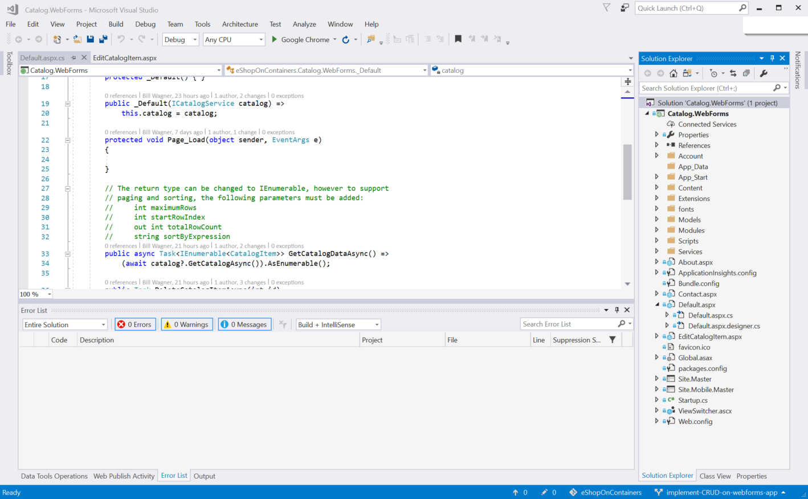

# Benefits of containerizing a monolithic application

The Catalog.WebForms application is available in the eShopOnContainers GitHub repository (<https://github.com/dotnet/eShopOnContainers>). This application is a standalone web application accessing a high-availability data store. Even so, there are advantages to running the application in a container. You create an image for the application. From that point forward, every deployment runs in the same environment. Every container uses the same OS version, has the same version of dependencies installed, uses the same framework, and is built using the same process. You can see the application loaded in Visual Studio 2017 in Figure 7-2.

**Figure 7-2**. Catalog management Web Forms application in Visual Studio 2017

In addition, developers can all run the application in this consistent environment. Issues that only appear with certain versions will appear immediately for developers rather than surfacing in a staging or production environment. Differences between the development environments among the development team matter less once applications run in containers.

Finally, containerized applications have a flatter scale-out curve. You have learned how containerized apps enable more containers in a VM or more containers in a physical machine. This translates to higher density and fewer required resources.

For all these reasons, consider running legacy monolithic apps in a Docker container using a “lift-and-shift” operation. The phrase “lift and shift” describes the scope of the task: you *lift* the entire application from a physical or virtual machine, and *shift* it into a container. In ideal situations, you do not need to make any changes to the application code to run it in a container.

>[!div class="step-by-step"]
[Previous] (vision.md)
[Next] (possible-migration-paths.md)
