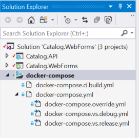
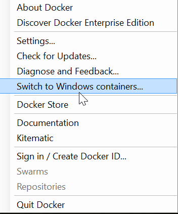

# Lifting and shifting

Visual Studio provides great support for containerizing an application. You right-click the project node and then select **Add** and **Docker Support**. The Docker project template adds a new project to the solution called **docker-compose**. The project contains the Docker assets that compose (or build) the images you need, and starts running the necessary containers, as shown in Figure 7-3.

In the simplest lift-and-shift scenarios, the application will be the single service that you use for the Web Forms application. The template also changes your startup project to point to the **docker-compose** project. Pressing Ctrl+F5 or F5 now creates the Docker image and launches the Docker container.

**Figure 7-3**. The **docker-compose** project in the Web Forms solution

Before you run the solution, you must make sure that you configure Docker to use Windows Containers. To do that, you right-click the Docker taskbar icon in Windows and select **Switch to Windows Containers**, as shown in Figure 7-4.

**Figure 7-4**. Switching to Windows Containers from the Docker taskbar icon in Windows

If the menu item says **Switch to Linux containers**, you are already running Docker with Windows Containers.

Running the solution restarts the Docker host. When you build, you build the application and the Docker image for the Web Forms project. The first time you do this, it takes considerable time. This is because the build process pulls down the base Windows Server image and the additional image for ASP.NET. Subsequent build and run cycles will be much faster.

Let’s take a deeper look at the files added by the Docker project template. It created several files for you. Visual Studio uses these files to create the Docker image and launch a container. You can use the same files from the CLI to run Docker commands manually.

The following Dockerfile example shows the basic settings for building a Docker image based on the Windows ASP.NET image that runs an ASP.NET site.

  ---------------------------------------
  FROM microsoft/aspnet
  
  ARG source
  
  WORKDIR /inetpub/wwwroot
  
  COPY \${source:-obj/Docker/publish} .
  ---------------------------------------

This Dockerfile will look very similar to those created for running an ASP.NET Core application in Linux containers. However, there are a few important differences. The most important difference is that the base image is microsoft/aspnet, which is the current Windows Server image that includes the .NET Framework. Other differences are that the directories copied from your source directory are different.

The other files in the **docker-compose** project are the Docker assets needed to build and configure the containers. Visual Studio puts the various docker-compose.yml files under one node to highlight how they are used. The base docker-compose file contains the directives that are common to all configurations. The docker-compose.override.yml file contains environment variables and related overrides for a developer configuration. The variants with .vs.debug and .vs.release provide environment settings that enable Visual Studio to attach to and manage the running container.

While Visual Studio integration is part of adding Docker support to your solution, you can also build and run from the command line, using the docker-compose up command, as you saw in previous sections.

>[!div class="step-by-step"]
[Previous] (application-tour.md)
[Next] (getting-data-from-the-existing-catalog-net-core-microservice.md)
