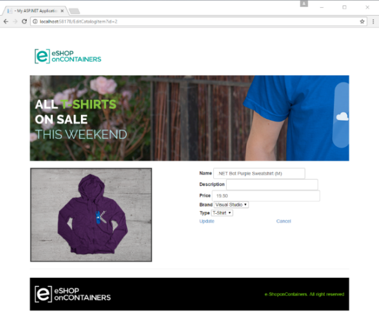

# Vision

*Windows Containers can be used as a way to improve development and test environments, and to deploy applications that are based on legacy .NET Framework technologies like Web* *Forms. Using containers for legacy applications in this way is referred to as a “lift and shift” scenario.*

Earlier sections of this guide have championed a microservices architecture where business applications are distributed among different containers, each running a small, focused service. That goal has many benefits. In new development, that approach is strongly recommended. Enterprise-critical applications will also benefit enough to justify the cost of a rearchitecture and reimplementation.

But not every application will benefit enough to justify the cost. That does not mean that those applications cannot be used in container scenarios.

In this section, we will explore an application for eShopOnContainers, shown in Figure 7-1. This application would be used by members of the eShopOnContainers enterprise team to view and edit the product catalog.

{width="2.813998250218723in" height="1.9952602799650043in"}

**Figure 7-1**. ASP.NET Web Forms application (legacy technology) on a Windows Container

This is a Web Forms application that is used to browse and modify the catalog entries. The Web Forms dependency means this application will not run on .NET Core unless it is rewritten without Web Forms and instead uses ASP.NET Core MVC. You will see how you can run applications like these in containers without changes. You will also see how you can make minimal changes to work in a hybrid mode where some functionality has been moved into a separate microservice, but most functionality remains in the monolithic application.

>[!div class="step-by-step"]
[Previous] (index.md)
[Next] (benefits-of-containerizing-a-monolithic-application.md)
