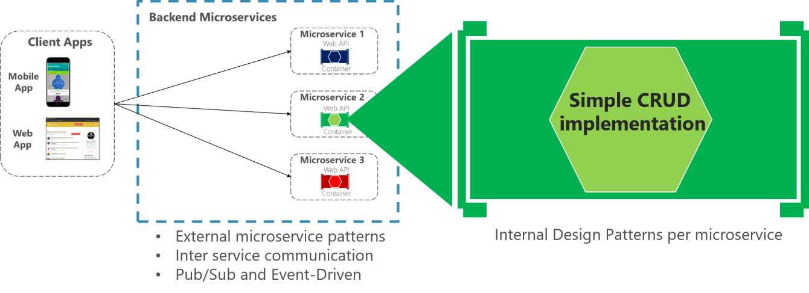
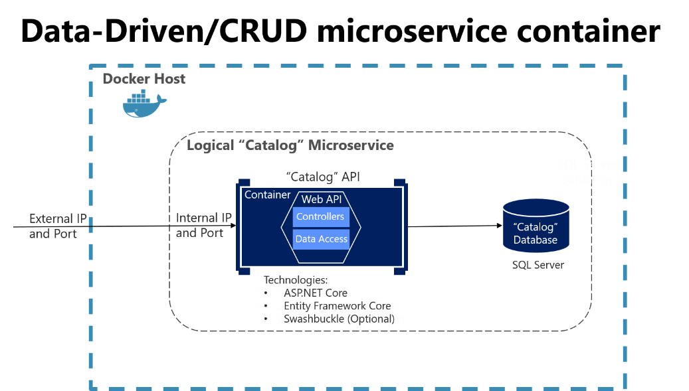
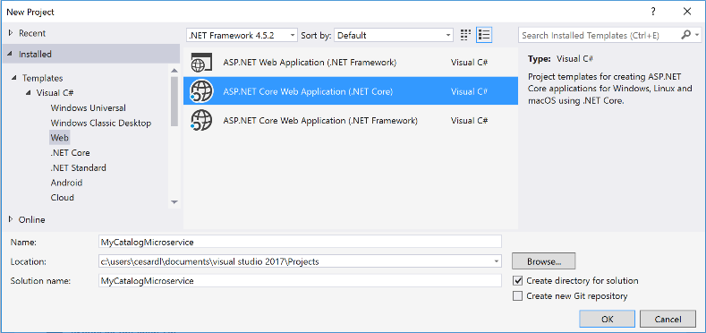
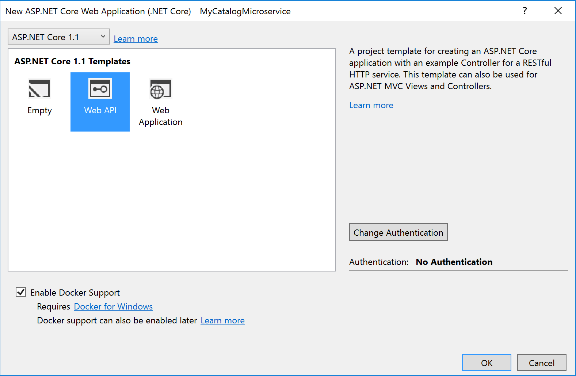
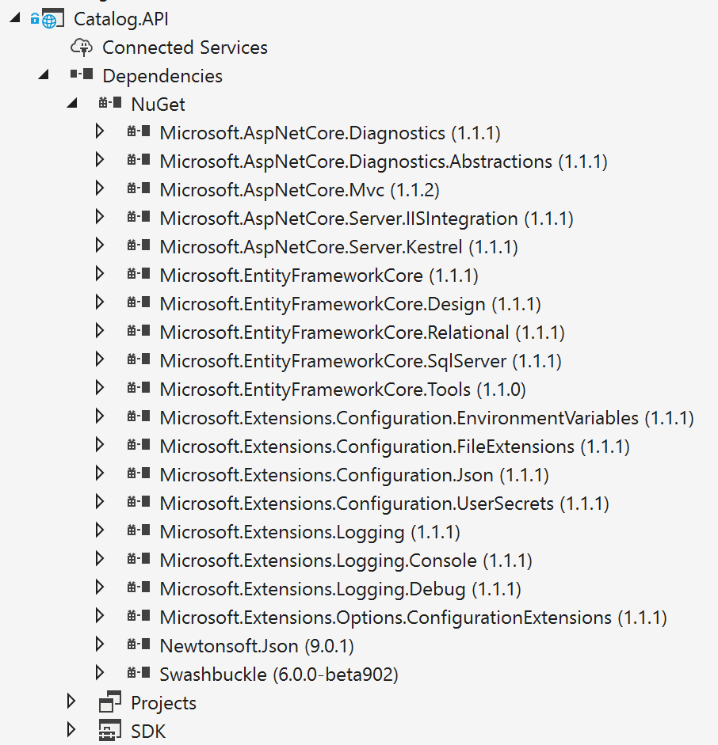
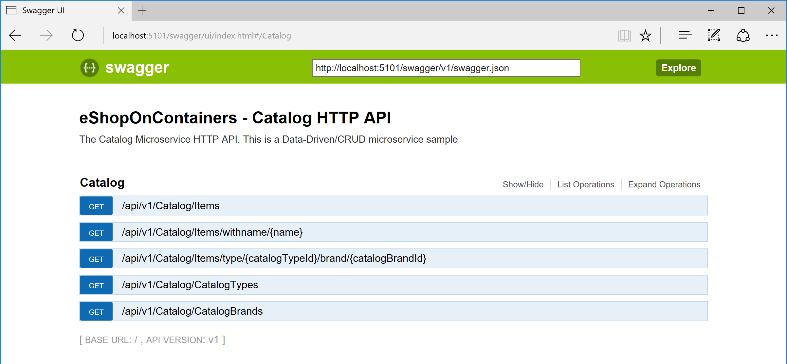
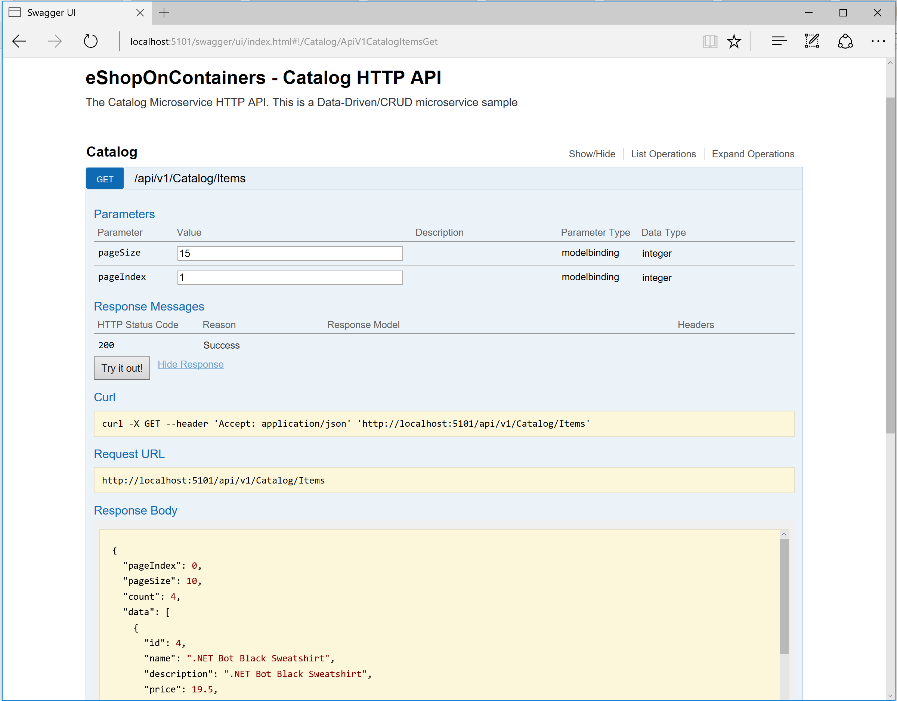
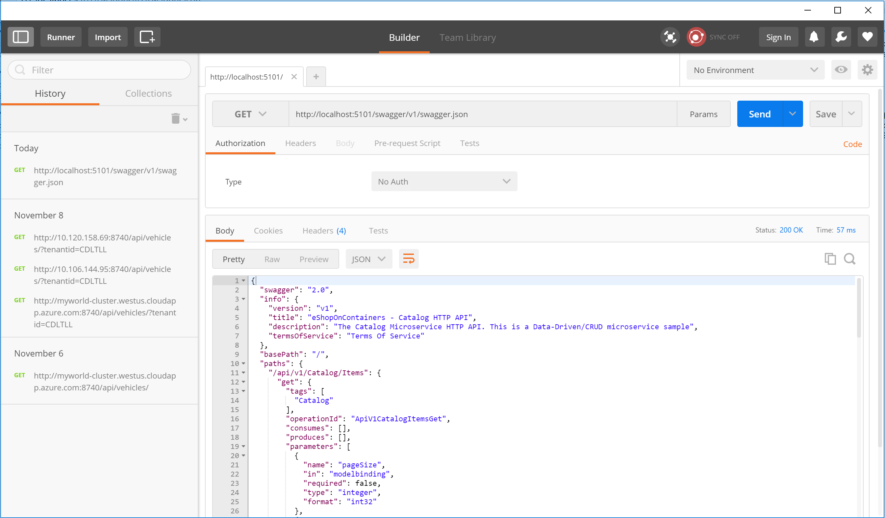

# Creating a simple data-driven CRUD microservice

This section outlines how to create a simple microservice that performs create, read, update, and delete (CRUD) operations on a data source.

## Designing a simple CRUD microservice

From a design point of view, this type of containerized microservice is very simple. Perhaps the problem to solve is simple, or perhaps the implementation is only a proof of concept.



**Figure 8-4**. Internal design for simple CRUD microservices

An example of this kind of simple data-drive service is the catalog microservice from the eShopOnContainers sample application. This type of service implements all its functionality in a single ASP.NET Core Web API project that includes classes for its data model, its business logic, and its data access code. It also stores its related data in a database running in SQL Server (as another container for dev/test purposes), but could also be any regular SQL Server host, as shown in Figure 8-5.



**Figure 8-5**. Simple data-driven/CRUD microservice design

When you are developing this kind of service, you only need [ASP.NET Core](https://docs.microsoft.com/en-us/aspnet/core/) and a data-access API or ORM like [Entity Framework Core](https://docs.microsoft.com/en-us/ef/core/index). You could also generate [Swagger](http://swagger.io/) metadata automatically through [Swashbuckle](https://github.com/domaindrivendev/Swashbuckle.AspNetCore) to provide a description of what your service offers, as explained in the next section.

Note that running a database server like SQL Server within a Docker container is great for development environments, because you can have all your dependencies up and running without needing to provision a database in the cloud or on-premises. This is very convenient when running integration tests. However, for production environments, running a database server in a container is not recommended, because you usually do not get high availability with that approach. For a production environment in Azure, it is recommended that you use Azure SQL DB or any other database technology that can provide high availability and high scalability. For example, for a NoSQL approach, you might choose DocumentDB.

Finally, by editing the Dockerfile and docker-compose.yml metadata files, you can configure how the image of this container will be created—what base image it will use, plus design settings such as internal and external names and TCP ports. 

## Implementing a simple CRUD microservice with ASP.NET Core

To implement a simple CRUD microservice using .NET Core and Visual Studio, you start by creating a simple ASP.NET Core Web API project (running on .NET Core so it can run on a Linux Docker host), as shown in Figure 8-6.

  ------------------------------------------------------------------------------------- -------------------------------------------------------------------------------------
     
  ------------------------------------------------------------------------------------- -------------------------------------------------------------------------------------

**Figure 8-6**. Creating an ASP.NET Core Web API project in Visual Studio

After creating the project, you can implement your MVC controllers as you would in any other Web API project, using the Entity Framework API or other API. In the eShopOnContainers.Catalog.API project, you can see that the main dependencies for that microservice are just ASP.NET Core itself, Entity Framework, and Swashbuckle, as shown in Figure 8-7.



**Figure 8-7**. Dependencies in a simple CRUD Web API microservice

### Implementing CRUD Web API services with Entity Framework Core

Entity Framework (EF) Core is a lightweight, extensible, and cross-platform version of the popular Entity Framework data access technology. EF Core is an object-relational mapper (ORM) that enables .NET developers to work with a database using .NET objects.

The catalog microservice uses EF and the SQL Server provider because its database is running in a container with the SQL Server for Linux Docker image. However, the database could be deployed into any SQL Server, such as Windows on-premises or Azure SQL DB. The only thing you would need to change is the connection string in the ASP.NET Web API microservice.

#### Add Entity Framework Core to your dependencies

You can install the NuGet package for the database provider you want to use, in this case SQL Server, from within the Visual Studio IDE or with the NuGet console. Use the following command:

```
  Install-Package Microsoft.EntityFrameworkCore.SqlServer
```

#### The data model

With EF Core, data access is performed by using a model. A model is made up of entity classes and a derived context that represents a session with the database, allowing you to query and save data. You can generate a model from an existing database, manually code a model to match your database, or use EF migrations to create a database from your model (and evolve it as your model changes over time). For the catalog microservice we are using the last approach. You can see an example of the CatalogItem entity class in the following code example, which is a simple Plain Old CLR Object ([POCO](https://en.wikipedia.org/wiki/Plain_Old_CLR_Object)) entity class.

```csharp
public class CatalogItem
{
    public int Id { get; set; }
    public string Name { get; set; }
    public string Description { get; set; }
    public decimal Price { get; set; }
    public string PictureUri { get; set; }
    public int CatalogTypeId { get; set; }
    public CatalogType CatalogType { get; set; }
    public int CatalogBrandId { get; set; }
    public CatalogBrand CatalogBrand { get; set; }
    public CatalogItem() { }
}
```

You also need a DbContext that represents a session with the database. For the catalog microservice, the CatalogContext class derives from the DbContext base class, as shown in the following example:

```csharp
public class CatalogContext : DbContext
{
    public CatalogContext(DbContextOptions<;CatalogContext> options) : base(options)
    {
    }

    public DbSet<;CatalogItem> CatalogItems { get; set; }
    public DbSet<;CatalogBrand> CatalogBrands { get; set; }
    public DbSet<;CatalogType> CatalogTypes { get; set; }

    // Additional code ...

}
```

You can have additional code in the DbContext implementation. For example, in the sample application, we have an OnModelCreating method in the CatalogContext class that automatically populates the sample data the first time it tries to access the database. This method is useful for demo data. You can also use the OnModelCreating method to customize object/database entity mappings with many other [EF extensibility points](https://blogs.msdn.microsoft.com/dotnet/2016/09/29/implementing-seeding-custom-conventions-and-interceptors-in-ef-core-1-0/).

You can see further details about OnModelCreating in the [Implementing the infrastructure-persistence layer with Entity Framework Core](#implementing_infrastructure_persistence) section later in this book.

##### Querying data from Web API controllers

Instances of your entity classes are typically retrieved from the database using Language Integrated Query (LINQ), as shown in the following example:

```csharp
[Route("api/v1/[controller]")]
public class CatalogController : ControllerBase
{
    private readonly CatalogContext _catalogContext;
    private readonly CatalogSettings _settings;
    private readonly ICatalogIntegrationEventService _catalogIntegrationEventService;

    public CatalogController(CatalogContext context,
        IOptionsSnapshot<;CatalogSettings> settings,
        ICatalogIntegrationEventService catalogIntegrationEventService)
    {
        _catalogContext = context ?? throw new ArgumentNullException(nameof(context));
        _catalogIntegrationEventService = catalogIntegrationEventService ??
           throw new ArgumentNullException(nameof(catalogIntegrationEventService));
        _settings = settings.Value;
        ((DbContext)context).ChangeTracker.QueryTrackingBehavior = QueryTrackingBehavior.NoTracking;
    }

    // GET api/v1/[controller]/items[?pageSize=3&pageIndex=10]
    [HttpGet]
    [Route("[action]")]
    public async Task<;IActionResult> Items([FromQuery]int pageSize = 10,
    [FromQuery]int pageIndex = 0)
    {
        var totalItems = await _catalogContext.CatalogItems
            .LongCountAsync();
        var itemsOnPage = await _catalogContext.CatalogItems
            .OrderBy(c => c.Name)
            .Skip(pageSize * pageIndex)
            .Take(pageSize)
            .ToListAsync();
        itemsOnPage = ChangeUriPlaceholder(itemsOnPage);
        var model = new PaginatedItemsViewModel<;CatalogItem>(
            pageIndex, pageSize, totalItems, itemsOnPage);
        return Ok(model);
    } 

    //...
}
```

##### Saving data

Data is created, deleted, and modified in the database using instances of your entity classes. You could add code like the following hard-coded example (mock data, in this case) to your Web API controllers.

```csharp
var catalogItem = new CatalogItem() {CatalogTypeId=2, CatalogBrandId=2,
   Name="Roslyn T-Shirt", Price = 12};
_context.Catalog.Add(catalogItem);
_context.SaveChanges();
```

##### Dependency Injection in ASP.NET Core and Web API controllers

In ASP.NET Core you can use Dependency Injection (DI) out of the box. You do not need to set up a third-party Inversion of Control (IoC) container, although you can plug your preferred IoC container into the ASP.NET Core infrastructure if you want. In this case, it means that you can directly inject the required EF DBContext or additional repositories through the controller constructor. In the example above of the CatalogController class, we are injecting an object of CatalogContext type plus other objects through the CatalogController constructor.

An important configuration to set up in the Web API project is the DbContext class registration into the service’s IoC container. You typically do so in the Startup class by calling the services.AddDbContext method inside the ConfigureServices method, as shown in the following example:

```csharp
public void ConfigureServices(IServiceCollection services)
{
    services.AddDbContext<;CatalogContext>(options =>
    {
        options.UseSqlServer(Configuration["ConnectionString"],
        sqlServerOptionsAction: sqlOptions =>
        {
           sqlOptions.
               MigrationsAssembly(
               typeof(Startup).
               GetTypeInfo().
               Assembly.
               GetName().Name);

           //Configuring Connection Resiliency:
           sqlOptions.
               EnableRetryOnFailure(maxRetryCount: 5,
               maxRetryDelay: TimeSpan.FromSeconds(30),
               errorNumbersToAdd: null);

       });

       // Changing default behavior when client evaluation occurs to throw.
       // Default in EFCore would be to log warning when client evaluation is done.
       options.ConfigureWarnings(warnings => warnings.Throw(
           RelationalEventId.QueryClientEvaluationWarning));
   });

  //...

}
```

### Additional resources

-   **Querying Data**
    [*https://docs.microsoft.com/en-us/ef/core/querying/index*](https://docs.microsoft.com/en-us/ef/core/querying/index)

-   **Saving Data**
    [*https://docs.microsoft.com/en-us/ef/core/saving/index*](https://docs.microsoft.com/en-us/ef/core/saving/index)

## The DB connection string and environment variables used by Docker containers

You can use the ASP.NET Core settings and add a ConnectionString property to your settings.json file as shown in the following example:

```csharp
{
    "ConnectionString": "Server=tcp:127.0.0.1,5433;Initial Catalog=Microsoft.eShopOnContainers.Services.CatalogDb;User Id=sa;Password=Pass@word",
    "ExternalCatalogBaseUrl": "http://localhost:5101",
    "Logging": {
        "IncludeScopes": false,
        "LogLevel": {
            "Default": "Debug",
            "System": "Information",
            "Microsoft": "Information"
        }
    }
}
```

The settings.json file can have default values for the ConnectionString property or for any other property. However, those properties will be overridden by the values of environment variables that you specify in the docker-compose.override.yml file.

From your docker-compose.yml or docker-compose.override.yml files, you can initialize those environment variables so that Docker will set them up as OS environment variables for you, as shown in the following docker-compose.override.yml file (the connection string and other lines wrap in this example, but it would not wrap in your own file).

```yml
# docker-compose.override.yml

#
catalog.api:
  environment:
    - ConnectionString=Server=sql.data;Database=Microsoft.eShopOnContainers.Services.CatalogDb;User Id=sa;Password=Pass@word
    - ExternalCatalogBaseUrl=http://10.0.75.1:5101
    #- ExternalCatalogBaseUrl=http://dockerhoststaging.westus.cloudapp.azure.com:5101
  
  ports:
    - "5101:5101"
```

The docker-compose.yml files at the solution level are not only more flexible than configuration files at the project or microservice level, but also more secure. Consider that the Docker images that you build per microservice do not contain the docker-compose.yml files, only binary files and configuration files for each microservice, including the Dockerfile. But the docker-compose.yml file is not deployed along with your application; it is used only at deployment time. Therefore, placing environment variables values in those docker-compose.yml files (even without encrypting the values) is more secure than placing those values in regular .NET configuration files that are deployed with your code.

Finally, you can get that value from your code by using Configuration\["ConnectionString"\], as shown in the ConfigureServices method in an earlier code example.

However, for production environments, you might want to explorer additional ways on how to store secrets like the connection strings. Usually that will be managed by your chosen orchestrator, like you can do with [Docker Swarm secrets management](https://docs.docker.com/engine/swarm/secrets/).

### Implementing versioning in ASP.NET Web APIs

As business requirements change, new collections of resources may be added, the relationships between resources might change, and the structure of the data in resources might be amended. Updating a Web API to handle new requirements is a relatively straightforward process, but you must consider the effects that such changes will have on client applications consuming the Web API. Although the developer designing and implementing a Web API has full control over that API, the developer does not have the same degree of control over client applications that might be built by third party organizations operating remotely.

Versioning enables a Web API to indicate the features and resources that it exposes. A client application can then submit requests to a specific version of a feature or resource. There are several approaches to implement versioning:

-   URI versioning

-   Query string versioning

-   Header versioning

Query string and URI versioning are the simplest to implement. Header versioning is a good approach. However, header versioning not as explicit and straightforward as URI versioning. Because URL versioning is the simplest and most explicit, the eShopOnContainers sample application uses URI versioning.

With URI versioning, as in the eShopOnContainers sample application, each time you modify the Web API or change the schema of resources, you add a version number to the URI for each resource. Existing URIs should continue to operate as before, returning resources that conform to the schema that matches the requested version.

As shown in the following code example, the version can be set by using the Route attribute in the Web API, which makes the version explicit in the URI (v1 in this case).

```csharp
[Route("api/v1/[controller]")]
public class CatalogController : ControllerBase
{
    // Implementation ...
```

This versioning mechanism is simple and depends on the server routing the request to the appropriate endpoint. However, for a more sophisticated versioning and the best method when using REST, you should use hypermedia and implement [HATEOAS (Hypertext as the Engine of Application State)](https://docs.microsoft.com/en-us/azure/architecture/best-practices/api-design#using-the-hateoas-approach-to-enable-navigation-to-related-resources).

### Additional resources

-   **Scott Hanselman. ASP.NET Core RESTful Web API versioning made easy**
    [*http://www.hanselman.com/blog/ASPNETCoreRESTfulWebAPIVersioningMadeEasy.aspx*](http://www.hanselman.com/blog/ASPNETCoreRESTfulWebAPIVersioningMadeEasy.aspx)

-   **Versioning a RESTful web API**

    [*https://docs.microsoft.com/en-us/azure/architecture/best-practices/api-design#versioning-a-restful-web-api*](https://docs.microsoft.com/en-us/azure/architecture/best-practices/api-design#versioning-a-restful-web-api)

-   **Roy Fielding. Versioning, Hypermedia, and REST**
    [*https://www.infoq.com/articles/roy-fielding-on-versioning*](https://www.infoq.com/articles/roy-fielding-on-versioning)

## Generating Swagger description metadata from your ASP.NET Core Web API 

[Swagger](http://swagger.io/) is a commonly used open source framework backed by a large ecosystem of tools that helps you design, build, document, and consume your RESTful APIs. It is becoming the standard for the APIs description metadata domain. You should include Swagger description metadata with any kind of microservice, either data-driven microservices or more advanced domain-driven microservices (as explained in following section).

The heart of Swagger is the Swagger specification, which is API description metadata in a JSON or YAML file. The specification creates the RESTful contract for your API, detailing all its resources and operations in both a human- and machine-readable format for easy development, discovery, and integration.

The specification is the basis of the OpenAPI Specification (OAS) and is developed in an open, transparent, and collaborative community to standardize the way RESTful interfaces are defined.

The specification defines the structure for how a service can be discovered and how its capabilities understood. For more information, including a web editor and examples of Swagger specifications from companies like Spotify, Uber, Slack, and Microsoft, see the Swagger site (<http://swagger.io>).

### Why use Swagger?

The main reasons to generate Swagger metadata for your APIs are the following.

**Ability for other products to automatically consume and integrate your APIs**. Dozens of products and [commercial tools](http://swagger.io/commercial-tools/) and many [libraries and frameworks](http://swagger.io/open-source-integrations/) support Swagger. Microsoft has high-level products and tools that can automatically consume Swagger-based APIs, such as the following:

-   [AutoRest](https://github.com/Azure/AutoRest). You can automatically generate .NET client classes for calling Swagger. This

-   tool can be used from the CLI and it also integrates with Visual Studio for easy use through the GUI.

-   [Microsoft Flow](https://flow.microsoft.com/en-us/). You can automatically [use and integrate your API](https://flow.microsoft.com/en-us/blog/integrating-custom-api/) into a high-level Microsoft Flow workflow, with no programming skills required.

-   [Microsoft PowerApps](https://powerapps.microsoft.com/en-us/). You can automatically consume your API from [PowerApps mobile apps](https://powerapps.microsoft.com/en-us/blog/register-and-use-custom-apis-in-powerapps/) built with [PowerApps Studio](https://powerapps.microsoft.com/en-us/guided-learning/learning-powerapps-parts/), with no programming skills required.

-   [Azure App Service Logic Apps](https://docs.microsoft.com/en-us/azure/app-service-logic/app-service-logic-what-are-logic-apps). You can automatically [use and integrate your API into an Azure App Service Logic App](https://docs.microsoft.com/en-us/azure/app-service-logic/app-service-logic-custom-hosted-api), with no programming skills required.

**Ability to automatically generate API documentation**. When you create large-scale RESTful APIs, such as complex microservice-based applications, you need to handle many endpoints with different data models used in the request and response payloads. Having proper documentation and having a solid API explorer, as you get with Swagger, is key for the success of your API and adoption by developers.

Swagger’s metadata is what Microsoft Flow, PowerApps, and Azure Logic Apps use to understand how to use APIs and connect to them.

### How to automate API Swagger metadata generation with the Swashbuckle NuGet package

Generating Swagger metadata manually (in a JSON or YAML file) can be tedious work. However, you can automate API discovery of ASP.NET Web API services by using the [Swashbuckle NuGet package](http://aka.ms/swashbuckledotnetcore) to dynamically generate Swagger API metadata.

Swashbuckle automatically generates Swagger metadata for your ASP.NET Web API projects. It supports ASP.NET Core Web API projects and the traditional ASP.NET Web API and any other flavor, such as Azure API App, Azure Mobile App, Azure Service Fabric microservices based on ASP.NET. It also supports plain Web API deployed on containers, as in for the reference application.

Swashbuckle combines API Explorer and Swagger or [swagger-ui](https://github.com/swagger-api/swagger-ui) to provide a rich discovery and documentation experience for your API consumers. In addition to its Swagger metadata generator engine, Swashbuckle also contains an embedded version of swagger-ui, which it will automatically serve up once Swashbuckle is installed.

This means you can complement your API with a nice discovery UI to help developers to use your API. It requires a very small amount of code and maintenance because it is automatically generated, allowing you to focus on building your API. The result for the API Explorer looks like Figure 8-8.



**Figure 8-8**. Swashbuckle API Explorer based on Swagger metadata—eShopOnContainers catalog microservice

The API explorer is not the most important thing here. Once you have a Web API that can describe itself in Swagger metadata, your API can be used seamlessly from Swagger-based tools, including client proxy-class code generators that can target many platforms. For example, as mentioned, [AutoRest](https://github.com/Azure/AutoRest) automatically generates .NET client classes. But additional tools like [swagger-codegen](https://github.com/swagger-api/swagger-codegen) are also available, which allow code generation of API client libraries, server stubs, and documentation automatically.

Currently, Swashbuckle consists of two NuGet packages: Swashbuckle.SwaggerGen and Swashbuckle.SwaggerUi. The former provides functionality to generate one or more Swagger documents directly from your API implementation and expose them as JSON endpoints. The latter provides an embedded version of the swagger-ui tool that can be served by your application and powered by the generated Swagger documents to describe your API. However, the latest versions of Swashbuckle wrap these with the Swashbuckle.AspNetCore metapackage.

Note that for .NET Core Web API projects, you need to use [Swashbuckle.AspNetCore](https://www.nuget.org/packages/Swashbuckle.AspNetCore/1.0.0) version 1.0.0 or later.

After you have installed these NuGet packages in your Web API project, you need to configure Swagger in the Startup class, as in the following code:

```csharp
public class Startup
{
    public IConfigurationRoot Configuration { get; }
    // Other startup code...

    public void ConfigureServices(IServiceCollection services)
    {
        // Other ConfigureServices() code...
        services.AddSwaggerGen();
        services.ConfigureSwaggerGen(options =>
        {
            options.DescribeAllEnumsAsStrings();
            options.SingleApiVersion(new Swashbuckle.Swagger.Model.Info()
            {
                Title = "eShopOnContainers - Catalog HTTP API",
                Version = "v1",
                Description = "The Catalog Microservice HTTP API",
                TermsOfService = "eShopOnContainers terms of service"
            });
        });
        // Other ConfigureServices() code...
    }

    public void Configure(IApplicationBuilder app,
        IHostingEnvironment env,
        ILoggerFactory loggerFactory)
    {
        // Other Configure() code...
        // ...
        app.UseSwagger()
            .UseSwaggerUi();
    }
}
```

Once this is done, you can start your application and browse the following Swagger JSON and UI endpoints using URLs like these:

```json
  http://<;your-root-url>/swagger/v1/swagger.json
  
  http://<;your-root-url>/swagger/ui
```

You previously saw the generated UI created by Swashbuckle for a URL like http://&lt;your-root-url&gt;/swagger/ui. In Figure 8-9 you can also see how you can test any API method.



**Figure 8-9**. Swashbuckle UI testing the Catalog/Items API method

Figure 8-10 shows the Swagger JSON metadata generated from the eShopOnContainers microservice (which is what the tools use underneath) when you request &lt;your-root-url&gt;/swagger/v1/swagger.json using [Postman](https://www.getpostman.com/).



**Figure 8-10**. Swagger JSON metadata

It is that simple. And because it is automatically generated, the Swagger metadata will grow when you add more functionality to your API.

### Additional resources

-   **ASP.NET Web API Help Pages using Swagger**
    [*https://docs.microsoft.com/en-us/aspnet/core/tutorials/web-api-help-pages-using-swagger*](https://docs.microsoft.com/en-us/aspnet/core/tutorials/web-api-help-pages-using-swagger)


>[!div class="step-by-step"]
[Previous] (microservice-application-design.md)
[Next] (multi-container-applications-docker-compose.md)
