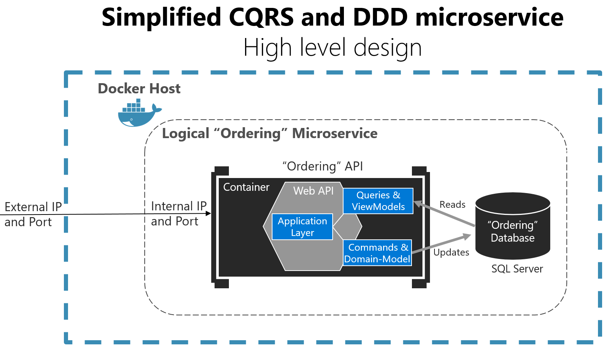

# Applying simplified CQRS and DDD patterns in a microservice

CQRS is an architectural pattern that separates the models for reading and writing data. The related term [Command Query Separation (CQS)](https://martinfowler.com/bliki/CommandQuerySeparation.html) was originally defined by Bertrand Meyer in his book *Object Oriented Software Construction*. The basic idea is that you can divide a system’s operations into two sharply separated categories:

-   Queries. These return a result and do not change the state of the system, and they are free of side effects.

-   Commands. These change the state of a system.

CQS is a simple concept—it is about methods within the same object being either queries or commands. Each method either returns state or mutates state, but not both. Even a single repository pattern object can comply with CQS. CQS can be considered a foundational principle for CQRS.

[Command and Query Responsibility Segregation (CQRS)](https://martinfowler.com/bliki/CQRS.html) was introduced by Greg Young and strongly promoted by Udi Dahan and others. It is based on the CQS principle, although it is more detailed. It can be considered a pattern based on commands and events plus optionally on asynchronous messages. In many cases, CQRS is related to more advanced scenarios, like having a different physical database for reads (queries) than for writes (updates). Moreover, a more evolved CQRS system might implement [Event-Sourcing (ES)](http://codebetter.com/gregyoung/2010/02/20/why-use-event-sourcing/) for your updates database, so you would only store events in the domain model instead of storing the current-state data. However, this is not the approach used in this guide; we are using the simplest CQRS approach, which consists of just separating the queries from the commands.

The separation aspect of CQRS is achieved by grouping query operations in one layer and commands in another layer. Each layer has its own data model (note that we say model, not necessarily a different database) and is built using its own combination of patterns and technologies. More importantly, the two layers can be within the same tier or microservice, as in the example (ordering microservice) used for this guide. Or they could be implemented on different microservices or processes so they can be optimized and scaled out separately without affecting one another.

CQRS means having two objects for a read/write operation where in other contexts there is one. There are reasons to have a denormalized reads database, which you can learn about in more advanced CQRS literature. But we are not using that approach here, where the goal is to have more flexibility in the queries instead of limiting the queries with constraints from DDD patterns like aggregates.

An example of this kind of service is the ordering microservice from the eShopOnContainers reference application. This service implements a microservice based on a simplified CQRS approach. It uses a single data source or database, but two logical models plus DDD patterns for the transactional domain, as shown in Figure 9-2.

{width="6.279861111111111in" height="3.598611111111111in"}

**Figure 9-2**. Simplified CQRS- and DDD-based microservice

The application layer can be the Web API itself. The important design aspect here is that the microservice has split the queries and ViewModels (data models especially created for the client applications) from the commands, domain model, and transactions following the CQRS pattern. This approach keeps the queries independent from restrictions and constraints coming from DDD patterns that only make sense for transactions and updates, as explained in later sections.

>[!div class="step-by-step"]
[Previous] (vision.md)
[Next] (applying-cqrs-and-cqs-approaches-in-a-ddd-microservice-in-eshoponcontainers.md)
