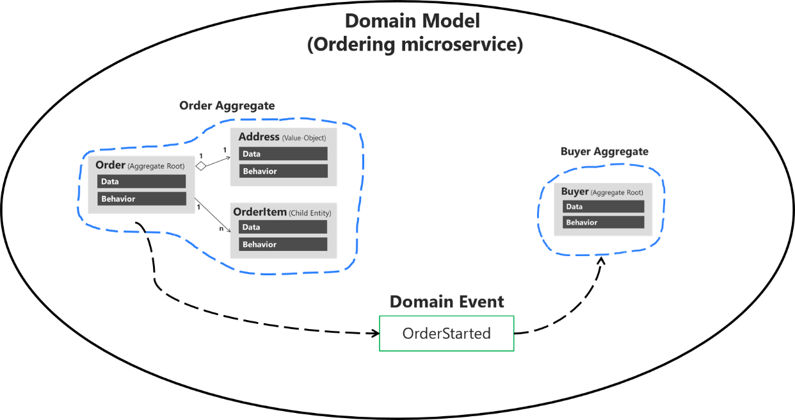
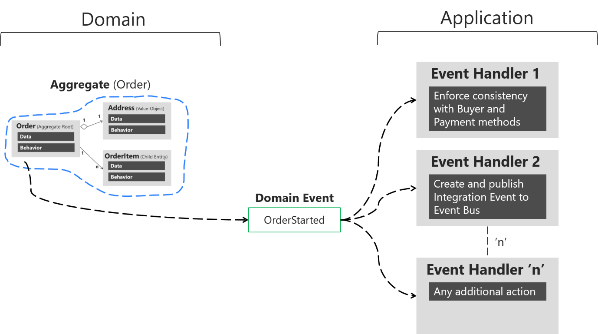

# Domain events: design and implementation

Use domain events to explicitly implement side effects of changes within your domain. In other words, and using DDD terminology, use domain events to explicitly implement side effects across multiple aggregates. Optionally, for better scalability and less impact in database locks, use eventual consistency between aggregates within the same domain.

## What is a domain event?

An event is something that has happened in the past. A domain event is, logically, something that happened in a particular domain, and something you want other parts of the same domain (in-process) to be aware of and potentially react to.

An important benefit of domain events is that side effects after something happened in a domain can be expressed explicitly instead of implicitly. Those side effects must be consistent so either all the operations related to the business task happen, or none of them. In addition, domain events enable a better separation of concerns among classes within the same domain.

For example, if you are just using just Entity Framework and entities or even aggregates, if there have to be side effects provoked by a use case, those will be implemented as an implicit concept in the coupled code after something happened. But, if you just see that code, you might not know if that code (the side effect) is part of the main operation or if it really is a side effect. On the other hand, using domain events makes the concept explicit and part of the ubiquitous language. For example, in the eShopOnContainers application, creating an order is not just about the order; it updates or creates a buyer aggregate based on the original user, because the user is not a buyer until there is an order in place. If you use domain events, you can explicitly express that domain rule based in the ubiquitous language provided by the domain experts.

Domain events are somewhat similar to messaging-style events, with one important difference. With real messaging, message queuing, message brokers, or a service bus using AMPQ, a message is always sent asynchronously and communicated across processes and machines. This is useful for integrating multiple Bounded Contexts, microservices, or even different applications. However, with domain events, you want to raise an event from the domain operation you are currently running, but you want any side effects to occur within the same domain.

The domain events and their side effects (the actions triggered afterwards that are managed by event handlers) should occur almost immediately, usually in-process, and within the same domain. Thus, domain events could be synchronous or asynchronous. Integration events, however, should always be asynchronous.

## Domain events versus integration events

Semantically, domain and integration events are the same thing: notifications about something that just happened. However, their implementation must be different. Domain events are just messages pushed to a domain event dispatcher, which could be implemented as an in-memory mediator based on an IoC container or any other method.

On the other hand, the purpose of integration events is to propagate committed transactions and updates to additional subsystems, whether they are other microservices, Bounded Contexts or even external applications. Hence, they should occur only if the entity is successfully persisted, since in many scenarios if this fails, the entire operation effectively never happened.

In addition, and as mentioned, integration events must be based on asynchronous communication between multiple microservices (other Bounded Contexts) or even external systems/applications. Thus, the event bus interface needs some infrastructure that allows inter-process and distributed communication between potentially remote services. It can be based on a commercial service bus, queues, a shared database used as a mailbox, or any other distributed and ideally push based messaging system.

## Domain events as a preferred way to trigger side effects across multiple aggregates within the same domain

If executing a command related to one aggregate instance requires additional domain rules to be run on one or more additional aggregates, you should design and implement those side effects to be triggered by domain events. As shown in Figure 9-14, and as one of the most important use cases, a domain event should be used to propagate state changes across multiple aggregates within the same domain model.

**Figure 9-14**. Domain events to enforce consistency between multiple aggregates within the same domain

In the figure, when the user initiates an order, the OrderStarted domain event triggers creation of a Buyer object in the ordering microservice, based on the original user info from the identity microservice (with information provided in the CreateOrder command). The domain event is generated by the order aggregate when it is created in the first place.

Alternately, you can have the aggregate root subscribed for events raised by members of its aggregates (child entities). For instance, each OrderItem child entity can raise an event when the item price is higher than a specific amount, or when the product item amount is too high. The aggregate root can then receive those events and perform a global calculation or aggregation.

It is important to understand that this event-based communication is not implemented directly within the aggregates; you need to implement domain event handlers. Handling the domain events is an application concern. The domain model layer should only focus on the domain logic—things that a domain expert would understand, not application infrastructure like handlers and side-effect persistence actions using repositories. Therefore, the application layer level is where you should have domain event handlers triggering actions when a domain event is raised.

Domain events can also be used to trigger any number of application actions, and what is more important, must be open to increase that number in the future in a decoupled way. For instance, when the order is started, you might want to publish a domain event to propagate that info to other aggregates or even to raise application actions like notifications.

The key point is the open number of actions to be executed when a domain event occurs. Eventually, the actions and rules in the domain and application will grow. The complexity or number of side-effect actions when something happens will grow, but if your code were coupled with “glue” (that is, just instantiating objects with the new keyword in C\#), then every time you needed to add a new action you would need to change the original code. This could result in new bugs, because with each new requirement you would need to change the original code flow. This goes against the [Open/Closed principle](https://en.wikipedia.org/wiki/Open/closed_principle) from [SOLID](https://en.wikipedia.org/wiki/SOLID_(object-oriented_design)). Not only that, the original class that was orchestrating the operations would grow and grow, which goes against the [Single Responsibility Principle (SRP)](https://en.wikipedia.org/wiki/Single_responsibility_principle).

On the other hand, if you use domain events, you can create a fine-grained and decoupled implementation by segregating responsibilities using this approach:

1.  Send a command (for example, CreateOrder).
2.  Receive the command in a command handler.
    -   Execute a single aggregate’s transaction.
    -   (Optional) Raise domain events for side effects (for example, OrderStartedDomainDvent).
1.  Handle domain events (within the current process) thast will execute an open number of side effects in multiple aggregates or application actions. For example:
    -   Verify or create buyer and payment method.
    -   Create and send a related integration event to the event bus to propagate states across microservices or trigger external actions like sending an email to the buyer.
    -   Handle other side effects.

As shown in Figure 9-15, starting from the same domain event, you can handle multiple actions related to other aggregates in the domain or additional application actions you need to perform across microservices connecting with integration events and the event bus.

**Figure 9-15**. Handling multiple actions per domain

The event handlers are typically in the application layer, because you will use infrastructure objects like repositories or an application API for the microservice’s behavior. In that sense, event handlers are similar to command handlers, so both are part of the application layer. The important difference is that a command should be processed just once. A domain event could be processed zero or *n* times, because if can be received by multiple receivers or event handlers with a different purpose for each handler.

The possibility of an open number of handlers per domain event allows you to add many more domain rules without impacting your current code. For instance, implementing the following business rule that has to happen right after an event might be as easy as adding a few event handlers (or even just one):

When the total amount purchased by a customer in the store, across any number of orders, exceeds $6,000, apply a 10% off discount to every new order and notify the customer with an email about that discount for future orders.

>[!div class="step-by-step"]
[Previous] (client-side-validation-(validation-in-the-presentation-layers).md)
[Next] (implementing-domain-events.md)
