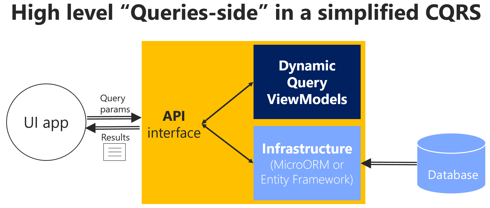
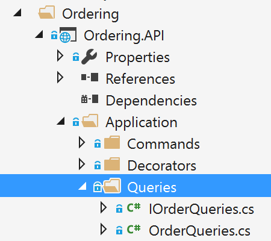

# Implementing reads/queries in a CQRS microservice

For reads/queries, the ordering microservice from the eShopOnContainers reference application implements the queries independently from the DDD model and transactional area. This was done primarily because the demands for queries and for transactions are drastically different. Writes execute transactions that must be compliant with the domain logic. Queries, on the other hand, are idempotent and can be segregated from the domain rules.

The approach is simple, as shown in Figure 9-3. The API interface is implemented by the Web API controllers using any infrastructure (such as a micro ORM like Dapper) and returning dynamic ViewModels depending on the needs of the UI applications.



**Figure 9-3**. The simplest approach for queries in a CQRS microservice

This is the simplest possible approach for queries. The query definitions query the database and return a dynamic ViewModel built on the fly for each query. Since the queries are idempotent, they will not change the data no matter how many times you run a query. Therefore, you do not need to be restricted by any DDD pattern used in the transactional side, like aggregates and other patterns, and that is why queries are separated from the transactional area. You simply query the database for the data that the UI needs and return a dynamic ViewModel that does not need to be statically defined anywhere (no classes for the ViewModels) except in the SQL statements themselves.

Since this is a simple approach, the code required for the queries side (such as code using a micro ORM like [Dapper](https://github.com/StackExchange/Dapper)) can be implemented [within the same Web API project](https://github.com/dotnet-architecture/eShopOnContainers/blob/master/src/Services/Ordering/Ordering.API/Application/Queries/OrderQueries.cs). Figure 9-4 shows this. The queries are defined in the **Ordering.API** microservice project within the eShopOnContainers solution.



**Figure 9-4**. Queries in the Ordering microservice in eShopOnContainers

## Using ViewModels specifically made for client apps, independent from domain model constraints

Since the queries are performed to obtain the data needed by the client applications, the returned type can be specifically made for the clients, based on the data returned by the queries. These models, or Data Transfer Objects (DTOs), are called ViewModels.

The returned data (ViewModel) can be the result of joining data from multiple entities or tables in the database, or even across multiple aggregates defined in the domain model for the transactional area. In this case, because you are creating queries independent of the domain model, the aggregates boundaries and constraints are completely ignored and you are free to query any table and column you might need. This approach provides great flexibility and productivity for the developers creating or updating the queries.

The ViewModels can be static types defined in classes. Or they can be created dynamically based on the queries performed (as is implemented in the ordering microservice), which is very agile for developers.

## Using Dapper as a micro ORM to perform queries 

You can use any micro ORM, Entity Framework Core, or even plain ADO.NET for querying. In the sample application, we selected Dapper for the ordering microservice in eShopOnContainers as a good example of a popular micro ORM. It can run plain SQL queries with great performance, because it is a very light framework. Using Dapper, you can write a SQL query that can access and join multiple tables.

Dapper is an open source project (original created by Sam Saffron), and is part of the building blocks used in [Stack Overflow](https://stackoverflow.com/). To use Dapper, you just need to install it through the [Dapper NuGet package](https://www.nuget.org/packages/Dapper), as shown in the following figure.


You will also need to add a using statement so your code has access to the Dapper extension methods.

When you use Dapper in your code, you directly use the SqlClient class available in the System.Data.SqlClient namespace. Through the QueryAsync method and other extension methods which extend the SqlClient class, you can simply run queries in a straightforward and performant way.

## Dynamic and static ViewModels

As shown in the following code from the ordering microservice, most of the ViewModels returned by the queries are implemented as *dynamic*. That means that the subset of attributes to be returned is based on the query itself. If you add a new column to the query or join, that data is dynamically added to the returned ViewModel. This approach reduces the need to modify queries in response to updates to the underlying data model, making this design approach more flexible and tolerant of future changes.

```csharp
using Dapper;
using Microsoft.Extensions.Configuration;
using System.Data.SqlClient;
using System.Threading.Tasks;
using System.Dynamic;
using System.Collections.Generic;

public class OrderQueries : IOrderQueries
{
    public async Task<IEnumerable<dynamic>> GetOrdersAsync()
    {
        using (var connection = new SqlConnection(_connectionString))
        {
            connection.Open();
            return await connection.QueryAsync<dynamic>(
@"SELECT o.[Id] as ordernumber,
o.[OrderDate] as [date],os.[Name] as [status],
SUM(oi.units*oi.unitprice) as total
FROM [ordering].[Orders] o
LEFT JOIN[ordering].[orderitems] oi ON o.Id = oi.orderid
LEFT JOIN[ordering].[orderstatus] os on o.OrderStatusId = os.Id
GROUP BY o.[Id], o.[OrderDate], os.[Name]");
        }
  }
}
```

The important point is that by using a dynamic type, the returned collection of data will be dynamically assembled as the ViewModel.

For most queries, you do not need to predefine a DTO or ViewModel class, which makes coding them straightforward and productive. However, you can predefine ViewModels (like predefined DTOs) if you want to have ViewModels with a more restricted definition as contracts.

#### Additional resources

-   **Dapper**
    [*https://github.com/StackExchange/dapper-dot-net*](https://github.com/StackExchange/dapper-dot-net)

-   **Julie Lerman. Data Points - Dapper, Entity Framework and Hybrid Apps (MSDN Mag. article)**

    *https://msdn.microsoft.com/en-us/magazine/mt703432.aspx*


>[!div class="step-by-step"]
[Previous] (applying-cqrs-and-cqs-approaches-in-a-ddd-microservice-in-eshoponcontainers.md)
[Next] (designing-a-ddd-oriented-microservice.md)
