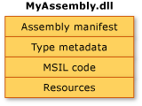

# Assembly contents
In general, a static assembly can consist of four elements:

- The [assembly manifest](manifest.md), which contains assembly metadata.

- Type metadata.  

- Microsoft intermediate language (MSIL) code that implements the types. It is generated by the compiler from one or more source code files.

- A set of resources.  

Only the assembly manifest is required, but either types or resources are needed to give the assembly any meaningful functionality.

The following illustration shows these elements grouped in a single physical file.

In this illustration, all three files belong to an assembly, as described in the assembly manifest contained in MyAssembly.dll. To the file system, they are three separate files. Note that the file Util.netmodule was compiled as a module because it contains no assembly information. When the assembly was created, the assembly manifest was added to MyAssembly.dll, indicating its relationship with Util.netmodule and Graphic.bmp.

As you currently design your source code, you make explicit decisions about how to partition the functionality of your application into one or more files. When designing .NET Framework code, you will make similar decisions about how to partition the functionality into one or more assemblies.

## See also

- [Assemblies in .NET](index.md)
- [Assembly manifest](manifest.md)
- [Assembly security considerations](security-considerations.md)
